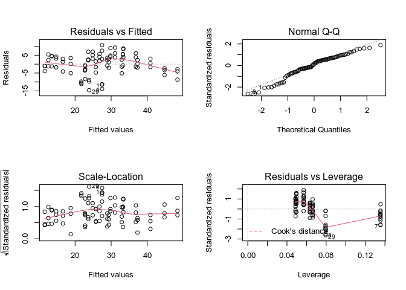

# Analyzing `CO2` with ANOVA and ANCOVA

In an ANOVA model each of our predictor variables are of the categorical type.

A three factor ANOVA with interactions follows the following formula:

*y*<sub>*ijkl*</sub> = *μ*<sub>...</sub> + *α*<sub>*i*</sub> + *β*<sub>*j*</sub> + *γ*<sub>*k*</sub> + (*α**β*)<sub>*ij*</sub> + (*α**γ*)<sub>*ik*</sub> + (*β**γ*)<sub>*jk*</sub> + (*α**β**γ*)<sub>*ijk*</sub> + *ϵ*<sub>*ijkl*</sub>

Where:

-   *y*<sub>*ijkl*</sub> is the response for *i*, *j*, and *k* factor levels and *l* observations,
-   *μ*<sub>...</sub> is the grand mean,
-   *α*, *β*, *γ* are factors with *i*, *j*, and *k* levels respectively,
-   (*α**β*), (*α**γ*), (*β**γ*), and (*α**β**γ*) are interactions between the factors, and
-   *ϵ* is the error term for *i*, *j*, and *k* factor levels and *l* observations.

In the `CO2` dataset the `conc` variable represents molecular concentrations of which are continuous, however because 7 distinct concentrations were used in this study it could be sensible to model `conc` as a categorical variable with 7 levels. We can easily do this without making changes to the data by calling `factor()` on the variable within the model formula. We can then use `summary()`, or alternatively `anova()`, to print out the ANOVA table for our fitted model.

``` r
CO2.aov <- aov(uptake~Type*Treatment*factor(conc), data=CO2)

summary(CO2.aov)
```

    ##                             Df Sum Sq Mean Sq F value   Pr(>F)    
    ## Type                         1   3366    3366 399.758  < 2e-16 ***
    ## Treatment                    1    988     988 117.368 2.32e-15 ***
    ## factor(conc)                 6   4069     678  80.548  < 2e-16 ***
    ## Type:Treatment               1    226     226  26.812 3.15e-06 ***
    ## Type:factor(conc)            6    374      62   7.412 7.24e-06 ***
    ## Treatment:factor(conc)       6    101      17   1.999   0.0811 .  
    ## Type:Treatment:factor(conc)  6    112      19   2.216   0.0547 .  
    ## Residuals                   56    471       8                     
    ## ---
    ## Signif. codes:  0 '***' 0.001 '**' 0.01 '*' 0.05 '.' 0.1 ' ' 1

*Note: Because linear regression and ANOVA are only different in language but not math, you could also use `aov()` on a previously fit `lm()` object.*

*Note: I have seen others suggest that both `aov()` and `anova()` fit an ANOVA model in `R`, but that is not exactly true. While `anova()` prints an ANOVA table from a fitted model, only `aov()` actually fits an ANOVA model in base `R`.*

We can see that just like in the [linear regression model](https://tylerbg.github.io/CDAR/docs/CO2_LR) each of the three variables are statistically significant.

Because some of our interaction are not statistically significant we may want to remove them from the model to make a simpler, reduced model. We should start by first removing the highest order interaction (`Type:Treatment:factor(conc)`) and refitting the model. While we could rewrite our formula in `aov()` with only the significant factors and interactions we could also just use `update` to remove the insignificant interactions from the model we already fit.

``` r
CO2.aov2 <- update(CO2.aov, .~.-Type:Treatment:factor(conc))

summary(CO2.aov2)
```

    ##                        Df Sum Sq Mean Sq F value   Pr(>F)    
    ## Type                    1   3366    3366 357.655  < 2e-16 ***
    ## Treatment               1    988     988 105.007 5.76e-15 ***
    ## factor(conc)            6   4069     678  72.065  < 2e-16 ***
    ## Type:Treatment          1    226     226  23.988 7.27e-06 ***
    ## Type:factor(conc)       6    374      62   6.632 1.88e-05 ***
    ## Treatment:factor(conc)  6    101      17   1.789    0.116    
    ## Residuals              62    583       9                     
    ## ---
    ## Signif. codes:  0 '***' 0.001 '**' 0.01 '*' 0.05 '.' 0.1 ' ' 1

In the reduced model the interaction between `Treatment` and `conc` is still insignificant, so we can again use `update()` to further reduce the ANOVA model.

``` r
CO2.aov3 <- update(CO2.aov2, .~.-Treatment:factor(conc))

summary(CO2.aov3)
```

    ##                   Df Sum Sq Mean Sq F value   Pr(>F)    
    ## Type               1   3366    3366  334.39  < 2e-16 ***
    ## Treatment          1    988     988   98.18 7.95e-15 ***
    ## factor(conc)       6   4069     678   67.38  < 2e-16 ***
    ## Type:Treatment     1    226     226   22.43 1.15e-05 ***
    ## Type:factor(conc)  6    374      62    6.20 3.15e-05 ***
    ## Residuals         68    684      10                     
    ## ---
    ## Signif. codes:  0 '***' 0.001 '**' 0.01 '*' 0.05 '.' 0.1 ' ' 1

We now see that each of our variables, `Type`, `Treatment`, and `conc`, and the interactions between `Type` and `Treatment` as well as `Type` and `conc` are statistically significant in the three-way ANOVA model.

But what if we did want to treat `conc` as a continuous variable? While we could then fit a [linear regression model](https://tylerbg.github.io/CDAR/docs/CO2_LR), we could instead treat `conc` as a covariate in an ANCOVA. In `R`, `aov()` will automatically treat a numerical variable as a covariate so we do not have to do much to change our code except leaving `conc` as a numerical variable.

``` r
CO2.ancova <- aov(uptake~Type*Treatment*conc, data=CO2)
```

There is one issue here however in that both `summary()` and `anova()` in base `R` use the type I sum of squares. With the ANCOVA we instead need to use the type III errors, otherwise we may be return incorrect statistical results that may lead to faulty conclusions. [While we can change from type I to III sum of squares in base `R`](https://mcfromnz.wordpress.com/2011/03/02/anova-type-iiiiii-ss-explained/) it is actually much easier to instead use the `Anova()` function from the `car` library to do this for us.

``` r
library(car)
```

    ## Loading required package: carData

``` r
Anova(CO2.ancova, type="3")
```

    ## Anova Table (Type III tests)
    ## 
    ## Response: uptake
    ##                     Sum Sq Df  F value    Pr(>F)    
    ## (Intercept)         4313.5  1 128.7005 < 2.2e-16 ***
    ## Type                 167.6  1   5.0000   0.02828 *  
    ## Treatment             57.1  1   1.7045   0.19564    
    ## conc                 912.6  1  27.2275  1.52e-06 ***
    ## Type:Treatment         5.0  1   0.1501   0.69952    
    ## Type:conc             24.3  1   0.7247   0.39727    
    ## Treatment:conc         1.6  1   0.0487   0.82593    
    ## Type:Treatment:conc   55.5  1   1.6570   0.20192    
    ## Residuals           2547.2 76                       
    ## ---
    ## Signif. codes:  0 '***' 0.001 '**' 0.01 '*' 0.05 '.' 0.1 ' ' 1

While there is a lot to look at in our summary statistics for the ANCOVA model we just fit, we should turn our focus to the highest order interaction, `Type:Treatment:conc`. Because the interaction term here is statistically insignificant we can conclude that an interaction between these three variables does not exist and remove it from our model to make a simpler model. We can again use `update()` to do so.

``` r
CO2.ancova2 <- update(CO2.ancova, .~.-Type:Treatment:conc)

Anova(CO2.ancova2, type="3")
```

    ## Anova Table (Type III tests)
    ## 
    ## Response: uptake
    ##                Sum Sq Df  F value    Pr(>F)    
    ## (Intercept)    4728.8  1 139.8990 < 2.2e-16 ***
    ## Type            112.1  1   3.3155   0.07251 .  
    ## Treatment        15.5  1   0.4592   0.50002    
    ## conc           1535.4  1  45.4239 2.575e-09 ***
    ## Type:Treatment  225.7  1   6.6780   0.01165 *  
    ## Type:conc       208.0  1   6.1535   0.01530 *  
    ## Treatment:conc   31.9  1   0.9429   0.33458    
    ## Residuals      2602.7 77                       
    ## ---
    ## Signif. codes:  0 '***' 0.001 '**' 0.01 '*' 0.05 '.' 0.1 ' ' 1

We now see that of our three remaining interaction terms the `Treatment:conc` interaction is the only that is not statistically significant. We can therefore further reduce our model.

``` r
CO2.ancova3 <- update(CO2.ancova2, .~.-Treatment:conc)

Anova(CO2.ancova3, type="3")
```

    ## Anova Table (Type III tests)
    ## 
    ## Response: uptake
    ##                Sum Sq Df  F value    Pr(>F)    
    ## (Intercept)    6417.7  1 190.0025 < 2.2e-16 ***
    ## Type            112.1  1   3.3179   0.07236 .  
    ## Treatment       134.6  1   3.9863   0.04936 *  
    ## conc           1935.9  1  57.3141 6.357e-11 ***
    ## Type:Treatment  225.7  1   6.6829   0.01160 *  
    ## Type:conc       208.0  1   6.1580   0.01523 *  
    ## Residuals      2634.6 78                       
    ## ---
    ## Signif. codes:  0 '***' 0.001 '**' 0.01 '*' 0.05 '.' 0.1 ' ' 1

In this reduced ANCOVA model we see that both the `Type:Treatment` and `Type:conc` interaction terms are statistically significant. Even though the variable `Type` is not statistically significant, because it does have a statistically significant interaction term with other variables in the model conventionally we should keep the term in our model.

``` r
par(mfrow=c(2,2))
plot(CO2.ancova3)
```



``` r
par(mfrow=c(1,1))
```

*Note: To observe the similarities between ANOVA, ANCOVA, and linear regression models try fitting a linear regression with `lm()` using the variables and interactions in the final ANCOVA model and printing summary statistics for the model.*

### Other Resources

[STHDA: One-Way ANOVA Test in R](http://www.sthda.com/english/wiki/one-way-anova-test-in-r)

[Scribbr: ANOVA in R: A step-by-step guide](https://www.scribbr.com/statistics/anova-in-r/)

[Data Analysis in R: Understanding ANOVA in R](https://bookdown.org/steve_midway/DAR/understanding-anova-in-r.html)

[Datanovia: ANOVA in R](https://www.datanovia.com/en/lessons/anova-in-r/)

[Applied Statistics with R: Analysis of Variance](https://daviddalpiaz.github.io/appliedstats/analysis-of-variance.html)

[R-bloggers: 3-way ANOVA](https://www.r-bloggers.com/2017/02/raccoon-ch-2-4-3-way-anova/)
