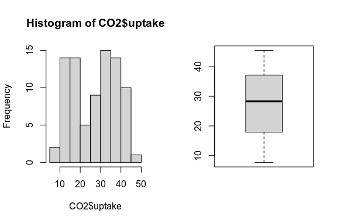
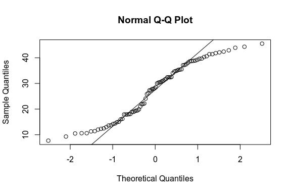
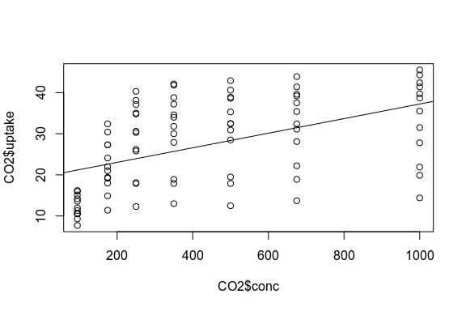

# Exploratory Data Analysis of CO2

Before we even start analyzing our data we should get an idea of what is actually in the dataset; what was measured, what are the dependent and independent variables, etc. We will typically know this before we load our dataset, but for the datasets that are provided in base `R` and other libraries we can simply use `?` followed by the name of the dataset to see the documentation of the dataset.

``` r
?CO2
```

We can see that there are five variables within the dataset:

-   `Plant`: a unique identifier for each observation,
-   `Type`: a categorical variable that gives the origin for each plant,
-   `Treatment`: a categorical variable that indicates which temperature treatment the plant was given,
-   `conc`: the concentration of CO<sub>2</sub> provided to the plant, and
-   `uptake`: the uptake rate of CO<sub>2</sub> by the plant.

We can confirm the variable types and their levels by using `str()` with the dataset.

``` r
str(CO2)
```

    ## Classes 'nfnGroupedData', 'nfGroupedData', 'groupedData' and 'data.frame':   84 obs. of  5 variables:
    ##  $ Plant    : Ord.factor w/ 12 levels "Qn1"<"Qn2"<"Qn3"<..: 1 1 1 1 1 1 1 2 2 2 ...
    ##  $ Type     : Factor w/ 2 levels "Quebec","Mississippi": 1 1 1 1 1 1 1 1 1 1 ...
    ##  $ Treatment: Factor w/ 2 levels "nonchilled","chilled": 1 1 1 1 1 1 1 1 1 1 ...
    ##  $ conc     : num  95 175 250 350 500 675 1000 95 175 250 ...
    ##  $ uptake   : num  16 30.4 34.8 37.2 35.3 39.2 39.7 13.6 27.3 37.1 ...
    ##  - attr(*, "formula")=Class 'formula'  language uptake ~ conc | Plant
    ##   .. ..- attr(*, ".Environment")=<environment: R_EmptyEnv> 
    ##  - attr(*, "outer")=Class 'formula'  language ~Treatment * Type
    ##   .. ..- attr(*, ".Environment")=<environment: R_EmptyEnv> 
    ##  - attr(*, "labels")=List of 2
    ##   ..$ x: chr "Ambient carbon dioxide concentration"
    ##   ..$ y: chr "CO2 uptake rate"
    ##  - attr(*, "units")=List of 2
    ##   ..$ x: chr "(uL/L)"
    ##   ..$ y: chr "(umol/m^2 s)"

We see that `Type` and `Treatment` are both categorical variables (factors in `R`) each with 2 levels while `conc` and `uptake` are both continuous variables (numerical in `R`). `Plant` is also listed as an ordinal factor, however as it is a unique identifier we really do not have any interest in this variable for analysis.

We can better see the distribution of our variables using the `summary()` command.

``` r
summary(CO2)
```

    ##      Plant             Type         Treatment       conc          uptake     
    ##  Qn1    : 7   Quebec     :42   nonchilled:42   Min.   :  95   Min.   : 7.70  
    ##  Qn2    : 7   Mississippi:42   chilled   :42   1st Qu.: 175   1st Qu.:17.90  
    ##  Qn3    : 7                                    Median : 350   Median :28.30  
    ##  Qc1    : 7                                    Mean   : 435   Mean   :27.21  
    ##  Qc3    : 7                                    3rd Qu.: 675   3rd Qu.:37.12  
    ##  Qc2    : 7                                    Max.   :1000   Max.   :45.50  
    ##  (Other):42

Because both `Type` and `Treatment` are factors `R` prints out the number of times each of the factor levels are present in the dataset (42 times for each level in both factors). The numerical variables, `conc` and `uptake`, have statistics of their distributions printed out, namely their minimum and maximum values, 1<sup>st</sup>, 2<sup>nd</sup> (median), and 3<sup>rd</sup> quartiles, and their average (mean) value.

One of the best mathods to explore the dataset is to plot the data in various ways. There are many types of plots and tools for plotting with the two most common using the base `R` plotting devices and `ggplot()`. Here, we will use base `R` as it is relativelly simple to use for EDA and later use `ggplot()` when we are looking to make presentable figures to present our results. To being, we can use `plot()` to provide a set of scatterplots that plot each variable against one another.

``` r
plot(CO2)
```


We can also graphically observe the distribution of each variable with tools such as `hist()` and `boxplot()` that print out a histogram and a boxplot of the variable of interest, respectively.

``` r
par(mfrow=c(1,2))
hist(CO2$uptake)
boxplot(CO2$uptake)
par(mfrow=c(1,1))
```



I strongly suggest to use both histograms and boxplots (in addition to other plots) when performing EDA to assess the distributions of variable as each independently present important information. For instance, the boxplot shows the quartiles, ranges, and apparent outliers in the data that are not as easy to interpret in histograms. Alternatively, histograms show a different side of the distribution of the data by placing data points in bins so we can see the type of distribution (normal, uniform, etc.) present in the variable that can easily be mistaken in a boxplot

For instance, if we only observed the boxplot for `conc` we may go on to assume that the data is evently distributed around the median, however when we look at the histogram of the same data we see that there appears to be two different peaks (the [bimodal distribution](https://www.statisticshowto.com/what-is-a-bimodal-distribution/)) where the data converge.

If we want to determine if a variable follows a normal distribution, `qqnorm()` followed by `qqline()` will print out a normalized Q-Q plot.

``` r
qqnorm(CO2$uptake)
qqline(CO2$uptake)
```



We can also use statistics to evaluate the distributions of our variables. For instance, the `shapiro.test()` funciton will perform a Shapiro-Wilk test for normality where an insignificant test statistic indicates that the variable is normally distributed.

``` r
shapiro.test(CO2$uptake)
```

    ## 
    ##  Shapiro-Wilk normality test
    ## 
    ## data:  CO2$uptake
    ## W = 0.94105, p-value = 0.0007908

From the results of the Shapiro-Wilk test we can see that the `uptake` variable is not normally distributed as the p-value for the test is statistically significant (p=0.00079).

``` r
plot(CO2$conc, CO2$uptake)
abline(lm(uptake~conc, CO2))
```



### Other Resources

[Penn State: Exploratory Data Analysis](https://online.stat.psu.edu/stat508/lesson/1b)

[R for Data Science](https://r4ds.had.co.nz/exploratory-data-analysis.html)

[STHDA: Exploratory Data Analysis](http://www.sthda.com/english/wiki/exploratory-data-analysis)
