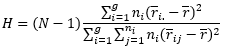

# Kruskal-Wallis rank sum test

 Typically, data sets with some continuous measurement that contain more
than two groups are compared using the [one-way Analysis of Variance
(ANOVA1)](https://repub.github.io/DLC_statistical_guides/docs/Info/one-way-ANOVA).
For instance, we may be interested in determining if the abundances of
Phosphorous in soils are the same among three different sites, or if the
height of specific plant species grown for 8-weeks differs between four
different temperature conditions. However, there are instances when the
ANOVA1 may not be appropriate, such as when the data is
ordinal or there are certain assumptions for the ANOVA1 that
are violated, specifically when the groups are not approximately normal
distributions, has outliers, or is an unbalanced design with unequal
variances. In these cases we can instead apply the Kruskal-Wallis rank
sum test, which as a non-parametric test has a different set of
assumptions:

-   the dependent variable is **ordinal** or **continuous**,
-   the observations are **independent** and **randomly sampled** from
    the population,
-   each group consists of **at least 5 observations**,
-   and the distributions for each group have the **same shape** (are
    **symmetrical**).

 When these assumptions are met we can apply the Kruskal-Wallis rank sum
test to statistically test the following null and alternative
hypotheses:

<i>H0</i>: The population medians are equal

<i>HA</i>: At least one of the population medians are not
equal with the other medians

 

 Similar with the ANOVA1, which calculates an F-statistic to
approximate a p-value from an F-distribution, the Kruskal-Wallis rank
sum test calculates an H-statistic to approximate a p-value from a
χ2 distribution with <i>g</i> - 1 degrees of freedom, where
<i>g</i> is the number of groups. This H-statistic is calculated by the
formula:

 

where <i>N</i> is the total number of observations, <i>ni</i>
is the number of observations in group <i>i</i>, <i>r̄i.</i>
is the average rank of all the observations in group <i>i</i>,
<i>r̄ij</i> is the rank of observation <i>j</i> from group
<i>i</i>, and <i>r̄</i> is the average of all <i>r̄ij</i>.

 Note that results from the Kruskal-Wallis rank sum test can only be
used to determine whether at least one of the groups has a distribution
that is different from at least one of the other groups. Like the
ANOVA1, post-hoc pairwise comparison tests are needed to
determine which of those groups have statistically different
distribution from one another. Common post-hoc tests for the
Kruskal-Wallis rank sum test include the [Dunn’s test]() and the
[Mann-Whitney U
test](https://repub.github.io/DLC_statistical_guides/docs/Info/Mann-Whitney-Wilcoxon)
with corrections.
