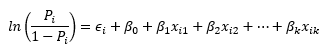

```{r setup, include=FALSE}
knitr::opts_chunk$set(echo = TRUE)
```

# Binary Logistic (Logit) Regression

&emsp;When our response variable has only two outcomes (binary) we can estimate the log of odds for which of the two outcomes an observation may fall in from a set of predictors using binary logistic regression.  For example, we may poll voters on whether they agree or disagree with a proposed bill, or we may test whether a new drug prevents ticks from biting dogs (yes or no).

&emsp;The logit model estimates the probabilities of the two outcomes occurring based on the estimated regression coefficients then classifies (predicts) the outcome that has the highest probability (>50%) for each observation.  The logit regression model equation has the formula:

<center>

</center><br>

where <i>P<sub>i</sub></i> is the probability of an event occurring for observation *i*, <i>&varepsilon;<sub>i</sub></i> is the error term for observation *i*, <i>&beta;<sub>.</sub></i> are the regression coefficients for *k* variables with <i>&beta;<sub>0</sub></i> representing the intercept, and <i>x<sub>i.</sub></i> the value for variable *k* in observation *i*.  The natural log (*ln*) of the probabilities in the left quantity are known as a logit, or the log odds that the event occurs, while the regression coefficients indicate by how much and in which direction the log odds change given a change in the respective independent variable.

&emsp;The assumptions for logit regression include:

* the observations are **independent** and **randomly sampled**,
* **little to no multicollinearity exists** among the predictor variables,
* there are **no extreme outliers or influential points**, 
* the **sample size is sufficiently large**, and
* a **linear relationship exists** between any continuous predictor variables and the logit transformation of the response variable.

&emsp;The first assumption is valid through study design, where the values of independent variables do not depend on another variable, and sampling method that randomly selects observations is chosen.  Multicollinearity, outliers, and influential points can be assessed after model fitting similar to linear regression.  There is no exact minimum number of observations required for logit regression, however [some studies suggest](https://bmcmedresmethodol.biomedcentral.com/articles/10.1186/1471-2288-14-137) at least 20 observations per independent variable is necessary for a stable model.  The linear relationship between the predictor varaibles and logit transformed response varaible can be assessed with the Box-Tidwell Transformation Test, which uses interaction terms for each variable and its natural log transformation to assess nonlinearity within the model, though can be ignored with a large sample size.

&emsp;Logit regression tests similar null and alternative hypotheses as linear regression, specifically whether any of the coefficients for the independent variables are non-zero.  These statistical hypotheses can be written as:

&emsp;**Null hypothesis:** The estimated coefficient <i>&beta;</i> for variable *i* is equal to 0.
&nbsp;
<center><i>H<sub>0</sub></i>:<i> &#946;<sub>i</sub> </i>=<i> 0</i></center>
&nbsp;

&emsp;**Alternative hypothesis:** <i>&beta;<sub>i</sub></i> is not equal to 0.
&nbsp;
<center><i>H<sub>A</sub></i>:<i> &#946;<sub>i</sub> </i>&#8800;<i> 0</i>, or<i> H<sub>A</sub></i>:<i> &#946;<sub>i</sub> </i>&gt;<i> 0 </i>or<i> &#946;<sub>i</sub> </i>&lt;<i> 0</i></center>
&nbsp;

&emsp;These hypotheses can be tested through the Wald test, where the square of each estimated coefficient divided by its standard error is compared with a &chi;<sup>2</sup> distribution with 1 degree of freedom.  However, this method can be unreliable with small sample sizes and variables with large estimated coefficients.  Likelihood ratio tests can be an alternative method for testing these hypotheses when there is concern that the Wald test may be unreliable.

&emsp;Unlike linear regression, a p-value estimated from a F-statistic calculated by the sum of squares is not viable.  Instead, goodness of fit tests, such as the &chi;<sup>2</sup> goodness of fit test or the Hosmer-Lemeshow test, are needed to determine how well the overall model fits the data.  In these tests, a significant p-value would indicate that the model does not describe the response variable well, or that the values for the response variable are significantly different from the values predicted by the model.