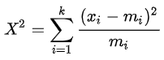

```{r setup, include=FALSE}
knitr::opts_chunk$set(echo = TRUE)
```

# The Chi-square (&chi;<sup>2</sup>) Test

&emsp;Pearson's &chi;<sup>2</sup> test of independence (or the &chi;<sup>2</sup> goodness-of-fit test) can be used when we have some variables that can be divided into two or more categories from which we want to determine if there are differences among them.  For example, we may want to determine if a sample of seniors from two separate universities have differing opinions (positive, negative, or neutral) on their college experience, or whether three brands of a medication are preferred by different socioeconomic classes (lower-, middle-, and upper-class).

&emsp; The &chi;<sup>2</sup> test compares the observed counts (your data) with the expected counts if the data came from the same distributions.  The null (<i>H<sub>0</sub></i>) and alternative (<i>H<sub>A</sub></i>) hypotheses to be tested are:

<center><i>H<sub>0</sub></i>: The variables have the same distributions</center>
<center><i>H<sub>A</sub></i>: There is a significant difference in the distribution of at least one of the variables</center>
<br>

&emsp;Before using the &chi;<sup>2</sup> test to test association (or independence) we should make sure we meet the following conditions:

* The data is in **non-transformed counts or frequencies (not percentages)**
* Each level is **mutually exclusive**
* Each subject or observation can **only contribute once**
* The **expected values should be >5 for at least 80% of the cells and none should be < 1**
* **No cells in the contingency table are 0**

&emsp;When either of the last two conditions are not satisfied then the [Fisher-exact test](https://tylerbg.github.io/DLC_statical_guides/docs/Info/Fisher-exact-test) should be considered instead.

&emsp;For each cell in the contengency table the &chi;<sup>2</sup> test will first calculate the differences between the expected and observed values, squares that difference, then divides by the expected counts.  The sum of those values is then calculated to give the &chi;<sup>2</sup>-statistic.  The formula for the  &chi;<sup>2</sup> test is:

<center>

</center>

where <i>x<sub>i</sub></i> and <i>m<sub>i</sub></i> are the observed and expected values, respectively.

&emsp;Once the &chi;<sup>2</sup>-statistic is calculated the corresponding p-value can be determined from the &chi;<sup>2</sup> distribution.  A p-value less than the chosen statistical threshold (typically &alpha; = 0.05) allows the null hypothesis to be rejected, to conclude that there is a statistically significant relationship between the observations in the categories and which variable they belong to.