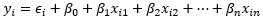

# Multiple Linear Regression (MLR)

 For data with a continuous response variable where we want to know the
significance, magnitude, and direction of more than one predictor
variable the single linear regression (SLR) model can be extended to a
multiple linear regression (MLR) model. While the response variable
should be continuous (or continuous-like) the predictor variables can
vary among many data types. For instance, we may want to predict the
height of trees (continuous) from the amount of water (continuous) and
type of fertilizer (nominal) given. Or, we could study how education
level (ordinal), age (continuous), and gender (binomial) may predict
income (continuous). Like SLR, MLR has the same LINE assumptions:

-   a **Linear relationship** exists between the response and predictor
    variables,
-   and the residuals (errors) are **Independent**, approximately
    **Normally distributed**, and have **Equal variance
    (Homoscedasticity)**

In addition to the LINE assumptions, MLR models assume:

-   there are **no significant outliers** or **high leverage points**,
-   the observations are **randomly selected** from the population,
-   and the independent variables have **little to no
    multicolinearity**.

 The assumption that the observations are randomly selected can be
validated prior to fitting a MLR model, however the remaining
assumptions generally must be assessed after the model has been fit.
Multicolinearity, which is colinearity among the predictor variables,
can be determined by calculating variance inflation factors (VIFs) for
each variable. It is commonly considered that VIF values greater than 5
indicate moderate colinearity that should be explored, while VIFs
greater than 10 indicate a problematic amount of colinearity that may
affect the model and results.

 The LINE assumptions and the assumption of no significant outliers or
high leverage points are typically assessed visually. Unlike the SLR
model which has one predictor, it is difficult to plot multiple
predictors together to assess whether a linear relationship exists, so
is typically assumed in MLR models unless there is reason not to. The
other assumptions can be assessed through diagnostic plots of the
residuals. These types of diagnostic plots can include plotting the
residual errors against the fitted values, normal quantile-quantile
(Q-Q) plots, and Cook’s distance plots (or plotting the residuals
against their leverage).

 The MLR model formula is written as:

 

where <i>yi</i> is the response for observation <i>i</i>,
<i>ϵi</i> is the error term for each observation <i>i</i>,
<i>β0</i> is the intercept, <i>βn</i> is the
regression coefficient (slope) for the independent variable <i>n</i>,
and <i>xin</i> is the value for the independent variable
<i>n</i> at observation <i>i</i>.

 Both the significance of the overall model and of each independent
variable is tested through an Analysis of Variance (ANOVA). The adjusted
Sums of Squares (SSadj) is calculated for the whole model and
for each independent variable (which sums to the SSadj for
the overall model). The F-statistics are then used to approximate
p-values from the F-distribution. Additionally, the

 **Null hypothesis:** The estimated coefficient <i>β</i> for variable
*i* is equal to 0.  

<i>H0</i>:<i> βi </i>=<i> 0</i>

 

 **Alternative hypothesis:** <i>βi</i> is not equal to 0.  

<i>HA</i>:<i> βi </i>≠<i> 0</i>, or<i>
HA</i>:<i> βi </i>&gt;<i> 0 </i>or<i>
βi </i>&lt;<i> 0</i>

 
