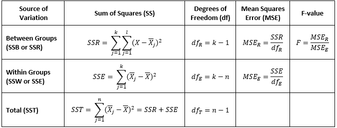

# One-way Analysis of Variance (ANOVA1)

 The ANOVA1 is a commonly used method for statistically
comparing the means of some continuous measurement between more than two
groups. For example, we may want to know if four native species of trees
accumulate Lead differently from contaminated soil, or whether the
expression of some protein differs in endothelial cells provided three
separate treatments. The assumptions of the ANOVA1 include:

-   the data are **continuous**,
-   the observations are **independent**,
-   each factor is **approximately normally distributed**,
-   there are no **significant outliers** or **high-leveradge points**,
-   and the distributions of the factors have **equal variances**.

 If the assumptions that the groups follow an approximately normal
distribution is violated or if there are significant outliers then
rank-based, non-parametric tests, such as the [Kruskal-Wallis
test](https://repub.github.io/DLC_statistical_guides/docs/Info/Kruskal-Wallis),
may instead be valid. Additionally, while the assumption of equal
variances can at times be violated, when the ANOVA1 design is
unbalanced (the groups have different numbers of observations) then
non-parametric tests may also be preferred.

 The ANOVA1 tests the null and alternative statistical
hypotheses:

<i>H0</i>: <i>μ1</i> = <i>μ2</i> = … =
<i>μj</i> for all <i>j</i> groups (The population means are
equal.)

<i>HA</i>: At least one of the population means are not equal
with at least one of the other means

 

 The ANOVA method calculates what is known as a F-statistic by:

1.  calculating the sum of squares (SS) differences between each group
    (SSB also known as SSR for regression sum of squares), within each
    group (SSW also known as SSE for error sum of squares), and the
    total sum of squares (SST), which for the ANOVA1 are the
    sum of the between- and within-group SS,
2.  determining the degrees of freedom (df),
3.  calculating the mean squared errors (MSE) by dividing each SS by
    their respective df,
4.  calculating an F-value by dividing the MSE for the between groups
    with the MSE for the within groups.

An example ANOVA1 table and the formulas for each calculation
is:

 

 From the F-value, an approximated p-value is then derived from the
F-distribution. A p-value that falls below the chosen statistical
threshold (typically α = 0.05) is considered statistically significant,
where the null hypothesis can be rejected in favor of the alternative.
However, the ANOVA1 does not indicate which group means
differ from one another, only that at least one of the group means are
different statistically. To determine which specific group means
statistically differ then a post-hoc pairwise comparison test is needed.

 The most common post-hoc pairwise comparison test is Tukey’s Honestly
Significant Difference (HSD) test (which does not need to follow a
statistically significant ANOVA1 result as the test already
controls for Type I errors). Tukey’s HSD test is most valid when the
assumption of equal variance is valid, otherwise the Games-Howell post
hoc test may be more appropriate. Alternatively, pairwise t-tests using
the Bonferroni, Benjamini-Hocheburg, Waller-Duncan, or a number of other
multiple test correction methods can be used.
