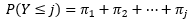
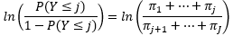
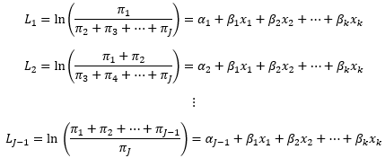

```{r setup, include=FALSE}
knitr::opts_chunk$set(echo = TRUE)
```

# Ordinal Logistic Regression (OLR)

&emsp;When a dependent variable is ordinal, a categorical variable with ordered levels, OLR, also known as the proportional-odds cumulative logit model, can be used to predict its value using one or more independent variables.  For example, a nutritionist may want to determine if age influences a client's likelihood of eating breakfast assessed by a 5-point scale ranked from unlikely to likely.  Or, a health insurance company may want to predict what plan (bronze, silver, gold, or platinum) should be offered based on an applicant's socioeconomic and health status.

&emsp;OLR is an extension of binary logistic regression to include more than two levels in the response wherein the cumulative probabilities are modeled so that the entire range of ordinal levels are binary.  That is, the cumulative probability of an event less than or equal to event *j*, or <i>P(Y &le; j)</i>, is:

<center>

</center><br>

where <i>&pi;</i> represents the probability for each event up to event *j*.  The cumulative logit for a number of events *J* can then be defined as:

<center>

</center><br>

or the natural log of the cumulative probabilities of an event less than or equal to *j* divided by the cumulative probabilities of an event greater than *j*.  Because each cumulative probability is modeled so that the range of ordinal levels are binary, *J - 1* logit equations (*L.*), and are defined by:

<center>

</center><br>

where <i>&alpha;<sub>.</sub></i> defines the intercept for each logit, <i>&beta;<sub>.</sub></i> is the coefficient for variable *k*, and <i>x<sub>.</sub></i> is the value for variable *k*.  Note that the variable coefficients (slopes) are the same in each logit equation while the intercepts, which define the log-odds of an event less than or equal to *j* when all of *x* equal 0, differ.  Because of the cumulative logits that define the OLR model, a fundamental assumption for OLR is that of **proportional odds**, or that each independent variable has a constant effect for each change in the level of the response variable.  If this assumptions is not valid then a [multinomial logistic regression](../multinomial-logistic-regression) model may instead be appropriate.  Other assumptions for OLR are similar to those of binary logistic regression:

* the observations are **independent** and **randomly sampled**,
* **little to no multicollinearity exists** among the predictor variables,
* there are **no extreme outliers or influential points**, and
* the **sample size is sufficiently large**.

&emsp;The first assumption is valid through study design, where the values of independent variables do not depend on another variable, and sampling method that randomly selects observations is chosen.  Multicollinearity, outliers, and influential points can be assessed after model fitting similar to linear regression.  Similar with binary logistic regression, no exact minimum number of observations is required, however it is likely that at least 20 observations per independent variable would be necessary for a stable model.

&emsp;OLR tests similar null and alternative hypotheses as linear and logit regression, specifically whether any of the coefficients for the independent variables are non-zero.  These statistical hypotheses can be written as:

&emsp;**Null hypothesis:** The estimated coefficient <i>&beta;</i> for variable *i* is equal to 0.
&nbsp;
<center><i>H<sub>0</sub></i>:<i> &#946;<sub>i</sub> </i>=<i> 0</i></center>
&nbsp;

&emsp;**Alternative hypothesis:** <i>&beta;<sub>i</sub></i> is not equal to 0.
&nbsp;
<center><i>H<sub>A</sub></i>:<i> &#946;<sub>i</sub> </i>&#8800;<i> 0</i>, or<i> H<sub>A</sub></i>:<i> &#946;<sub>i</sub> </i>&gt;<i> 0 </i>or<i> &#946;<sub>i</sub> </i>&lt;<i> 0</i></center>
&nbsp;

&emsp;These hypotheses can be tested using multiple methods, but commonly either the Wald test, where the square of each estimated coefficient divided by its standard error is compared with a &chi;<sup>2</sup> distribution with 1 degree of freedom, or when the sample size is large a t-test which calculates a t-statistic to approximate a p-value based on the standard normal distribution.  To test the overall fit of the model, the &chi;<sup>2</sup> goodness of fit test can be employed where a significant p-value would indicate that the model does not describe the response variable well, or that the values for the response variable are significantly different from the values predicted by the model.