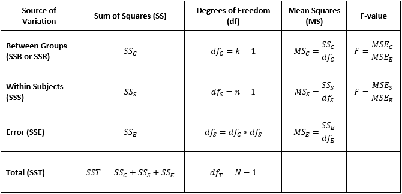

# Repeated Measures Analysis of Variance (ANOVA)

 As the one-way ANOVA is an extension of the t-test to compare the means
of three or more groups, the repeated measures ANOVA is an extension of
the paired t-test wherein the same subjects are observed in each group.
Repeated measures ANOVA are often used when measuring some variable in
subjects over a period of time. For example, we could use the repeated
measures ANOVA to compare the weights of participants at the beginning,
middle, and end of a weight loss program. The repeated measures ANOVA
could also be used in instances where the same subjects undergo
different conditions, such as measuring blood pressure after given
different dosages of some new theraputic drug.

 The repeated measures ANOVA has the same assumptions as the one-way
ANOVA in addition to the assumption of **sphericity**, or that the
variances for the differences between all combinations of related groups
must be equal. This assumption can be tested using Mauchly’s Test of
Sphericity, and if the assumptions of sphericity is violated then a
correction to the degrees of freedom should be made.

 Since the repeated measures ANOVA compares group means, the null
(<i>H0</i>) and alternative (<i>HA</i>) hypotheses
are similar to those for the one-way ANOVA:

<i>H0</i>: <i>μ1</i> = <i>μ2</i> = … =
<i>μj</i> for all <i>j</i> groups (The population means are
equal.)

<i>HA</i>: At least one of the population means are not equal
with at least one of the other means

 

 With the repeated measures ANOVA the sum of squares (SS) table includes
a new row that calculates the differences between subjects
(SSS), although this row is not always provided in the output
from statistical software because it is usually of no interest.

 

 Because the repeated measures ANOVA takes into account the differences
between the subjects the approach ends up have greater power than the
one-way ANOVA. This is because some of the variability that would have
been attributed to random error is instead accounted for by having the
same subjects, thereby reducing the mean squared error (MSE)
and thus increasing the F-statistic and lowering the approximated
p-value for the between group differences.

 Also similar with the one-way ANOVA, if <i>H0</i> is
rejected the group or groups with means that differ from one another are
not identified. Instead, post-hoc pairwise comparisons tests can be
employed, such as paired t-tests with multiple test corrections.
