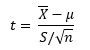
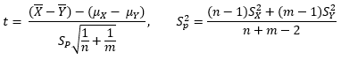
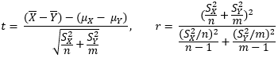

```{r setup, include=FALSE}
knitr::opts_chunk$set(echo = TRUE)
```

# T-tests

&emsp;Suppose we are interested in testing whether one sample mean deviates from some set value or if the means from two samples are unequal.  In these cases we can rely on the t-test, which is based on calculating a t-statistic that can be used, along with the degrees of freedom, to estimate a p-value from the t-distribution.  This is because when we use t-tests, we are assuming that the population variance is unknown (which is almost always the case).  If the population variance is known however, then a z-test would be more appropriate.

&emsp;Prior to running and interpreting a t-test, the following assumptions should be valid:

* The data is continuous,
* is approximately normally distributed,
* has no significant outliers or points with high leverage,
* is randomly sampled from the population,
* and is independent (in the case of two-sample tests).

&emsp;If the assumption of an approximately normal distribution is violated, or if the data is ordinal rather than continuous, then rank-based, nonparametric tests such as the [Mann Whitney & Wilcoxon Tests](https://repub.github.io/DLC_statistical_guides/docs/Info/Mann-Whitney-Wilcoxon) may be appropriate instead.  Alternatively, thanks to the Central Limit Theorem, when there are enough observations (n >= 30) then we can ignore this violation and continue with the t-test.

&emsp;It is also important to note that t-tests can be one- or two-tailed.  One-tailed t-tests are more common with one-sample t-tests when we are testing whether the population mean of the sample is above or below some threshold, while two-tailed t-tests are typical when we are comparing two samples and have no prior knowledge of which may have a mean greater than the other.

### One-sample t-test

&emsp;For the situation where we have data from one sample and wish to test whether its distribution is derived from a population with a specific mean, then we can apply the one-sample t-test.  For example, we may be interested whether the systolic blood pressures from a sample of hypertensive patients given a drug are below 140 mmHg (one-tailed test), or whether the average scores on a math test are above or below 70% (two-tailed test).  The test statistic (t-value) for the one-sample t-test is calculated by:

<center>

</center><br>

Where <i>X&#772;</i> is the sample mean, <i>&mu;</i> is the value for the population mean that we are testing against, <i>S</i> is the standard deviation of the sample, and <i>n</i> is the number of observations.  In the case of blood pressure, the null and alternative hypotheses are:

<center><i>H<sub>0</sub></i>: <i>&mu;<sub>BP</sub></i> &ge; <i>140<br>
H<sub>A</sub></i>: <i>&mu;<sub>BP</sub></i> &lt; <i>140</i></center>

### Two-sample t-test

&emsp;Alternatively, we may have data from two different groups that we wish to see if they have the same mean or different means.  For instance, we could be comparing blood pressures between patients given a new drug against those given a placebo, or whether students who took an AP math course performed better on a math test compared to those who did not.  As long as the assumptions above are met, or if we have a large enough number of observations (typically n >= 30), then a two-sample t-test may be appropriate.

&emsp;When calculating the test statistic (t-value) for the two-sample t-test, we can either assume that the population variances of the two samples are equal or unequal.  In the case where we assume that the population variances are equal then we can pool the sample variances to then calculate the t-value as:

<center>

</center><br>

where <i>X&#772;</i> and <i>Y&#772;</i> are the sample means, <i>&mu;<sub>X</sub></i> and <i>&mu;<sub>Y</sub></i> are the population means (the difference of which is equal to 0 when our null hypothesis is that the population means are equal), <i>S<sub>p</sub></i> is the pooled standard deviation, <i>S<sup>2</sup><sub>X</sub></i> and <i>S<sup>2</sup><sub>Y</sub></i> are the variances for the two samples, and <i>n</i> and <i>m</i> are the number of observations in the two samples.

&emsp;If we instead assume that the population variances are not equal then we adjust the equation for calculating the t-value and calculate the adjusted degrees of freedom (<i>r</i>), both of which are used to approximate a p-value as follows:

<center>

</center><br>

Since computer software will be doing the computation for you, population variances are typically unknown, and because if the variances are equal then both equations will give approximately the same p-value, it is usually best to go with the assumption that the population variances are unequal.  For comparing the blood pressures between patients, the null and alternative hypotheses would be written as:

<center><i>H<sub>0</sub></i>: <i>&mu;<sub>BP-placebo</sub></i> = <i>&mu;<sub>BP-drug</sub><br>
H<sub>A</sub></i>: <i>&mu;<sub>BP-placebo</sub></i> &ne; <i>&mu;<sub>BP-drug</sub></i></center>

### Paired t-test

&emsp;There are other occasions where we have two samples that we wish to compare, however they come from the same individuals.  For example, we may have recorded systolic blood pressure from patients while they are on a placebo then while they are on a novel therapy, or compare math test scores before and after a tutoring program.  In the case of the blood pressures, the null and alternative hypotheses would look the same as the two-sample t-test, however when calculating the test statistic the paired nature of the data will be taken into account.  This can be more powerful than the unpaired t-test as the differences within each individual are accounted for.