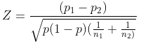

```{r setup, include=FALSE}
knitr::opts_chunk$set(echo = TRUE)
```

# Comparing Two Proportions

&emsp;Sometimes when we sample data from two populations we are interested in whether those two populations differ on some binary (only two outcomes) variable.  For example, we may be interested if Democrat and Republican senators vote differently (either yes or no) on a bill, or whether smokers and non-smokers believe that cigarettes should be taxed to fund health care (agree or disagree).  For these questions we can compare the population proportions with the following hypotheses:

&emsp;**Null hypothesis:** The proportions of the two variables are the equal.
<center><i>H<sub>0</sub>: p<sub>1</sub> = p<sub>2</sub></i></center>
<br>

&emsp;<b>Alternative hypothesis:</b> The proportions of the two variables are not equal.
<br>
<center><i>H<sub>A</sub>: p<sub>1</sub> &ne; p<sub>2</sub></i></center>
<br>

&emsp;To statistically test the equality of two proportions the following assumptions should be valid.

- The data was gathered by **simple random sampling**
- The two samples are **independent**
- Both groups follow a **binomial distribution**

&emsp;To compare the proportions, a z-statistic is first calculated in the equation:

<center>

</center>
<br>

where <i>p</i><sub>1</sub> and <i>p</i><sub>2</sub> are the proportions from the first and second populations, <i>n</i><sub>1</sub> and <i>n</i><sub>2</sub> are their sample sizes, and <i>p</i> is the pooled proportion from the two populations.

&emsp;Once the z-statistic is calculated the corresponding p-value can be determined from the z-distribution.  A p-value less than the chosen statistical threshold (typically &alpha; = 0.05) allows the null hypothesis to be rejected, to conclude that there is a statistically significant difference in the proportions between the two populations.