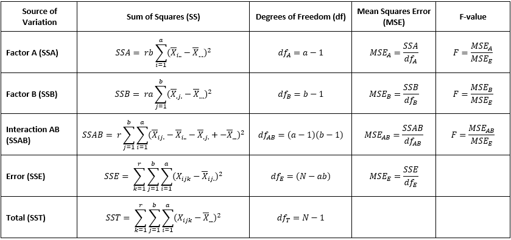

## Two-way Analysis of Variance (ANOVA2)

 For data sets with two factors the ANOVA2 can be a powerful
statistical tool. For example, we may hypothesize that happiness scores
vary by gender (male or female) and socioeconomic bracket (lower-,
middle-, and upper-class), or that levels of water pollution in
reservours differ by season (winter, spring, summer, and fall) and the
local community type (village, town, or city). Similar to the
ANOVA1, the ANOVA2 has the following assumptions:

-   The data are **continuous**,
-   the observations are **randomly sampled** from the population,
-   each factor is **approximately normally distributed**,
-   there are no **significant outliers** or **high-leveradge points**,
-   and there are **equal variances** among the groups.

 The ANOVA2 tests the following null and alternative
statistical hypotheses for each factor and their interaction:

1.  Is there a difference in the population means for Factor A
    (<i>α</i>)?

    

    <i>H0</i>: α1 = α2 = … =
    αn

    

    <i>HA</i>: at least one <i>αi</i> is not equal
    to at least one other <i>αi</i>

    

     

2.  Is there a difference in the population means for Factor B
    (<i>β</i>)?

    

    <i>H0</i>: β1 = β2 = … =
    βn

    

    <i>HA</i>: at least one <i>βi</i> is not equal
    to at least one other <i>βi</i>

    

     

3.  Is there an interaction between Factors A and B?

    

    <i>H0</i>: Factors A and B do not influence one another

    

    

    <i>HA</i>: Factor A is influenced by Factor B, and vice
    versa

    

     

 The ANOVA method calculates what is known as a F-statistic by:

1.  calculating the sum of squares (SS) differences between each of the
    two factors A and B (SSA and SSB), the SS for the interaction
    between factors A and B (SSAB), within each group (SSW also known as
    SSE for error sum of squares), and the total sum of squares (SST),
    which for the ANOVA1 are the sum of the between- and
    within-group SS,
2.  determining the degrees of freedom (df),
3.  calculating the mean squared errors (MSE) by dividing each SS by
    their respective df,
4.  calculating an F-value by dividing the MSE for the between groups
    with the MSE for the within groups.

An example ANOVA1 table and the formulas for each calculation
is:

 

 From the F-value, an approximated p-value is then derived from the
F-distribution. A p-value that falls below the chosen statistical
threshold (typically α = 0.05) is considered statistically significant,
where the null hypothesis can be rejected in favor of the alternative.

 Note that the primary purpose of using an ANOVA2 over two
separate ANOVA1s for each factor is to test whether there is
an interaction between those two factors and should be checked first in
the results. A statistically significant interaction term would indicate
that Factor A influences Factor B (and vice versa), thus interpreting
the other effects would be misleading. Post-hoc tests, such as Tukey’s
Honestly Significant Difference (HSD) test, can report the simple main
effects of the interaction, or the difference in Factor A at each level
of Factor B and the difference in Factor B at each level of Factor A.

 If the interaction term is not significant, then you do not need to run
a new model without the interaction term but can continue with
interpreting the main effects. The ANOVA2 does not indicate
which group means differ from one another, only that at least one of the
group means are different statistically. To determine which specific
group means statistically differ then a post-hoc pairwise comparison
test is needed. Tukey’s HSD test is most valid when the assumption of
equal variance is valid, otherwise the Games-Howell post hoc test may be
more appropriate. Alternatively, pairwise t-tests using the Bonferroni,
Benjamini-Hocheburg, Waller-Duncan, or a number of other multiple test
correction methods can be used.
