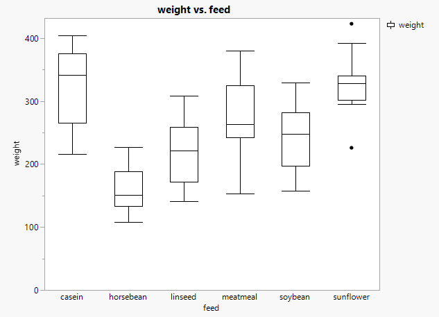
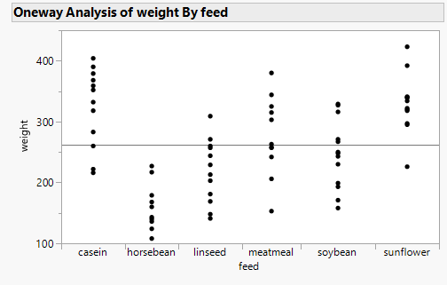
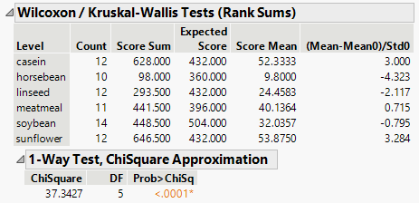
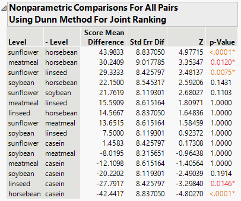

```{r setup, include=FALSE}
knitr::opts_chunk$set(echo = TRUE)
```

# Kruskal-Wallis rank sum test

&emsp;Typically when we have more than two treatments we are interested in comparing we apply the one-way ANOVA.  However, when we decide that the one-way ANOVA may not be appropriate, such as when certain assumptions are violated or we have an unbalanced design with unequal variances, we can instead apply the Kruskal-Wallis rank sum test.  Because the Kruskal-Wallis test is a non-parametric test we do not need to meet certain assumptions that accompany the parametric one-way ANOVA, such as equal variances and normally distributed data.

&emsp;For this example we will be using the `chickwts` data set that is supplied in R but provided in [JMP format here](https://github.com/tylerbg/DLC_stat_resources/tree/master/docs/JMP/dat/chickwts.jmp).  The data set includes chick weights measured in grams (*weight*) for 71 chicks after being fed one of six supplemented feeds (*feed*) for six weeks and are presented in the figure below.

<center>

</center>
<br>

&emsp;From the plot above we might hypothesize that there are differences in the chick weights after being fed some of these supplemented feeds for 6 weeks.  In particular, we might suggest that the horsebean feed leads to lower chick weights than the other feeds.

&emsp;To use the Kruskal-Wallis test we can select `Analyze -> Fit Y by X` then add *weight* to the *Y, Response* box and *feed* to the *X, Factor* box.  After selecting *OK* we are given a dot plot with a horizontal line representing the grand mean of the data.

<center>

</center>
<br>

&emsp;To get summary statistics from a Kruskal-Wallis test we can select the red down arrow next to *Oneway Analysis of weight By feed* then select `Nonparametric -> Wilcoxen Test`.

<center>

</center>
<br>

&emsp;From the results presented in the *1-Way Test, ChiSqaure Approximation* table we can see that at least one of the variables has a distribution that is significantly different from at least one of the other variables.  Like the one-way ANOVA however, while the Kruskal-Wallis test indicaets that there are statistically significant differences among some of the variables it does not identify which variables are different from one another.  We will need to use a post-hoc pairwise comparison test, for which the Dunn's test is a commonly used post-hoc test for nonparametric tests.  To use the Dunn's test, we need to click the red arrow again next to *Oneway Analysis of weight By feed* then select `Nonparametric -> Nonparametric Multiple Comparisons -> Dunn All Pairs for Joint Ranks`.

<center>

</center>
<br>

&emsp;The results from the Dunn's tests indicate that out of the 15 pairwise comparisons 5 have statistically significant differences, which include:

* sunflower > horsebean
* meatmeal > horsebean
* sunflower > lineseed
* linseed < casein
* horsebean < casein

&emsp;Therefore, we could interpret these results to conclude that sunflower, meatmeal, and casein feeds provided chicks with the highest weights while the linseed and horsebean fed chicks had the lowest weight after six weeks.  We could then follow-up with a cost-benefit analysis to determine which of the feeds would produce chicks with the greatest weight at the lowest cost.