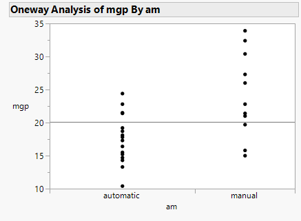

```{r setup, include=FALSE}
knitr::opts_chunk$set(echo = TRUE)
```

# Mann-Whitney U & Wilcoxon signed-rank tests

&emsp;When we have an ordinal dependent variable or a continuous variable that does not meet the assumptions of the t-test, we can look to the Mann-Whitney U test (also known as the Wilcoxon rank sum test).  If the groups are paired then the Wilcoxon signed-rank test replaces the paired t-test as a non-parametric alternative.  This means that while these tests do make the assumption that the two samples come from similarly shaped (symmetrical) distributions, those distributions do not need to be normally distributed (parametric).  

### Mann-Whitney U test

&emsp;In this example we will use the `mtcars` data set that is provided in base R and supplied as a [JMP data table here](https://github.com/tylerbg/DLC_stat_resources/tree/master/docs/JMP/dat/mtcars.jmp).  The data set includes 10 aspects of automobile design and performance for 32 automobile models built between 1973 and 1974.  We will specifically be interested in whether there are differences in miles per gallon (*mpg*) between the two types of transmission (*am*), automatic and manual.

&emsp;To statistically determine if there are differences between these two types of transmissions we will use the Mann-Whitney U test.  First, we select `Analyze -> Fit Y by X` and add *mpg* to the *Y, Response* box and *am* to the *X, Factor* box then select *OK*.

<center>

</center>
<br>

&emsp;Next, we can select the red down arrow next to *Oneway Analysis of mpg By am* then select `Nonparametric -> Wilcoxon Test`.

<center>

</center>
<br>

&emsp;

### Wilcoxon signed-rank test

&emsp;In the case that our data is paired the Mann-Whitney U test is no longer viable, so instead we should apply the Wilcoxon signed-rank test.  In the [Student's Sleep Study](https://github.com/tylerbg/DLC_stat_resources/tree/master/docs/JMP/dat/sleep.jmp) a table that contains data from 10 patients (*ID*) who were given two soporific drugs (*group*) to assess whether they experienced an increase in hours of sleep (*extra*).  