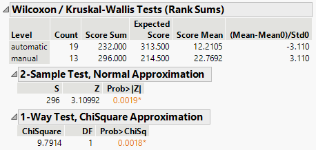
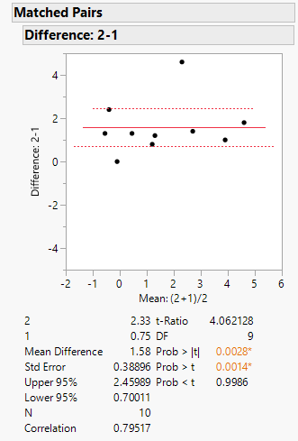
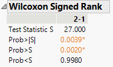

```{r setup, include=FALSE}
knitr::opts_chunk$set(echo = TRUE)
```

# Mann-Whitney U & Wilcoxon signed-rank tests

### Mann-Whitney U test

&emsp;In this example we will use the `mtcars` data set that is provided in base R and supplied as a [JMP data table here](https://github.com/tylerbg/DLC_stat_resources/tree/master/docs/JMP/dat/mtcars.jmp).  The data set includes 10 aspects of automobile design and performance for 32 automobile models built between 1973 and 1974.  We will specifically be interested in whether there are differences in miles per gallon (*mpg*) between the two types of transmission (*am*), automatic and manual.

&emsp;To statistically determine if there are differences between these two types of transmissions we will use the Mann-Whitney U test.  First, we select `Analyze -> Fit Y by X` and add *mpg* to the *Y, Response* box and *am* to the *X, Factor* box then select *OK*.

<center>

</center>
<br>

&emsp;Next, we can select the red down arrow next to *Oneway Analysis of mpg By am* then select `Nonparametric -> Wilcoxon Test`.

<center>

</center>
<br>

&emsp;

### Wilcoxon signed-rank test

&emsp;In the case that our data is paired the Mann-Whitney U test is no longer viable, so instead we should apply the Wilcoxon signed-rank test.  In the [Student's Sleep Study](https://github.com/tylerbg/DLC_stat_resources/tree/master/docs/JMP/dat/sleep.jmp) a table that contains data from 10 patients (*ID*) who were given two soporific drugs (*group*) to assess whether they experienced an increase in hours of sleep (*extra*).

&emsp;Before we fit the Wilcoxon signed-rank test however we will need to transform our data so that the values recorded in *extra* are split into two columns, one for each *group* and with each row being one of the participants.  To do so, we can select `Tables -> Split` and in the resulting pop-up window place *group* in the *Split By* box and *extra* in the *Split Columns* box.  We can choose to keep the *ID* variable by selecting *Keep All* under *Remaining columns*, though it will not be required to properly reformat the data or run the test.  After selecting *OK* a new data table with *extra* reformatted into two columns labeled *1* and *2* for groups 1 and 2.

&emsp;Now we can run the Wilcoxon signed-rank test by selecting `Analyze -> Specialized Modeling -> Matched Pairs` then placing the *1* and *2* columns (prefereably in order) into the *Y, Paired Response* box and selecting *OK*.

<center>

</center>
<br>

&emsp;In the print out we are given a plot with points for the differences between the two treatments for each participant with red lines representing the mean of those differences and upper and lower 95% confidence intervals.  Below the plot we are provided summary statistics for those differences and the results from a paired t-test.  To run a Wilcoxon signed-rank test we need to click the red arrow next to *Matched Pairs* then select `Wilcoxon Signed Rank`.

<center>

</center>
<br>

&emsp;In this output we are provided the test statistic for the Wilcoxon signed rank test (S) and the corresponding p-values for the two-tailed (*Prob>|S|*) and the upper (*Prob>S*) and lower (*Prob<S*) one-tailed tests.  Since we were interested in whether there were any differences in the amount of sleep between the two groups we will look at the results of the two-tailed test which indicates that there is a statistically significant difference between the two treatments.  Therefore, we can conclude that the second treatment increases the amount of sleep significantly more than the first treatment.