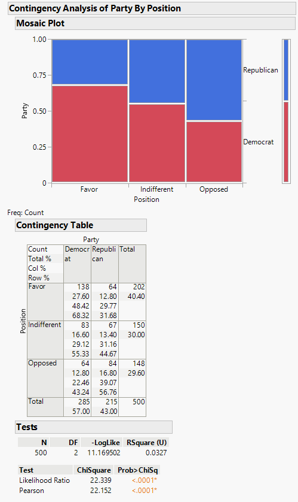

```{r setup, include=FALSE}
knitr::opts_chunk$set(echo = TRUE)
```

# The Chi-square (&chi;<sup>2</sup>) Test

&emsp;When our data includes two categorical variables, we can determine if there is a statistically significant relationship (or alternatively dependence) between them with the &chi;<sup>2</sup> test. WIth the &chi;<sup>2</sup> test, we compare the observed counts (our data) with the expected counts if the data came from the same distributions.

&emsp;For this tutorial we will use this [data set](https://github.com/tylerbg/DLC_stat_resources/tree/master/docs/JMP/dat/tax_reform.jmp) from an example offered in [STAT 500 Applied Statistics](https://online.stat.psu.edu/stat500/lesson/8) where participants were asked to give their party affiliation (*Democrat* or *Republican*) and their opinion on a tax reform bill (*Favor*, *Indifferent*, or *Opposed*).

<div align="center">
<table style="width:60%">
  <tbody>
    <tr>
      <td></td>
      <td><b>Favor</b></td>
      <td><b>Indifferent</b></td>
      <td><b>Opposed</b></td>
    </tr>
    <tr>
      <td><b>Democrat</b></td>
      <td><center>138</center></td>
      <td><center>83</center></td>
      <td><center>64</center></td>
    </tr>
    <tr>
      <td><b>Republican</b></td>
      <td><center>64</center></td>
      <td><center>67</center></td>
      <td><center>84</center></td>
    </tr>
  </tbody>
</table>
</div>

&emsp;The researcher wants to know whether a relationship exists between party affiliation and opinion, which corresponds to the following statistical hypotheses:

<center><i>H<sub>0</sub></i>: No relationship exists between party affiliation and opinion on the tax reform bill</center>
<center><i>H<sub>A</sub></i>: There is a significant relationship between party affiliation and opinion on the tax reform bill</center>
<br>

&emsp;To test these hypotheses with a &chi;<sup>2</sup> test we can first select *Analyze* -> *Fit Y by X*.  Then in the pop-up window we can add *Party* and *Position* to the *Y, Response* and *X, Factor* boxes, respectively, then add *Count* to the *Freq* box.  Note that the order of factors for the &chi;<sup>2</sup> is not important, so if you chose to respectively switch *Party* and *Position* to the *X, Factor* and *Y, Response* boxes you will receive the same results.  We can then select *OK* to run the &chi;<sup>2</sup> test.

<center>

</center>

&emsp;From the results of the &chi;<sup>2</sup> test, in the *Tests* table we can see that there is a statistically significant difference between how Democrats and Republicans view the proposed tax reform bill.  If we wish to see exactly how our participants' opinions differ between party lines we can click the red arrow next to *Contingency Analysis of Party By Position* then select *Analysis of Means for Proportions*.

<center>

</center>

&emsp;The above plot compares the proportion of Democrats who held each position compared to the average position, from which points outside the blue regions indicate statistically significant differences.  We can conclude that the Democratic respondents overall had more respondents that chose *Favor* and fewer who chose *Opposed* regarding the tax bill compared to their Republican counterparts.  There was not a statistically significant difference in the proportion of respondents that chose *Indifferent* between Democrat and Republican respondents.
