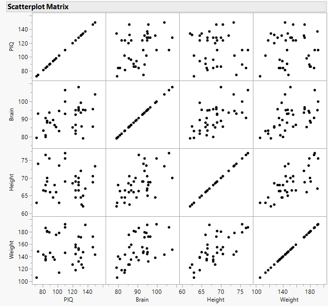
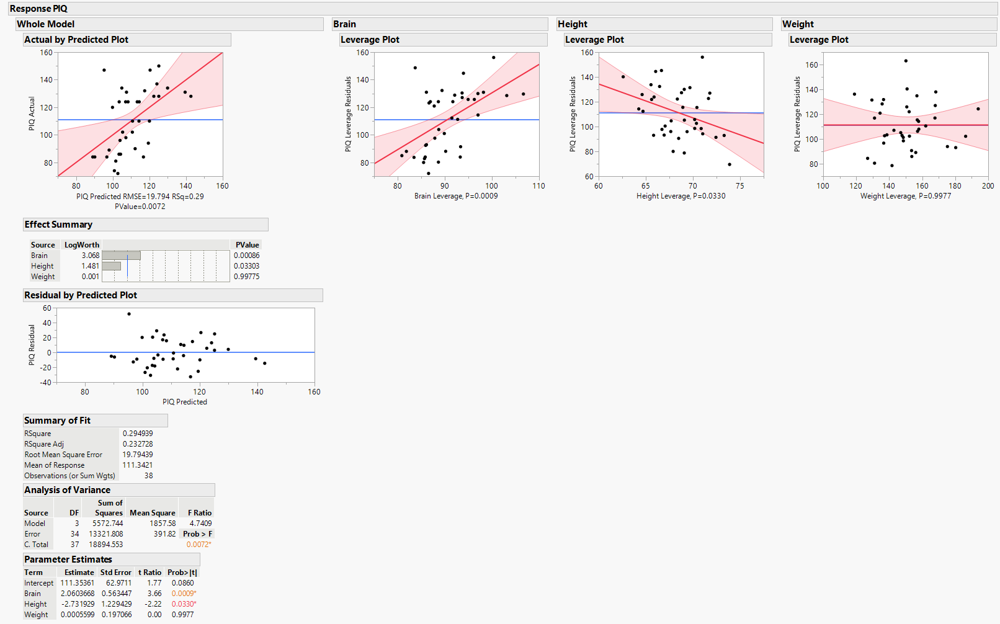

```{r setup, include=FALSE}
knitr::opts_chunk$set(echo = TRUE)
```

# Multiple Linear Regression (MLR)

&emsp;More than likely we will be interested in the relationship between some response variable and more than one explanatory variable.  This is because a single independent variable rarely fully explains some dependent variable.  In these cases, rather than fitting a simple linear regression (SLR) model for each explanatory variable we can employ MLR, an extension of SLR, to assess these relationships in one statistical model.

&emsp;In this example we will be using [this data set](https://github.com/tylerbg/DLC_stat_resources/tree/master/docs/JMP/dat/iqsize.jmp) originally provided by the [Example 5-1 of the STAT 501 Regression Methods course](https://online.stat.psu.edu/stat501/lesson/5/5.1) course that includes data on participant's performance IQ score (*PIQ*), brain size (*Brain*) measured from MRI scans and given as counts/10,000, and two variables on body size, *Height* in inches and *Weight* in pounds.

<center>

</center>

&emsp;Plotting each of the variables against one another we can see that *Height*, *Weight*, and *Brain* each appear to have some positive relationship with one another, but what about with *PIQ*?  There may be some relationships there, particularly with *Brain*, however it is difficult to tell for certain observationally.  Using MLR we can determine what relationships, if any, these three physical features have with the *PIQ* scores.

&emsp;To fit an MLR model in JMP we can select *Analyze* -> *Fit Model* and put *PIQ* in the *Y* box and *Brain*, *Height*, and *Weight* into the *Construct Model Effects* Box.  We can leave all of the options to their defaults and go ahead and select *Run* to fit the model.

<center>

</center>

&emsp;Within the print out of the model results, in the *Analysis of Variance* table we can see that the overall model has a statistically significant fit, from which in the *Summary of Fit* table we note that the r<sup>2</sup> is 0.295 to indicate that 29.5% of the variance in *PIQ* scores is explained by the MLR model.  Note that we are also given other model diagnostics such as the *Residual by Predicted Plot*, which indicates that there may be one possible outlier but otherwise the residual errors are apparently random.

&emsp;Next, we can check the *Parameter Estimates* table to note that *Brain* and *Height* are statistically significant predictors of *PIQ*, and from their estimated coefficients under *Estimate* we see that those relationships are positive and negative, respectively.  Conversely, *Weight* did not have a statistically significant relationship with *PIQ* scores.  We can conclude that for every unit increase in brain size the expected PIQ score increases by 2.06 while every inch increase in height reduces the expected PIQ score by -2.73.