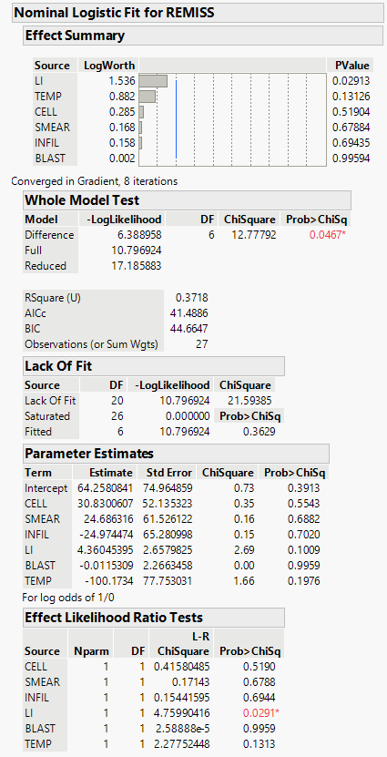
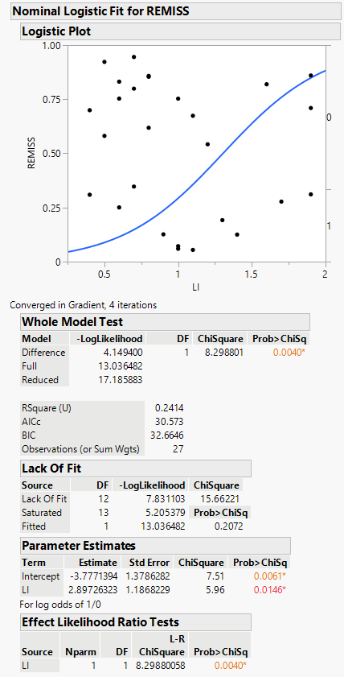

# Binary Logistic (Logit) Regression

 When our response variable has only two outcomes (binary), such as
*agree* and \*\*disagree\* or *yes* and *no*, we can estimate the log of
odds for which of the two outcomes an observation may fall in from a set
of predictors using binary logistic regression.

 For this example we will use this [data
set](https://github.com/tylerbg/DLC_stat_resources/tree/master/docs/JMP/dat/leukemia_remission.jmp)
originally provided in [STAT 501 Regression
Methods](https://online.stat.psu.edu/stat501/lesson/15/15.1) that
includes six possible factors that may predict Leukemia remission
(*REMISS*):

-   *BLAST* - absolute number of blasts in the peripheral blood
-   *CELL* - cellularity of the marrow clot section
-   *INFIL* - percentage of absolute marrow leukemia cell infiltrate
-   *LI* - percentage labeling index of the bone marrow leukemia cells
-   *SMEAR* - smear differential percentage of blasts
-   *TEMP* - highest temperature prior to start of treatment

 Our response variable for leukemia remission, *REMISS*, is either a 0
for no remission or a 1 for remission, meaning that it is binary and
suitable for logistic regression. Our six predictor variables are all
continuous and we can leave them as they are. We will go ahead and
accept that the observations are independent, there are no outliers, and
we have a sufficiently large sample size.

 To fit a binary logistic regression model we can select *Analyze* -&gt;
*Fit Model* then put *REMISS* in the *Y* box and our remaining six
variables in the *Construct Model Effects* box. In the *Personality*
drop down tab make sure that either *Nominal Logistic* or *Ordinal
Logistic* is selected (because our response variable is binary nominal
and ordinal logistic regression will give the same results). The
remaining options we can leave at their defaults and we can select *Run*
to fit the model.

 The first thing to note in the output is the *Whole Model Test* table
which compares the log likelihoods of the full model (all six variables)
against a model without any variables to determine whether the overall
model has a statistically significant fit, which we see that our model
does. Next, we can check the *Parameter Estimates* table to check which
variables are statistically significant predictors in the model, however
as we can see none of the six variables have a p-value less than 0.05.
Conversely, in the *Effect Likelihood Ratio Tests* table we do see that
one variable, *LI*, is significant. Since both our overall model and the
*LI* variable have statistically significant log likelihoods we can try
fitting a new model that only includes *LI* predicting *REMISS*.

 Again we select *Analyze* -&gt; *Fit Model* and add *REMISS* to the *Y*
box but now only include *LI* in the *Construct Model Effects* box.
Checking again that one of the logistic options are selected in the
*Personality* drop down tab we can click *Run* to fit the new model.

 In the summary from our simpler model we see in the *Whole Model Test*
table that again comparing the log likelihoods of the full model (this
time just with *LI* as a predictor) against a model with only an
intercept that the overall model significantly predicts *REMISS*.
Additionally, in the *Parameter Estimates* table we now see that *LI* is
a statistically significant predictor with a p-value below 0.05.

 Note that the interpretation of the coefficient is different from
linear regression. Specifically for our example, we could conclude that
for every 1 unit increase in the *LI* variable the log odds of *REMISS*
being 1 increases by 2.897. This type of interpretation will not be very
meaningful for many applications, but the important information to take
away here is that *LI* is a significant predictor of *REMISS* for which
they share a positive relationship.
