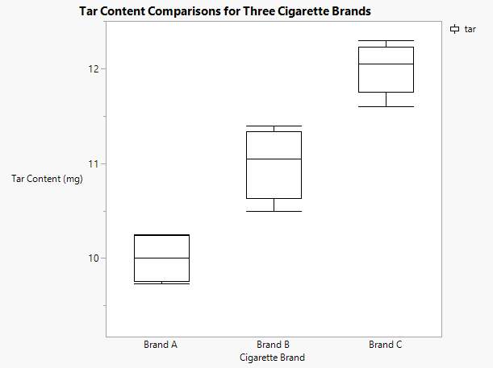
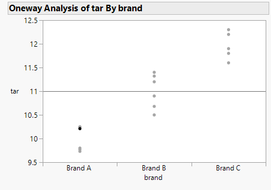
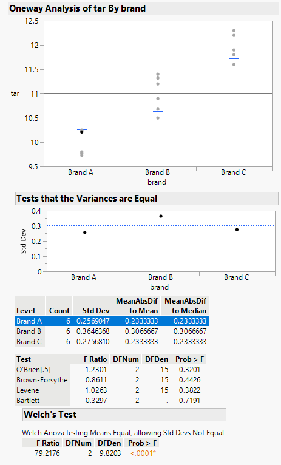
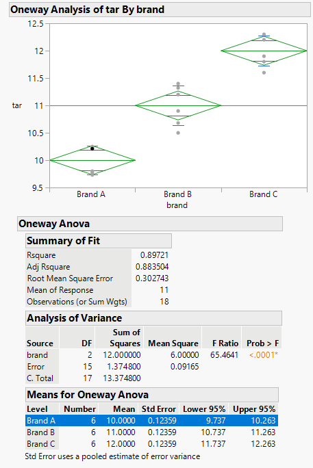
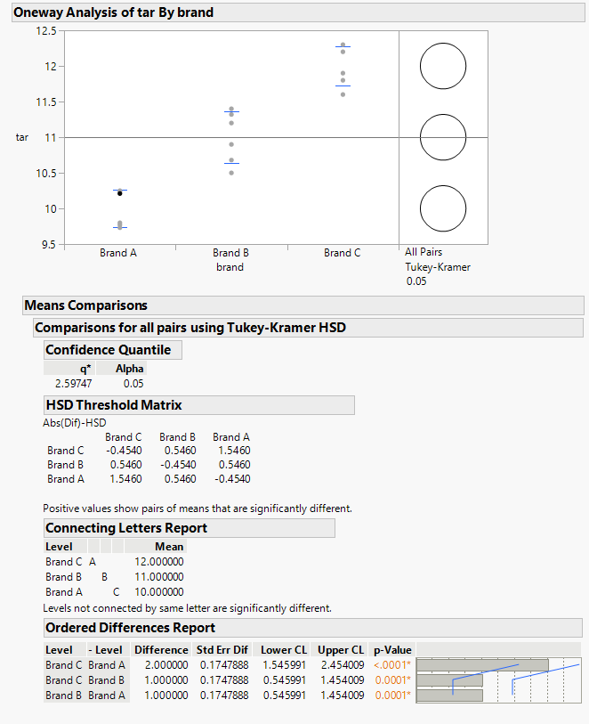

```{r setup, include=FALSE}
knitr::opts_chunk$set(echo = TRUE)
```

# One-way Analysis of Variance (ANOVA)

&emsp;For this tutorial we will be using a sample dataset from the [PSU STAT 500 Applied Statistics course](https://online.stat.psu.edu/stat500/lesson/10/10.1). The dataset contains measurements of tar content as measured by Lab Precise from three cigarette brands. A barplot for the tar content from each brand is shown below.

<center>

</center>

&emsp; From briefly inspecting the barplot, there does appear to be a difference in tar content among the three cigarette brands. However, we should use a statistical test, in this case a one-way ANOVA, to quantitatively determine if there are differences in tar content among the brands based on the following statistical hypotheses and assumptions. We will use a threshold of 0.05 (sometimes shown as &alpha; = 0.05) to determine statistical significance in the following tests.

###[Anova Assumptions]()

&emsp;Since each of the tar measurements comes from a different brand of cigarette, we could safely assume that there is no dependence between the three brands and accept the assumption of independent observations. To assess other assumptions and if an one-way ANOVA fits our data set, we can first fit the model in JMP by selecting *Analyze* -> *Fit Y by X*.  In the pop-up window we will put "tar" as our *Y, Response* and "brand" as our *X, Factor*.  After selecting *OK* a new pop-up will display a plot with the grand mean (presented as a horizontal line) and the points for each measurement of tar content among the three brands of cigarettes.

<center>

</center>

&emsp;First, we can check the assumption of equal variances by clicking on the red down arrow next to "Oneway Analysis of tar By brand" then selecting "Unequal Variances", which will expand the output window to show a new plot of the standard deviations for each brand of cigarette, a table of summary statistics, then two additional tables of statistics.

<center>

</center>

&emsp;For determining whether our assumption of equal variances is valid, we will be interested in the second table with the O'Brien, Brown-Forsythe, Levene, and Bartlett tests, which are all statistical tests for equal variance.  Since all four tests are statistically insignificant, we can safely assume that the measurements of tar content for each brand of cigarette have the same variance.

&emsp;To get a full summary of results from the ANOVA model we can again click on the red down arrow then select "Means/Anova", which will expand the current output to include a table of summary statistics for the model fit, the sum of squares ANOVA table, and summary statistics for the mean tar content of the three cigarette brands.

<center>

</center>

&emsp;While there is a lot of information provided here, our focus will be on the sum of squares table which indicates that there is a statistically significant difference in the mean tar content for at least one of the cigarette brands.  Unfortunately, the one-way ANOVA does not indicate which of the means are significantly different from the others.  We need to follow-up the one-way ANOVA with a post-hoc pairwise comparison test to determine statistically which brands differ in their tar content.  By again clicking the red down arrow we can select *Compare Means* to see we have multiple options.  Each are pairwise comparison tests with their own advantages and disadvantages, but we will use the commonly used Tukey's Honestly Significant Difference (Tukey HSD) for this tutorial.

<center>

</center>

&emsp;Again we are given a lot of information, but what we are specifically interested in is the last statistics table which compares each cigarette brand against the others.  For each pairwise comparison the Tukey's HSD test indicates that there is a statistically significant difference in the mean tar content.  Therefore, we can conclude that Brand C has higher content thatn Brand A or B while Brand A has the lowest content among the three cigarette brands.