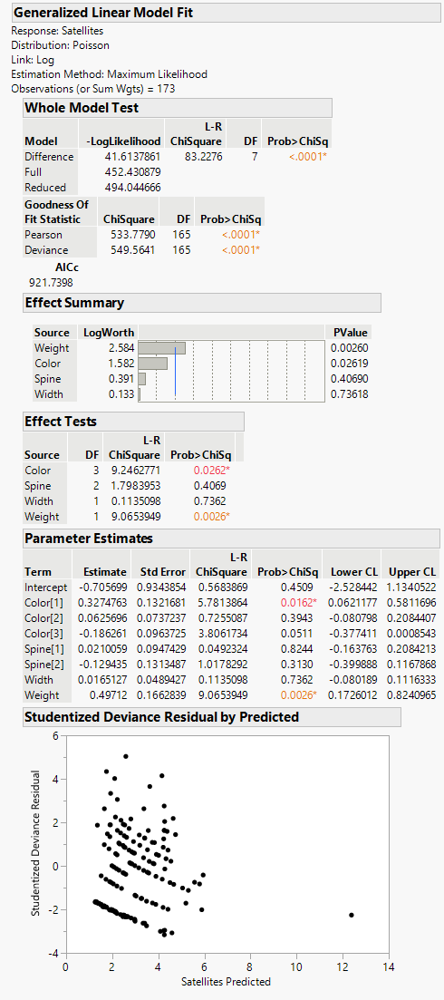

```{r setup, include=FALSE}
knitr::opts_chunk$set(echo = TRUE)
```

# Poisson Regression

&emsp;When we are looking to determine whether some factors are associated with some response variable that is a count of some occurrence (such as the number of birds that visit a bird feeder over an hour or the number of ticks found on bear cubs), we can use Poisson regression, a special type of Generalized Linear Regression.  

&emsp;For this example, we will use [this data set](https://github.com/tylerbg/DLC_stat_resources/tree/master/docs/JMP/dat/crab.jmp) provided in [STAT 501 Regression Methods](https://online.stat.psu.edu/stat504/lesson/9/9.2) that observed the relationship between the number of male crabs attaching to a female crab's nest (*Satellites*) and the characteristics of the female crab that include the color (*Color*), spine condition (*Spine*), weight (*Weight*), and carapace width (*Width*).

&emsp;To fit a Poisson regression model we first select *Analyze* -> *Fit Model* and add the *Satellites* variable to the *Y* box and the remaining variables to the *Construct Model Effects* box.  Then, under the *Personality:* drop-down menu we select *Generalized Linear Model*.  Two new drop-down menus titled *Distribution:* and *Link Function:* should appear below, from which we select *Poisson* and *Log*, respectively.  We can then select *Run* to fit a Poisson regression model.

<center>

</center>

&emsp;Under both the *Effect Summary* and *Effect Tests* tables we can see summary statistics for the four predictor variables within the model, which indicate that the *Color* and *Weight* variables are statistically significant predictors.  The *Parameter Estimates* also shows that *Weight* is statistically significant in the model with a positive relationship with the number of satellites as noted by the positive coefficient under *Estimate*.  However, in this tab *Color* (as well as *Spine*) is separated into multiple rows.  This is because the *Color* variable is a factor with four levels (*1*, *2*, *3*, and *4*), and the model is using contrasts to compare each of the first three levels against the fourth level.