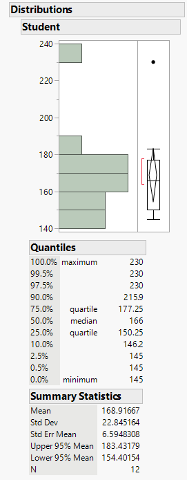
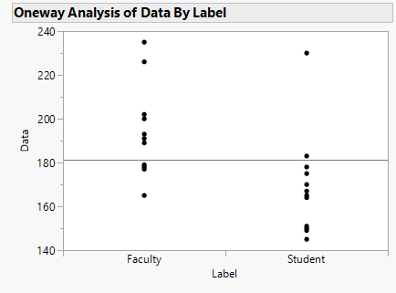
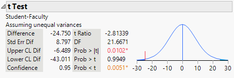
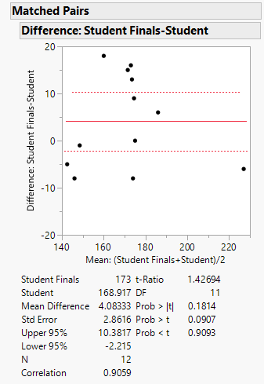

```{r setup, include=FALSE}
knitr::opts_chunk$set(echo = TRUE)
```

# T-tests

&emsp;Suppose we are interested in testing whether one sample mean deviates from some set value or if the means from two samples are unequal.  In these cases we can rely on the t-test.  While there are different forms of the t-test, they all are based on calculating a t-statistic that can be used to estimate a p-value from the t-distribution.  The data set we will be using for this example can be [downloaded here](https://github.com/tylerbg/DLC_stat_resources/tree/master/docs/JMP/dat/cholesterol.jmp), which includes blood cholesterol values from 12 PSU students and faculty at the beginning of the semester in addition to values from the same 12 students during finals week.

### T-test for one mean

&emsp;The simplest form of the t-test is when we want to test the distribution of one sample against some predetermined value.  Let's say we hypothesized that on average students at the beginning of the semester have a normal blood cholesterol level (<200 mg/dL).  We can test this by first selecting *Analyze* -> *Distribution* and adding the *Student* variable to the *Y, Columns* box then selecting *OK*.

<center>

</center>

&emsp;The pop-up provides a histogram, boxplot, and summary statistics for the *Student* variable, from which we can note that the mean blood cholesterol value for the students at the beginning of the semester is 168.9 mg/dL.  However, we do want a statsitical test to determine whether this value is significantly lower than our normal blood cholesterol threshold of 200 mg/dL.  So, we can select the red arrow next to *Student* and select *Test Mean*.  In the pop-up window we specify our hypothesized mean to be 200 and select *OK*.

<center>

</center>

&emsp;In the results from the t-test we are given the test statistic (t-value) and three p-values, one for a two-tailed t-test (*Prob > |t|*), and for the upper- (*Prob > t*) and lower-tailed t-tests (*Prob < t*).  Since our original hypothesis was that the average student blood cholesterol was below 200 mg/dL we can use the results from the lower-tailed t-test to conclude that yes, the students on average do have normal blood cholesterol levels at the beginning of the semester.

### Two-sample t-test

&emsp;Now let us say that we want to compare the average PSU student's blood cholesterol with faculty to determine whether they are different at the beginning of the semester.  We fill first need to do a little data transformation before we run the t-test so that the variable names (*Student* and *Faculty*) are in one column and the blood cholesterol values in a second column.  This can be done by selecting *Tables* -> *Stack* then in the resulting pop-up window place *Student* and *Faculty* in the *Stack Columns* box.  We can also select *Drop All* under *Non-stacked columns* to simplify the resulting data table by removing unused variables.

&emsp;Now our data is formatted to run a two-sample t-test.  In the new data table we can select *Analyze* -> *Fit Y by X* and place the *Data* variable, which includes the blood cholesterol values, into the *Y, Response* box and *Label*, which has the groups for which the blood cholesterol values belong, into the *X, Factor* box.  After selecting *OK* a new window will pop up with a dot-plot of faculty and student blood cholesterol levels.

<center>

</center>

&emsp;Next, we can click the red arrow next to *Oneway Analysis of Data By Label* and select *t Test* to print out a summary of results.

<center>

</center>

&emsp;Note again that the results table provides p-values for both two- and one-tailed t-tests.  Since we questioned whether there were differences between students and faculty blood cholesterol levels but not in one specific direction, we can take the results of the two-tailed t-test (*Prob > |t|*) to conclude that there is a statistically significant difference in the average blood cholesterol levels between students and faculty, with students having blood cholesterol levels ~25 mg/dL less than faculty on average.

### Paired t-test

&emsp;Now let us say that we collected samples from the same group of students during finals week to see if their blood cholesterol levels might have changed due to the stress of the semester.  We can compare the means from the beginning of the semester and those at finals week, but now we will be performing a paired t-test because our samples are coming from the same individuals.  Note that it is important that we put the data in the same order!

&emsp;For the paired t-test we can go back to our original data table that had all three variables, *Student*, *Faculty*, and *Student Finals*.  For the *Student* and *Student Finals* variables each row corresponds to the same participant in our study.  We will not need to stack the variables this time before running the test, so we can go ahead and start our analysis by selecting *Analyze* -> *Specialized Modeling* -> *Matched Pairs*.  In the resulting pop-up window place both *Student* and *Student Finals* in the *Y, Paired Response* box and select *OK* to run the paired t-test.

<center>

</center>

&emsp;In the results window we see a plot of the differences in blood cholesterol values for each student as points, the average difference as a solid red line, and the 95% upper and lower confidence intervals as dashed red lines.  Below the plot are the summary statistics and results from the paired t-test.  Since our question was whether the blood cholesterol levels for students changed from the beginning of the semester to finals week and not in a specific direction, we can use the results from the two-tailed t-test (*Prob > |t|*), from which we can conclude that there is not a statistically significant change in student blood cholesterol levels between the beginning and end of the semester.