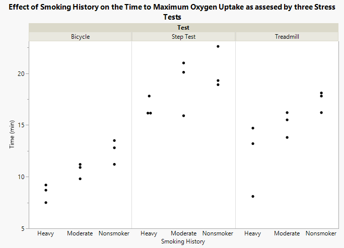
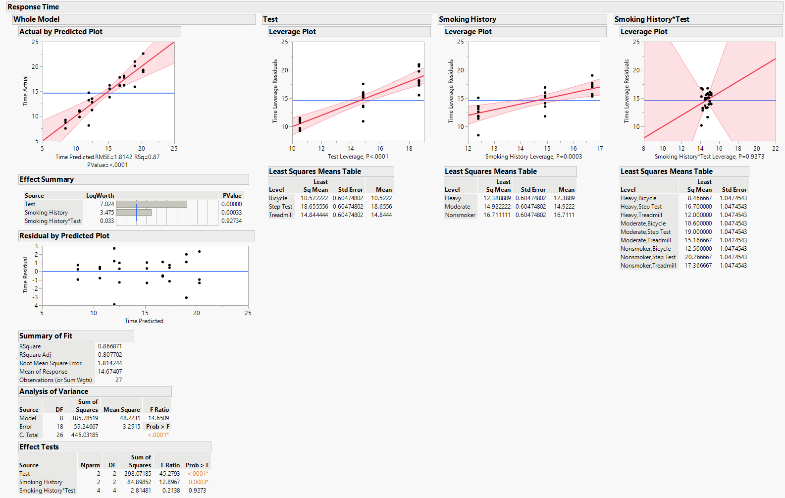

```{r setup, include=FALSE}
knitr::opts_chunk$set(echo = TRUE)
```

# Two-way Analysis of Variance (ANOVA<sup>2</sup>)

&emsp;For this example we will use a data set from [STAT 414 Introduction to Mathematical Statistics](https://online.stat.psu.edu/stat415/lesson/14/14.1) where a physiologist wanted to determine if smoking history affected how a subject responds to different types of stress tests. The time to maximum oxygen uptake (VO<sub>2max</sub>) was measured from subjects belonging to three different categories of smoking history (*Nonsmoker*, *Moderate*, and *Heavy*) while performing three different stress tests (*Bicycle*, *Step Test*, and *Treadmill*).

<center>

</center>
<br>

1. Does smoking history affect the time to VO<sub>2max</sub>?
<center><i>H<sub>0</sub></i>:<i> &alpha;<sub>Nonsmoker</sub> = &alpha;<sub>Moderate</sub> = &alpha;<sub>Heavy</sub> = 0</i></center>
<center><i>H<sub>A</sub></i>: at least one <i>&alpha;<sub>i</sub> &ne; 0</i></center>
2. Are there differences between the types of stress tests and the time to reach VO<sub>2max</sub>?
<center><i>H<sub>0</sub></i>:<i> &beta;<sub>Bicycle</sub> = &beta;<sub>Step Test</sub> = &beta;<sub>Treadmill</sub> = 0</i></center>
<center><i>H<sub>A</sub></i>: at least one <i>&beta;<sub>j</sub> &ne; 0</i></center>
3. Is there an interaction between the three types of stress tests and smoking history?
<center><i>H<sub>0</sub></i>: <i>&alpha;&beta;<sub>ij</sub> = 0</i></center>
<center><i>H<sub>A</sub></i>: <i>&alpha;&beta;<sub>ij</sub> &ne; 0</i></center>

### Fit a two-way ANOVA

&emsp;After loading our data set into JMP we can fit a two-way ANOVA by selecting *Analyze* -> *Fit Model* to bring up a new window where we will specify the parameters of our model.  First, we put the **Time** variable into the *Y* box, then we add the **Smoking History** and **Test** Variables to the *Construct Model Effects* box.  Since we also want to include the interaction term between **Smoking History** and **Test** we should also highlight both variables in the *Select Columns* box and then select *Cross* in the *Construct Model Effects* box.  We can keep all of the other options at their defaults and select *Run* to fit our model.


<div>
  <!-- Add id to image -->
  
</div>
 
<button type="button" onclick="show()" id="btnID">
  
</button>
 
<script>
  function show() {
    document.getElementById('image') .style.display = "block";
    document.getElementById('btnID') .style.display = "none";
  }
</script>