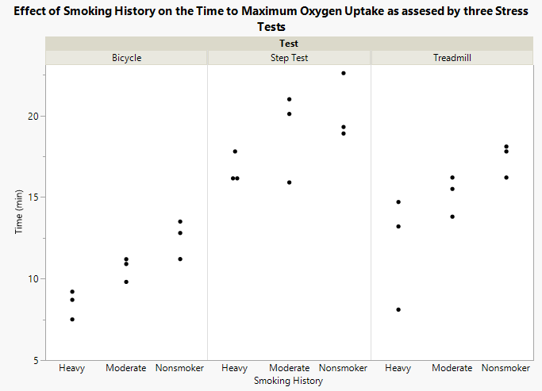
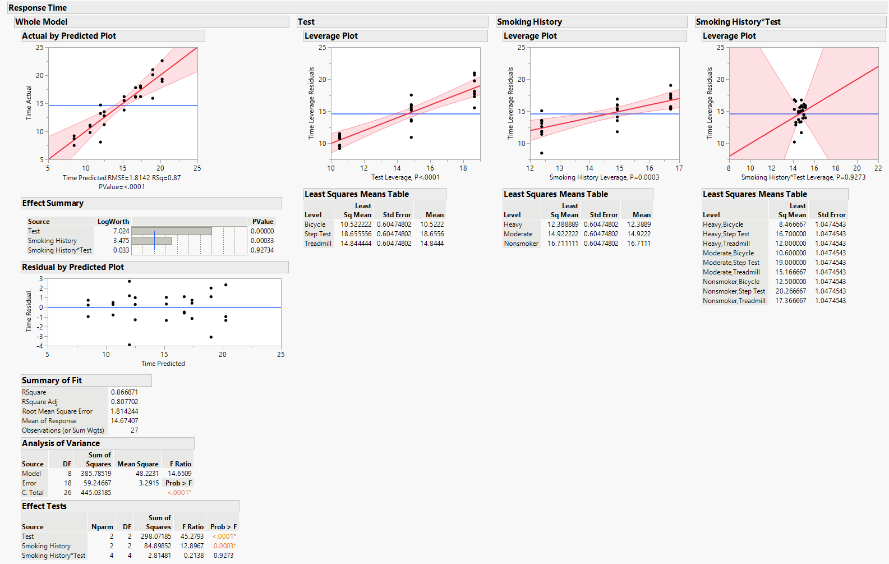
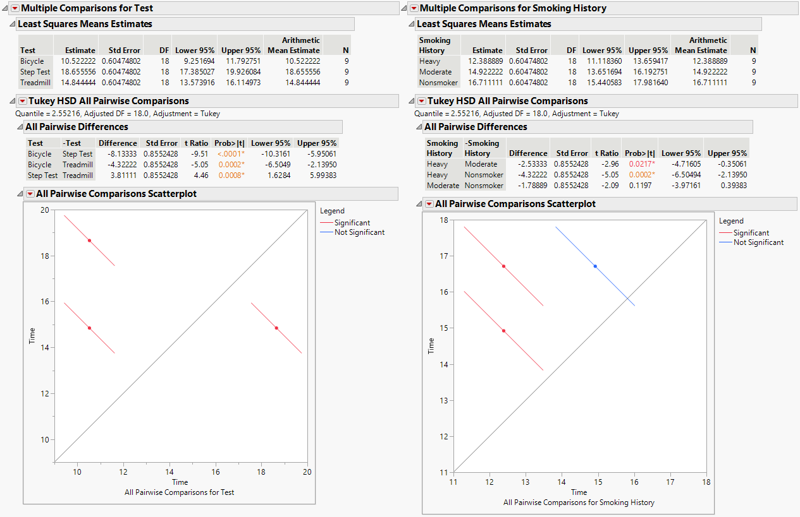

# Two-way Analysis of Variance (ANOVA2)

 For this example we will use [this data
set](https://github.com/tylerbg/DLC_stat_resources/tree/master/docs/JMP/dat/stress_test.jmp)
originally from [STAT 414 Introduction to Mathematical
Statistics](https://online.stat.psu.edu/stat415/lesson/14/14.1) where a
physiologist wanted to determine if smoking history affected how a
subject responds to different types of stress tests. The time to maximum
oxygen uptake (VO2max) was measured from subjects belonging
to three different categories of smoking history (*Nonsmoker*,
*Moderate*, and *Heavy*) while performing three different stress tests
(*Bicycle*, *Step Test*, and *Treadmill*).

 

1.  Does smoking history affect the time to VO2max?
    

    <i>H0</i>:<i> αNonsmoker =
    αModerate = αHeavy = 0</i>
    

    

    <i>HA</i>: at least one <i>αi ≠ 0</i>
    

2.  Are there differences between the types of stress tests and the time
    to reach VO2max?
    

    <i>H0</i>:<i> βBicycle = βStep Test
    = βTreadmill = 0</i>
    

    

    <i>HA</i>: at least one <i>βj ≠ 0</i>
    

3.  Is there an interaction between the three types of stress tests and
    smoking history?
    

    <i>H0</i>: <i>αβij = 0</i>
    

    

    <i>HA</i>: <i>αβij ≠ 0</i>
    

### Fit a two-way ANOVA

 After loading our data set into JMP we can fit a two-way ANOVA by
selecting *Analyze* -&gt; *Fit Model* to bring up a new window where we
will specify the parameters of our model. First, we put the **Time**
variable into the *Y* box, then we add the **Smoking History** and
**Test** Variables to the *Construct Model Effects* box. Since we also
want to include the interaction term between **Smoking History** and
**Test** we should also highlight both variables in the *Select Columns*
box and then select *Cross* in the *Construct Model Effects* box. We can
keep all of the other options at their defaults and select *Run* to fit
our model.

*Multiple Comparisons*. In the pop-out window we can select the variable
we want to run post-hoc tests for in the *Choose an Effect* box, check
the box next to *All Pairwise Comparisons - Tukey HSD*, then click *OK*
to perform the test.

 The results from the pairwise Tukey HSD test on the **Test** variable
indicate that the mean time to maximum oxygen uptake is significantly
different between each of the three stress tests, with *Bicycle* with
the shortest time, then the *Treadmill*, and then the *Step Test* with
the highest time. For **Smoking History**, the Tukey HSD results
indicate that there is a significantly lower mean time to maximum oxygen
uptake between *Heavy* and the *Moderate* and *Nonsmoker* groups while
there is not a statistically significant difference between *Moderate*
and *Nonsmoker*. Therefore, we could conclude that heavy smokers reach
their maximum oxygen uptake during high intensity exercise faster than
moderate smokers or non-smokers.
