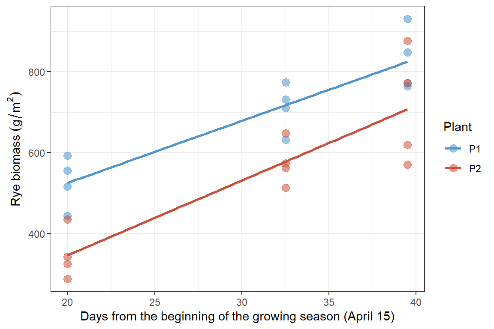

# Analysis of Covariance (ANCOVA)

 Sometimes when we are using an ANOVA to test whether there are
differences among some number of independent groups for some dependent
variable we may believe that there is another continuous variable that
could affect our results. In these cases we can adjust or control for
this confounding variable through an ANCOVA, where instead of assessing
differences between group means we statistically test for differences in
those means after adjusting for the covariate. With the ANCOVA we can
have more than one continuous covariate and like other ANOVA models the
number of categorical independent variables determines if the ANCOVA is
“one-way”, “two-way”, etc.

 The ANCOVA has similar assumptions to the ANOVA:

-   The **dependent variable and the covariate(s) are continuous** while
    the **independent variable is categorical**
-   The observations are **independent** and **randomly sampled**
-   There are no **outliers** or **points with high leverage**
-   The errors (residuals) are **approximately normally distributed**
    and have **equal variances**
-   If using more than one covariate, **no covariates should be highly
    correlated with another**

 The null and alternative hypotheses for the ANCOVA are also similar to
those for the ANOVA, however the means (μ) are adjusted for the
covariate(s) (μ̇).

 <i>H<sub>0</sub></i>: There is no effect of the independent variable on
the dependent variable when controlling for the covariate.
<center>
μ̇<sub>1</sub> = μ̇<sub>2</sub> = … = μ̇<sub>k</sub>
</center>
<br>  <i>H<sub>A</sub></i>: At least one of the adjusted group means is
different from the other adjusted group means.
<center>
μ̇<sub>i</sub> ≠ μ̇<sub>j</sub> for some i and j
</center>

<br>

### Fitting an ANCOVA model

 [The data set for this
example](https://github.com/tylerbg/DLC_stat_resources/blob/master/docs/R/dat/Rye-ANCOVA-2008.csv),
originally provided in [STAT 485 Topics in R Statistical
Language](https://online.stat.psu.edu/stat485/lesson/welcome-stat-485),
compares the biomass of rye plants in g/m<sup>2</sup> (*RyeDMg*) planted
at two different dates (*Plant*) and then terminated after a number of
days following the beginning of the growing season on April
15<sup>th</sup> (*Tdate*). After loading the data we should get some
information on the variables to make sure they are coded correctly and
there are no issues such as missing data. There are 5 other variables in
the data set that are of no interest us, such as the repetition number
and term, so we will concatenate the variables that we plan to use in
the ANCOVA analysis to a character vector with `c()` then print the
structure and summary statistics of those variables as follows.

``` r
rye <- read.csv("dat/Rye-ANCOVA-2008.csv", stringsAsFactors = TRUE)

cols <- c("Plant", "RyeDMg", "Tdate")

str(rye[, cols])
```

    ## 'data.frame':    24 obs. of  3 variables:
    ##  $ Plant : Factor w/ 2 levels "P1","P2": 1 2 1 2 1 2 1 2 1 2 ...
    ##  $ RyeDMg: num  443 287 632 513 772 ...
    ##  $ Tdate : num  20 20 32.5 32.5 39.5 39.5 20 20 32.5 32.5 ...

``` r
summary(rye[, cols])
```

    ##  Plant       RyeDMg          Tdate      
    ##  P1:12   Min.   :287.0   Min.   :20.00  
    ##  P2:12   1st Qu.:515.6   1st Qu.:20.00  
    ##          Median :606.0   Median :32.50  
    ##          Mean   :616.4   Mean   :30.67  
    ##          3rd Qu.:766.2   3rd Qu.:39.50  
    ##          Max.   :930.5   Max.   :39.50

 We can see that our dependent variable, *RyeDMg*, is numerical
(continuous) while our explanatory variable, *Plant*, is a factor
(categorical). The covariate, *Tdate*, is also numerical and therefore
our data set is coded correctly to fit a one-way ANCOVA model.
Additionally, the summary statistics do not show any obvious outliers,
missing data, or mis-coded observations, so we can continue with
planning our analysis.

 Plotting the data (below) we can see that rye planted in early autumn
(*P1*) appear to have a higher biomass throughout the growing season
compared to those planted in late autumn (*P2*). The rate of increase
for these two planting times also appear to be very similar as their
slopes are nearly parallel to suggest that there is not an interaction
between *Plant* and *Tdate* so we will not hypothesize or test for an
interaction term.



 To fit an ANCOVA model we can use the `aov()` function with the
dependent variable to the left and explanatory variables to the right of
a `~` in the formula. Then, we can use the `summary()` or `anova()`
function to print summary statistics of the model.

``` r
rye.aov <- aov(RyeDMg ~ Tdate + Plant, data = rye)

summary(rye.aov)
```

    ##             Df Sum Sq Mean Sq F value   Pr(>F)    
    ## Tdate        1 449275  449275   74.93 2.27e-08 ***
    ## Plant        1 127240  127240   21.22 0.000152 ***
    ## Residuals   21 125908    5996                     
    ## ---
    ## Signif. codes:  0 '***' 0.001 '**' 0.01 '*' 0.05 '.' 0.1 ' ' 1

 From the ANCOVA sum of squares table we can see that both the
independent variable and covariate, *Plant* and *Tdate*, are
statistically significant predictors of rye biomass. Therefore, we can
conclude that plant biomass is significantly higher in rye planted in
early August compared to those planted in late August when controlling
for termination date.

 Note that the default sum of squares calculated by the `summary()` and
`anova()` functions are Type I, or the sequential sum of squares. This
is fine for the example here, however when we include interaction terms
or have unbalanced designs we may wish to reorder the terms to best
reflect the experiment and research question. To calculate the Type II
or Type III sum of squares we can call functions in other libraries,
such as `Anova()` from the `car` package.

 Another thing to note is that the ANCOVA model is mathematically the
same as a multiple linear regression (MLR) model, and therefore using
the `aov()` function with `lm()` will result in the same sum of squares
table. The difference between the ANCOVA (and other ANOVA methods) and
MLR approaches is whether the sum of squares or statistics on the
variable coefficients best answer our research question.

### Full Code

``` r
# Load data set, assign variables of interest to an object, and print the structure and summary
# statistics of those variables
rye <- read.csv("dat/Rye-ANCOVA-2008.csv", stringsAsFactors = TRUE)

cols <- c("Plant", "RyeDMg", "Tdate")

str(rye[, cols])
summary(rye[, cols])

# Fit an ANCOVA model with RyeDMg as the dependent and Tdate and Plant as explanatory variables then
# print the 1st sum of squares
rye.aov <- aov(RyeDMg ~ Tdate + Plant, data = rye)

summary(rye.aov)
```
