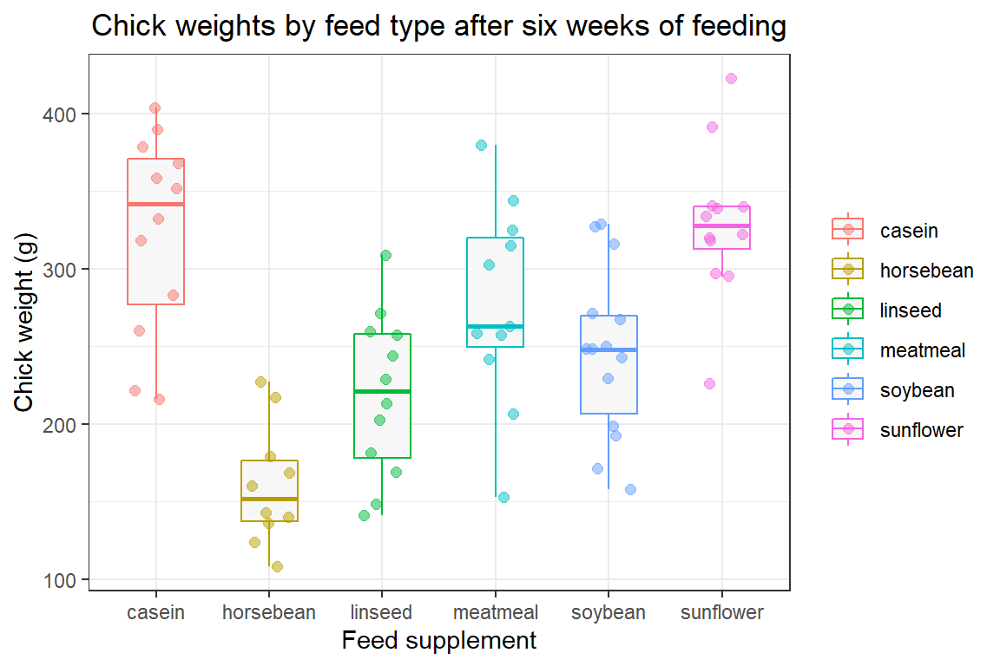

# Kruskal-Wallis rank sum test

 Typically when we have more than two treatments we are interested in
comparing we apply the one-way ANOVA. However, when we decide that the
one-way ANOVA may not be appropriate, such as when certain assumptions
are violated or we have an unbalanced design with unequal variances, we
can instead apply the Kruskal-Wallis rank sum test. Because the
Kruskal-Wallis test is a non-parametric test we do not need to meet
certain assumptions that accompany the parametric one-way ANOVA, such as
equal variances and normally distributed data. Instead, the
Kruskal-Wallis test has the following assumptions:

-   The dependent variable is **ordinal or continuous**
-   The observations are **independent** and **randomly sampled** from
    the population
-   The distributions for each group have the same shape

 When these assumptions are met we can apply the Kruskal-Wallis test to
test the null and alternative hypotheses:

<center>
<i>H<sub>0</sub></i>: The population medians are equal
</center>
<center>
<i>H<sub>A</sub></i>: At least one of the population medians are not
equal with the other medians
</center>

<br>

 For this example we will be using the `chickwts` data set supplied in
base R. The data set includes chick weights measured in grams (*weight*)
for 71 chicks after being fed one of six supplemented feeds (*feed*) and
are presented in the figure below.



 From the plot above we might hypothesize that there are differences in
the chick weights after being fed some of these supplemented feeds for 6
weeks. In particular, we might suggest that the horsebean feed leads to
lower chick weights than the other feeds

 Before we start fitting a statistical model to the data we should get
an idea of what it looks like. Using the `summary()` function we can
print summary statistics of each variable.

``` r
summary(chickwts)
```

    ##      weight             feed   
    ##  Min.   :108.0   casein   :12  
    ##  1st Qu.:204.5   horsebean:10  
    ##  Median :258.0   linseed  :12  
    ##  Mean   :261.3   meatmeal :11  
    ##  3rd Qu.:323.5   soybean  :14  
    ##  Max.   :423.0   sunflower:12

 From the print out we can see that the *weight* variable has a wide
range, from 108 grams to 423 grams. For the *feed* variable we see that
we have 6 feed types that are unequal but relatively close in size. We
do not see any miscoded data, missing values, obvious ouliers or
skewness, or anything obvious that would cause concern. For this example
we will also accept that the assumptions for the Kruskal-Wallis test are
valid for this data set, so we can continue with the Kruskal-Wallis
test.

 To do so, we employ the `kruskal.test()` function that has the formula
with the syntax “continuous response variable \~ categorical independent
variable” that we will assign to an object (`chickwts.kw`). Then to get
the results of the test we can simply print the object as follows:

``` r
chickwts.kw <- kruskal.test(weight ~ feed, chickwts)

chickwts.kw
```

    ## 
    ##  Kruskal-Wallis rank sum test
    ## 
    ## data:  weight by feed
    ## Kruskal-Wallis chi-squared = 37.343, df = 5, p-value = 5.113e-07

 The `kruskal.test()` function provides the test statistic
(`chi-squared = 37.343`), degrees of freedom (`df = 5`), and p-value
(`p-value = 5.113e-07`), from which we can reject the null hypotheses at
a statstical threshold of α = 0.05 to conclude that there is at least
one group median that is different from the others. However, similar to
the one-way ANOVA the Kruskal-Wallis rank sum test does not tell us
which median(s) is different from the others. We will need to use a
post-hoc test to make pairwise comparisons to determine which medians
are statistically different from one another. Instead of Tukey’s
honestly significant difference test for the parametric one-way ANOVA,
we can use Dunn’s test to make these non-parametric pairwise
comparisons.

 In base R we do not have a function to perform the Dunn’s test, so we
will need to rely on the `FSA` package from which we can use the
`dunnTest()` function with the same formula we used for the
`kruskal.test()` function to assign the results to an object and then
print the results directly from that object.

``` r
library(FSA)

chickwts.dunn <- dunnTest(weight ~ feed, chickwts)

chickwts.dunn
```

    ##               Comparison          Z      P.unadj        P.adj
    ## 1     casein - horsebean  4.8130692 1.486298e-06 2.080817e-05
    ## 2       casein - linseed  3.3082926 9.386670e-04 1.032534e-02
    ## 3    horsebean - linseed -1.6587360 9.716899e-02 5.830140e-01
    ## 4      casein - meatmeal  1.4157560 1.568470e-01 6.273879e-01
    ## 5   horsebean - meatmeal -3.3640591 7.680508e-04 9.216610e-03
    ## 6     linseed - meatmeal -1.8198180 6.878673e-02 4.815071e-01
    ## 7       casein - soybean  2.4999221 1.242206e-02 9.937650e-02
    ## 8    horsebean - soybean -2.6020934 9.265660e-03 8.339094e-02
    ## 9      linseed - soybean -0.9332554 3.506881e-01 7.013763e-01
    ## 10    meatmeal - soybean  0.9741450 3.299846e-01 9.899537e-01
    ## 11    casein - sunflower -0.1829698 8.548217e-01 8.548217e-01
    ## 12 horsebean - sunflower -4.9875241 6.115798e-07 9.173698e-06
    ## 13   linseed - sunflower -3.4912624 4.807439e-04 6.249670e-03
    ## 14  meatmeal - sunflower -1.5947040 1.107784e-01 5.538922e-01
    ## 15   soybean - sunflower -2.6897988 7.149510e-03 7.149510e-02

 Because we had 6 groups for pairwise comparisons we have
*n* \* (*n* − 1)/2 = 6 \* (6 − 1)/2 = 15 total comparisons. As you can
imagine, as the number of groups increases the number of pairwise
comparisons nearly exponentially increases. The `dunnTest()` function
already handles multiple test error correction for us (which we can
choose to change the method of correction), however it can still be
tedious to determine which p-values are statistical significant. To make
things easier we can use the `ifelse()` function to create a new column
that indicates which comparisons are below our statistical threshold of
α = 0.05 as follows:

``` r
chickwts.dunn$res$sig <- ifelse(chickwts.dunn$res$P.adj > 0.05, "", "*")

chickwts.dunn
```

    ##               Comparison          Z      P.unadj        P.adj sig
    ## 1     casein - horsebean  4.8130692 1.486298e-06 2.080817e-05   *
    ## 2       casein - linseed  3.3082926 9.386670e-04 1.032534e-02   *
    ## 3    horsebean - linseed -1.6587360 9.716899e-02 5.830140e-01    
    ## 4      casein - meatmeal  1.4157560 1.568470e-01 6.273879e-01    
    ## 5   horsebean - meatmeal -3.3640591 7.680508e-04 9.216610e-03   *
    ## 6     linseed - meatmeal -1.8198180 6.878673e-02 4.815071e-01    
    ## 7       casein - soybean  2.4999221 1.242206e-02 9.937650e-02    
    ## 8    horsebean - soybean -2.6020934 9.265660e-03 8.339094e-02    
    ## 9      linseed - soybean -0.9332554 3.506881e-01 7.013763e-01    
    ## 10    meatmeal - soybean  0.9741450 3.299846e-01 9.899537e-01    
    ## 11    casein - sunflower -0.1829698 8.548217e-01 8.548217e-01    
    ## 12 horsebean - sunflower -4.9875241 6.115798e-07 9.173698e-06   *
    ## 13   linseed - sunflower -3.4912624 4.807439e-04 6.249670e-03   *
    ## 14  meatmeal - sunflower -1.5947040 1.107784e-01 5.538922e-01    
    ## 15   soybean - sunflower -2.6897988 7.149510e-03 7.149510e-02

 Now it is easy to see that 5 of the 15 pairwise comparisons are
statistically significant and we can make the following conclusions:

-   Casein supplemented feed provided higher chick weights than the
    horsebean or linseed supplement
-   The meatmeal supplemented feed also resulted in higher chick weights
    than horsebean
-   Sunflower supplemented food results in higher chick weight compared
    to horsebean and linseed

### Full code block

``` r
# Print summary statistics of the chickwts data set
summary(chickwts)

# Perform a Kruskal-Wallis rank sum test and print the results
chickwts.kw <- kruskal.test(weight ~ feed, chickwts)

chickwts.kw

# Load the FSA library to run and print the results from the Dunn's post-hoc pairwise test
library(FSA)

chickwts.dunn <- dunnTest(weight ~ feed, chickwts)

chickwts.dunn

# Assign asterisks in a new column to note which pairwise comparisons are statistically significant
chickwts.dunn$res$sig <- ifelse(chickwts.dunn$res$P.adj > 0.05, "", "*")

chickwts.dunn
```
