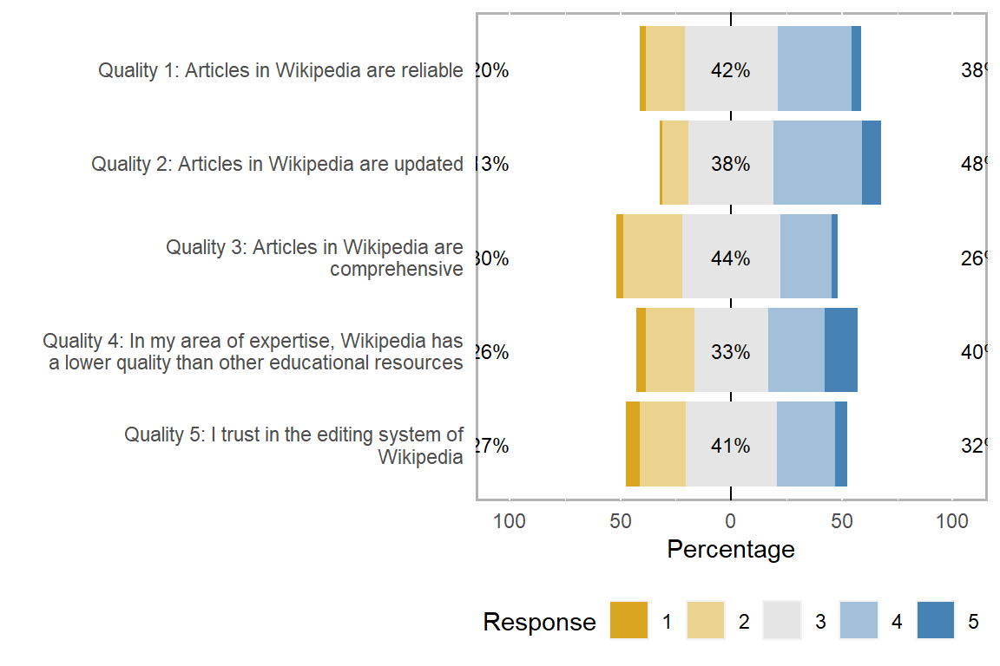
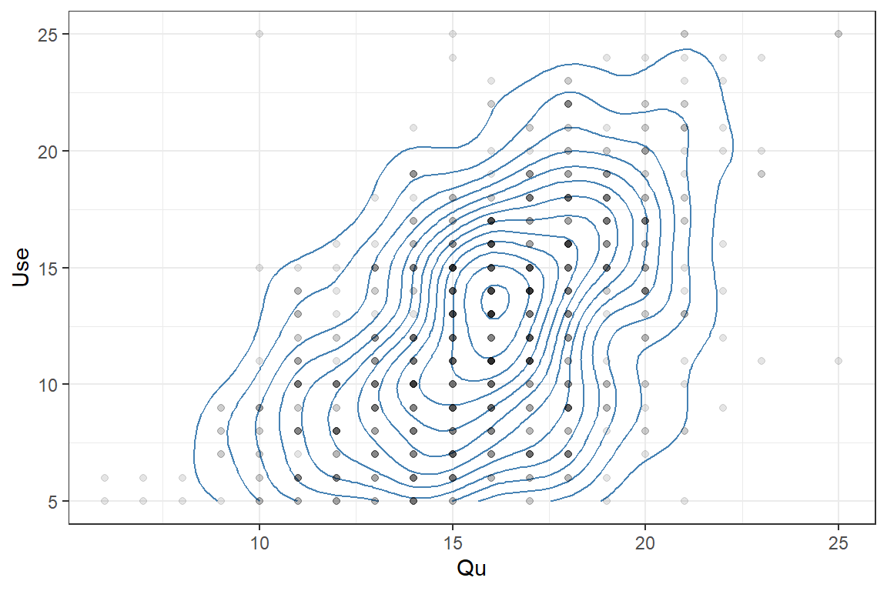

# Likert scale analysis

 For this tutorial we will be using a modified data set that contains
Likert responses collected from faculty at the Open University of
Catalonia on their opinions for using Wikipedia as a teaching resource.
The data set was originally provided by the [UCI Maching Learning
Repository](https://archive.ics.uci.edu/ml/datasets/wiki4he).

``` r
wiki.dat <- read.csv("dat/wiki4HE_rev.csv", stringsAsFactors = TRUE)
str(wiki.dat)
```

    ## 'data.frame':    796 obs. of  18 variables:
    ##  $ AGE   : int  40 42 37 40 51 47 43 55 54 50 ...
    ##  $ GENDER: Factor w/ 2 levels "Female","Male": 2 2 2 2 2 2 2 2 2 2 ...
    ##  $ DOMAIN: Factor w/ 6 levels "Arts & Humanities",..: 6 4 2 2 5 2 2 5 1 2 ...
    ##  $ Qu1   : int  3 4 2 3 4 3 4 3 4 4 ...
    ##  $ Qu2   : int  3 4 2 4 5 3 4 3 4 4 ...
    ##  $ Qu3   : int  2 3 2 3 4 3 4 3 2 4 ...
    ##  $ Qu4   : int  2 3 5 3 3 4 2 3 5 2 ...
    ##  $ Qu5   : int  3 2 3 3 4 4 4 4 3 3 ...
    ##  $ Use1  : int  3 2 1 3 3 2 3 1 1 4 ...
    ##  $ Use2  : int  1 2 1 3 3 1 4 2 1 1 ...
    ##  $ Use3  : int  1 1 1 3 5 3 4 3 4 5 ...
    ##  $ Use4  : int  2 1 1 3 5 2 3 3 4 4 ...
    ##  $ Use5  : int  4 2 1 3 5 4 5 4 5 5 ...
    ##  $ Exp1  : int  4 2 2 4 5 4 4 4 5 4 ...
    ##  $ Exp2  : int  4 2 2 4 5 3 5 4 5 5 ...
    ##  $ Exp3  : int  4 4 2 3 5 4 5 3 5 2 ...
    ##  $ Exp4  : int  1 2 1 3 4 1 2 1 1 1 ...
    ##  $ Exp5  : int  2 4 3 4 4 4 2 4 1 1 ...

 With Likert scale analysis we take a group of Likert items and sum (or
average) the responses to those items into one score. This method is
beneficial when we are not interested in the answer to any specific
question but rather the opinion of respondents on a broader topic. While
less specific, this line of surveying allows us to increase our power
and statistical tool shed.

 For example, instead of hypothesizing that respondents will answer the
question “Articles in Wikipedia are reliable” will be more or lesser in
one group than another, we can create and combine similar questions to
get a broader sense on how people view the ‘quality’ of Wikipedia.



 First we take the sum (or alternatively the average) of the responses
for each respondent in each question grouping. An easy way to perform
this in R is to use the `rowSums()` function to create a new variable
(column) that sums the scores of all questions belonging to our topic.

``` r
wiki.dat$Qu <- rowSums(wiki.dat[, c("Qu1", "Qu2", "Qu3", "Qu4", "Qu5")])
```

### Comparing two groups


``` r
t.test(Qu ~ GENDER, data = wiki.dat)
```

    ## 
    ##  Welch Two Sample t-test
    ## 
    ## data:  Qu by GENDER
    ## t = -2.1664, df = 768.52, p-value = 0.03059
    ## alternative hypothesis: true difference in means between group Female and group Male is not equal to 0
    ## 95 percent confidence interval:
    ##  -0.85111378 -0.04191159
    ## sample estimates:
    ## mean in group Female   mean in group Male 
    ##             15.60725             16.05376

### Comparing multiple groups


``` r
domain.fit <- aov(lm(Qu ~ DOMAIN, data = wiki.dat))
summary(domain.fit)
```

    ##              Df Sum Sq Mean Sq F value Pr(>F)  
    ## DOMAIN        5    118  23.585    2.74 0.0183 *
    ## Residuals   790   6799   8.607                 
    ## ---
    ## Signif. codes:  0 '***' 0.001 '**' 0.01 '*' 0.05 '.' 0.1 ' ' 1

``` r
par(mfrow=c(2,2))
plot(domain.fit)

TukeyHSD(domain.fit)
```

    ##   Tukey multiple comparisons of means
    ##     95% family-wise confidence level
    ## 
    ## Fit: aov(formula = lm(Qu ~ DOMAIN, data = wiki.dat))
    ## 
    ## $DOMAIN
    ##                                                    diff         lwr        upr     p adj
    ## Engineering & Architecture-Arts & Humanities  0.7233622 -0.27840901  1.7251334 0.3080720
    ## Health Sciences-Arts & Humanities            -0.1016136 -1.34922324  1.1459961 0.9999069
    ## Law & Politics-Arts & Humanities             -0.5418075 -1.66715036  0.5835353 0.7418628
    ## Other-Arts & Humanities                       0.2112871 -0.61587008  1.0384442 0.9782634
    ## Sciences-Arts & Humanities                    0.8692810 -0.48581117  2.2243733 0.4452908
    ## Health Sciences-Engineering & Architecture   -0.8249758 -2.10635708  0.4564055 0.4410434
    ## Law & Politics-Engineering & Architecture    -1.2651697 -2.42784107 -0.1024984 0.0238135
    ## Other-Engineering & Architecture             -0.5120751 -1.38934197  0.3651917 0.5537977
    ## Sciences-Engineering & Architecture           0.1459188 -1.24032900  1.5321667 0.9996711
    ## Law & Politics-Health Sciences               -0.4401940 -1.82033488  0.9399469 0.9436892
    ## Other-Health Sciences                         0.3129006 -0.83713476  1.4629360 0.9713217
    ## Sciences-Health Sciences                      0.9708946 -0.60221294  2.5440022 0.4903808
    ## Other-Law & Politics                          0.7530946 -0.26299988  1.7691891 0.2792945
    ## Sciences-Law & Politics                       1.4110886 -0.06692832  2.8891055 0.0710521
    ## Sciences-Other                                0.6579940 -0.60783636  1.9238243 0.6740555


### Relationships between responses



``` r
wiki.dat$Use <- rowSums(wiki.dat[, c("Use1", "Use2", "Use3", "Use4", "Use5")])

use.qu.fit <- lm(Use ~ Qu, data = wiki.dat)
summary(use.qu.fit)
```

    ## 
    ## Call:
    ## lm(formula = Use ~ Qu, data = wiki.dat)
    ## 
    ## Residuals:
    ##      Min       1Q   Median       3Q      Max 
    ## -11.5152  -2.7438   0.0594   2.5863  17.1451 
    ## 
    ## Coefficients:
    ##             Estimate Std. Error t value Pr(>|t|)    
    ## (Intercept) -0.01805    0.76388  -0.024    0.981    
    ## Qu           0.78730    0.04733  16.634   <2e-16 ***
    ## ---
    ## Signif. codes:  0 '***' 0.001 '**' 0.01 '*' 0.05 '.' 0.1 ' ' 1
    ## 
    ## Residual standard error: 3.936 on 794 degrees of freedom
    ## Multiple R-squared:  0.2584, Adjusted R-squared:  0.2575 
    ## F-statistic: 276.7 on 1 and 794 DF,  p-value: < 2.2e-16

``` r
plot(use.qu.fit)
```


