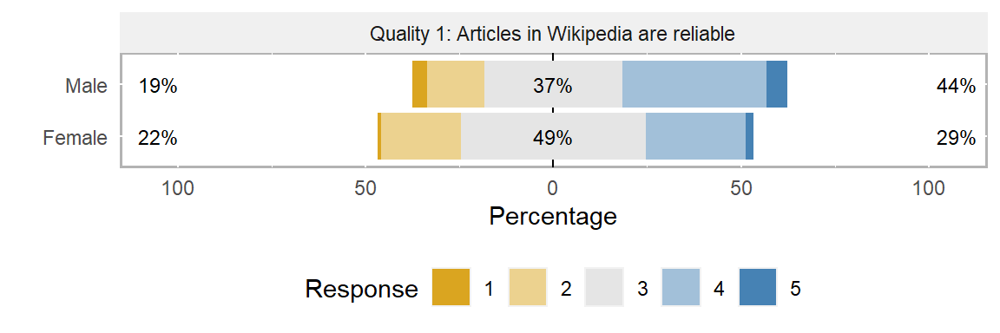
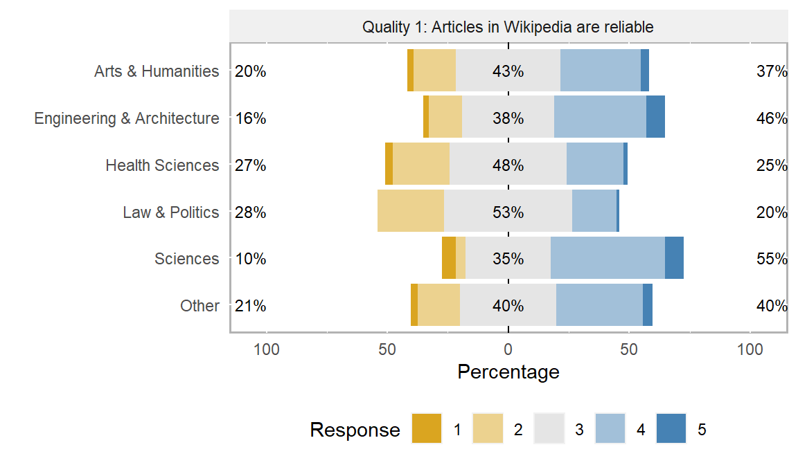

# Likert-type scale analysis

 For this tutorial we will be using a [modified data
set](https://github.com/tylerbg/DLC_stat_resources/blob/master/docs/R/dat/wiki4HE_rev.csv)
that contains Likert responses collected from faculty at the Open
University of Catalonia on their opinions for using Wikipedia as a
teaching resource. The data set was originally provided by the [UCI
Maching Learning
Repository](https://archive.ics.uci.edu/ml/datasets/wiki4he).

``` r
wiki.dat <- read.csv("dat/wiki4HE_rev.csv", stringsAsFactors = TRUE)
```

### Two group comparisons

 Let us say that we are interested if two groups respond differently to
a single Likert-item. In this case, we are interested if males and
females generally have different views on the reliability of Wikipedia
articles as a resource. Viewing the results of the survey, as in the
barplot below, suggests that male respondents view Wikipedia articles as
more reliable compared to their female counterparts overall, with 44% of
males selecting either “Agree” or “Strongly agree” compared to 29% of
females.



 To statistically test whether these differences between the genders
exist, we must decide on the test to use. Because the responses are
ordinal in nature, where there are a small set number of possible
responses that are ordered but do not have equal separation between
their levels, parametric tests that rely on assumptions of approximately
normal distributions such as the t-test are not appropriate. Instead,
non-parametric tests that do not make assumptions on how the data is
distributed should be applied. In the case of comparing two groups,
males versus females in this example, the Mann-Whitney U test can be
applied.

 The Mann-Whitney U test is commonly referred to the non-parametric
equivalent to the parametric t-test, using the U-statistic over the
t-statistic. Where the t-test tests the hypothesis that the means are
equal, the Mann-Whitney U test instead test whether the medians of two
groups come from the same distribution.

#### Hypotheses

 Of course, we want to form our hypothesis before we look at our data,
which we can write as:

 <b><i>H</i><sub>0</sub>:<i></b> The probability that a randomly drawn
male or female respondent is larger than a randomly drawn respondent
from the respective opposite group = 50%</i>  
 <b><i>H</i><sub>A</sub>:<i></b> The probability that a randomly drawn
male or female respondent is larger than a randomly drawn respondent
from the respective opposite group ≠ 50%</i>

 While wordy, what we are saying in our null hypothesis is that both
groups respond similarly while our alternative hypothesis is that one
group (either male or female) answers differently (higher or lower)
compared to the other group.

 To perform a Mann-Whitney U test in R we can use the `wilcox.test()`
function, which defaults to using the Mann-Whitney test when we have two
unpaired samples (also known as the Wilcoxon two-sample test). For this
example we will use a statistical threshold of α = 0.05.

``` r
wilcox.test(Qu1 ~ GENDER, data = wiki.dat)
```

    ## 
    ##  Wilcoxon rank sum test with continuity correction
    ## 
    ## data:  Qu1 by GENDER
    ## W = 66136, p-value = 0.0003153
    ## alternative hypothesis: true location shift is not equal to 0

 The results of the Mann-Whitney U test, a p-value less than 0.05,
indicate that there is a statistically significant difference between
how males and females respond to how they view the reliability of
WIkipedia articles.

 *Note: Alternatively, we could use the Kruskal-Wallis test, which can
also be applied when we want to compare more than two groups as
follows.*

### Multiple (&gt;2) group comparisons

 When we want to compare more than two groups, such as if we want to
compare the responses to quality item 1 among the different ‘domains’,
the Kruskal-Wallis test can be applied. From the following plot of the
responses by domain, we might think that respondents for the Sciences
and the Engineering & Architecture domains are more positive in their
thinking of Wikipedia’s reliability than say for Law & Politics or
Health Sciences.



 Similarly to the two group comparisons as above, we should use a
non-parametric test to determine if there are statistical differences
among how the domains respond to Wikipedia article reliability. Just
like we used a non-parametric equivalent to the t-test to compare two
groups, we can use a non-parametric equivalent to the ANOVA to test
multiple groups such as the Kruskall-Wallis test.

#### Hypotheses

 <b><i>H</i><sub>0</sub>:<i></b> The medians of all domains are
equal</i>  
 <b><i>H</i><sub>A</sub>:<i></b> The median of at least one domain is
not equal to to at least one other domain</i>

 We can run a simple Kruskall-Wallis test in base R using the
`kruskal.test` command as follows.

``` r
kruskal.test(Qu1 ~ DOMAIN, data = wiki.dat)
```

    ## 
    ##  Kruskal-Wallis rank sum test
    ## 
    ## data:  Qu1 by DOMAIN
    ## Kruskal-Wallis chi-squared = 26.205, df = 5, p-value = 8.143e-05

 While the Kruskal-Wallis test indicates that there is a significantly
different mean among the groups (p-value is less than 0.05), it does not
indicate which of those means are statistically different from the
others. We need to follow up this test with a pairwise test that can
compare each of the means against one another.

 The Dunn’s test is the most common post-hoc test for the Kruskal-Wallis
test, however a function to perform the test is not included in base R.
We will need to install and load the `FSA` library which contains the
`dunnTest()` function to perform the post-hoc analysis.

``` r
library(FSA)

dunnTest(Qu1 ~ DOMAIN, data = wiki.dat, method = "bonferroni")
```

    ##                                        Comparison          Z      P.unadj       P.adj
    ## 1  Arts & Humanities - Engineering & Architecture -1.6988814 0.0893415352 1.000000000
    ## 2             Arts & Humanities - Health Sciences  1.6417929 0.1006329295 1.000000000
    ## 3    Engineering & Architecture - Health Sciences  2.9266911 0.0034258900 0.051388350
    ## 4              Arts & Humanities - Law & Politics  2.4036834 0.0162308217 0.243462325
    ## 5     Engineering & Architecture - Law & Politics  3.7902873 0.0001504731 0.002257097
    ## 6                Health Sciences - Law & Politics  0.4757856 0.6342271115 1.000000000
    ## 7                       Arts & Humanities - Other -0.4452769 0.6561196695 1.000000000
    ## 8              Engineering & Architecture - Other  1.5201492 0.1284734696 1.000000000
    ## 9                         Health Sciences - Other -2.1013533 0.0356099640 0.534149460
    ## 10                         Law & Politics - Other -3.0246025 0.0024896012 0.037344018
    ## 11                   Arts & Humanities - Sciences -2.4061365 0.0161222382 0.241833573
    ## 12          Engineering & Architecture - Sciences -1.1243634 0.2608588717 1.000000000
    ## 13                     Health Sciences - Sciences -3.3747557 0.0007388126 0.011082189
    ## 14                      Law & Politics - Sciences -4.0361547 0.0000543344 0.000815016
    ## 15                               Other - Sciences -2.2848425 0.0223220656 0.334830985

 Since we have 6 different groups that we are comparaing against one
another (pairwise), our output consists of 15 pairwise comparisons. As
our number of groups that we are comparing increases (k), the number of
pairwise comparisons increases by k(k-1)/2. Therefore, as more groups
are included in the analysis the number of comparisons, and thus
adjustments for multiple comparisons must be performed.

``` r
dunn.res <- dunnTest(Qu1 ~ DOMAIN, data = wiki.dat, method = "bonferroni")
dunn.res$res$sig <- ifelse(dunn.res$res$P.adj <= 0.05, "*", " ")

dunn.res
```

    ##                                        Comparison          Z      P.unadj       P.adj sig
    ## 1  Arts & Humanities - Engineering & Architecture -1.6988814 0.0893415352 1.000000000    
    ## 2             Arts & Humanities - Health Sciences  1.6417929 0.1006329295 1.000000000    
    ## 3    Engineering & Architecture - Health Sciences  2.9266911 0.0034258900 0.051388350    
    ## 4              Arts & Humanities - Law & Politics  2.4036834 0.0162308217 0.243462325    
    ## 5     Engineering & Architecture - Law & Politics  3.7902873 0.0001504731 0.002257097   *
    ## 6                Health Sciences - Law & Politics  0.4757856 0.6342271115 1.000000000    
    ## 7                       Arts & Humanities - Other -0.4452769 0.6561196695 1.000000000    
    ## 8              Engineering & Architecture - Other  1.5201492 0.1284734696 1.000000000    
    ## 9                         Health Sciences - Other -2.1013533 0.0356099640 0.534149460    
    ## 10                         Law & Politics - Other -3.0246025 0.0024896012 0.037344018   *
    ## 11                   Arts & Humanities - Sciences -2.4061365 0.0161222382 0.241833573    
    ## 12          Engineering & Architecture - Sciences -1.1243634 0.2608588717 1.000000000    
    ## 13                     Health Sciences - Sciences -3.3747557 0.0007388126 0.011082189   *
    ## 14                      Law & Politics - Sciences -4.0361547 0.0000543344 0.000815016   *
    ## 15                               Other - Sciences -2.2848425 0.0223220656 0.334830985

 We can see that indeed both the Engineering & Architecture and the
Sciences domains rate the reliability of Wikipedia significantly higher
overall than Law & Politics. WHile only the pairwise comparison between
Sciences and Health Sciences is statistically significant, the
comparison between Health Sciences and Engineering & Architecture is
very close to the threshold. While we have another pairwise comparison
that is statistically significant, between Law & Politics and Other,
because the Other group could be quite broad and nonspecific, the
results from this comparison may not be much use for us, and we could
consider taking “Other” out of the domain analysis entirely.

 *Note that we used the Bonferroni correction here which is a very
conservative approach to handle multiple test errors. The `dunnTest()`
function can perform other types of multiple correction for which more
information can be found by submitting `?dunnTest` into the R console.*

### Statistical analysis with a continuous independent variable

 What if we hypothesize there is a relationship in how respondents view
Wikipedia reliability by their age? If we look at the density-point plot
below it might be difficult to make any conclusions. Thankfully, we can
use a statistical test ot help answer our question!


 When we have a continuous (or approximately-continuous) variable that
we are interested in, such as the age of the respondent, the group-wise
comparison tests above are no longer applicable. Instead, we can use
regression techqniques. However, because our data is ordinal, where the
differences between each level are note equal, linear regression is not
appropriate. Instead, we can use the Ordinal Linear Regression (OLR) to
statistical determine if there is some relationship between respondent
age and how they view Wikipedia reliability.

 While base R does not include a function to perform OLR, the commonly
used `MASS` package has the easy to use `polr()` function that can fit
the OLR model for us.

``` r
library(MASS)

olr.fit <- polr(factor(Qu1, ordered = TRUE) ~ AGE, data = wiki.dat, Hess = TRUE)
summary(olr.fit)
```

    ## Call:
    ## polr(formula = factor(Qu1, ordered = TRUE) ~ AGE, data = wiki.dat, 
    ##     Hess = TRUE)
    ## 
    ## Coefficients:
    ##        Value Std. Error t value
    ## AGE -0.01747   0.008177  -2.136
    ## 
    ## Intercepts:
    ##     Value    Std. Error t value 
    ## 1|2  -4.3496   0.4130   -10.5314
    ## 2|3  -2.1011   0.3571    -5.8834
    ## 3|4  -0.2264   0.3486    -0.6493
    ## 4|5   2.4167   0.3813     6.3387
    ## 
    ## Residual Deviance: 2009.721 
    ## AIC: 2019.721

 While the `polr()` function calculates our test statistic (t-value) for
the coefficients of the model, it does not automatically calculate
p-values for us. Instead, we can determine the respective p-values using
the following commands, most notably the `pnorm()` function which
calculates the p-value from the test statistic on the t-distribution.

``` r
results.table <- coef(summary(olr.fit))
p.values <- pnorm(abs(results.table[, "t value"]), lower.tail = FALSE) * 2
(results.table <- cbind(results.table, "p-value" = p.values))
```

    ##           Value  Std. Error    t value      p-value
    ## AGE -0.01746564 0.008176516  -2.136073 3.267344e-02
    ## 1|2 -4.34957262 0.413009235 -10.531417 6.189542e-26
    ## 2|3 -2.10108244 0.357120092  -5.883406 4.019087e-09
    ## 3|4 -0.22636501 0.348634155  -0.649291 5.161503e-01
    ## 4|5  2.41668159 0.381260652   6.338660 2.317723e-10

 In the above code, we first create a table of the coefficients (like we
see from the `summary()` command). Then, we calculate the p-values using
`pnorm()` and append the results to our table with `cbind()`.

 From the results of the OLR model, the coefficient of `AGE` is
statistically significant (less than 0.05) and we can conclude that
there is a relationship between the age of the respondents and how they
view the reliability of Wikipedia articles. Further, because the value
of the `AGE` coefficient is negative we can conclude that that
relationship is negative, meaning that repondents of older ages tend to
view Wikipedia reliability more negatively than those of younger ages.
