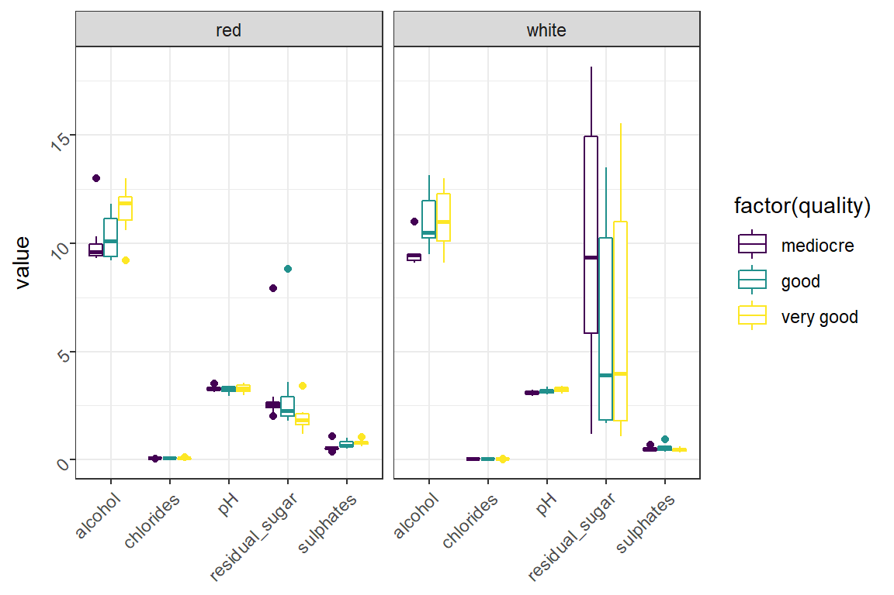

<!-- TABLE OF CONTENTS -->
<!-- <aside> -->
<!--   <div id="toc_container"> -->
<!--   <p class="toc_title">Contents</p> -->
<!--   <ul class="toc_list"> -->
<!--     <li><a href="#manova">MANOVA</a></li> -->
<!--     <li><a href="#checking-assumptions">Checking assumptions</a> -->
<!--     <ul> -->
<!--        <li><a href="#sample-size">Sample size</a></li> -->
<!--        <li><a href="#outliers">Outliers</a> -->
<!--        <ul> -->
<!--          <li><a href="#multivariate-outliers">Multivariate outliers</a></li> -->
<!--          <li><a href="#univariate-outliers">Univariate outliers</a></li> -->
<!--        </ul></li> -->
<!--        <li><a href="#normality">Normality</a> -->
<!--        <ul> -->
<!--          <li><a href="#multivariate-normality-test">Multivariate normality test</a></li> -->
<!--          <li><a href="#univariate-normality-test">Univariate normality test</a></li> -->
<!--        </ul></li> -->
<!--        <li><a href="#correlations">Correlations</a></li> -->
<!--        <li><a href="#heteroskedasticity">Heteroskedasticity</a></li> -->
<!--     </ul></li> -->
<!--     <li><a href="#one-way-manova">One-way MANOVA</a> -->
<!--     <ul> -->
<!--       <li><a href="#post-hoc-anova">Post-hoc ANOVA</a></li> -->
<!--       <li><a href="#post-hoc-pairwise-comparisons">Pos-hoc pairwise comparisons</a></li> -->
<!--     </ul></li> -->
<!--     <li><a href="#two-way-manova">Two-way MANOVA</a> -->
<!--     <ul> -->
<!--       <li><a href="#post-hoc-anova2">Post-hoc ANOVA</a></li> -->
<!--       <li><a href="#post-hoc-pairwise-comparisons2">Pos-hoc pairwise comparisons</a></li> -->
<!--     </ul></li> -->
<!--   </ul> -->
<!--   </div> -->
<!-- </aside> -->
<aside>

<div id="toc_container">

<p class="toc_title">
Contents
</p>
<ul class="toc_list">
<a href="#manova">MANOVA</a><br>
<a href="#checking-assumptions">Checking assumptions</a><br>
<a href="#sample-size"> Sample size</a><br>
<a href="#outliers"> Outliers</a><br>
<a href="#multivariate-outliers">  Multivariate outliers</a><br>
<a href="#univariate-outliers">  Univariate outliers</a><br>
<a href="#normality"> Normality</a><br>
<a href="#multivariate-normality-test">  Multivariate normality
test</a><br> <a href="#univariate-normality-test">  Univariate normality
test</a><br> <a href="#correlations"> Correlations</a><br>
<a href="#heteroskedasticity"> Heteroskedasticity</a><br>
<a href="#one-way-manova">One-way MANOVA</a><br>
<a href="#post-hoc-anova"> Post-hoc ANOVA</a><br>
<a href="#post-hoc-pairwise-comparisons"> Pos-hoc pairwise
comparisons</a><br> <a href="#two-way-manova">Two-way MANOVA</a><br>
<a href="#post-hoc-anova2"> Post-hoc ANOVA</a><br>
<a href="#post-hoc-pairwise-comparisons2"> Pos-hoc pairwise
comparisons</a><br>
</ul>

</div>

</aside>

# MANOVA

 For this tutorial we will employ functions from three different
packages:

-   `car` (Companion to Applied Regression) that includes additional
    statistical tests,
-   `rstatix` which provides pipe-friendly statistical tests, and
-   `tidyverse` that contains multiple packages for data manipulation,
    visualization, and analysis.

``` r
library(car)
library(rstatix)
library(tidyverse)
```

 After loading the packages we can bring in the data set we will be
working with using the `read_csv()` function. This dataset includes red
and white wines (`type`) that vary among three quality levels
(`quality`) with five measures of their chemical attributes:

-   `residual_sugar` - grams per liter of sugars remaining after
    fermentation
-   `pH` - acidity as measured by the negative log<sub>10</sub> of the
    solution’s hydronium ion concentration
-   `alcohol` - percent volumn that is alcohol
-   `chlorides` - grams per liter of sodium chloride
-   `sulphates` - grams per liter of potassium sulphate

``` r
wine <- read_csv("../dat/wine-quality.csv")

head(wine)
```

    ## # A tibble: 6 × 7
    ##   type  quality residual_sugar    pH alcohol chlorides sulphates
    ##   <chr> <chr>            <dbl> <dbl>   <dbl>     <dbl>     <dbl>
    ## 1 red   good               1.8  3.38    11.8     0.066      0.72
    ## 2 red   good               2    2.94     9.2     0.082      0.66
    ## 3 red   good               3    3.16    11.5     0.103      1   
    ## 4 red   good               2.5  3.27     9.3     0.097      0.6 
    ## 5 red   good               2.6  3.36     9.4     0.093      0.86
    ## 6 red   good               3.6  3.39    11       0.067      0.66

 Note that the `type` and `quality` variables are enccoded as
characters. This is usually fine, but for ease of use we should go ahead
and recode them to factors. For the `type` variable we can code is as a
normal factor, however the `quality` variable is actually ordered, so we
should recode it as an ordered factor.

``` r
wine$type <- factor(wine$type)
wine$quality <- factor(wine$quality,
                       levels = c("mediocre", "good", "very good"),
                       ordered = TRUE)

str(wine)
```

    ## spec_tbl_df [60 × 7] (S3: spec_tbl_df/tbl_df/tbl/data.frame)
    ##  $ type          : Factor w/ 2 levels "red","white": 1 1 1 1 1 1 1 1 1 1 ...
    ##  $ quality       : Ord.factor w/ 3 levels "mediocre"<"good"<..: 2 2 2 2 2 2 2 2 2 2 ...
    ##  $ residual_sugar: num [1:60] 1.8 2 3 2.5 2.6 3.6 2 2 8.8 2 ...
    ##  $ pH            : num [1:60] 3.38 2.94 3.16 3.27 3.36 3.39 3.22 3.37 3.38 3.11 ...
    ##  $ alcohol       : num [1:60] 11.8 9.2 11.5 9.3 9.4 11 11.2 9.4 10.1 10.1 ...
    ##  $ chlorides     : num [1:60] 0.066 0.082 0.103 0.097 0.093 0.067 0.12 0.082 0.084 0.067 ...
    ##  $ sulphates     : num [1:60] 0.72 0.66 1 0.6 0.86 0.66 0.58 0.5 0.64 0.97 ...
    ##  - attr(*, "spec")=
    ##   .. cols(
    ##   ..   type = col_character(),
    ##   ..   quality = col_character(),
    ##   ..   residual_sugar = col_double(),
    ##   ..   pH = col_double(),
    ##   ..   alcohol = col_double(),
    ##   ..   chlorides = col_double(),
    ##   ..   sulphates = col_double()
    ##   .. )
    ##  - attr(*, "problems")=<externalptr>

 From the output of `str()` we can see that `type` and `quality` are now
coded as a factor and an ordered factor where its levels are ordered as
*mediocre* \< *good* \< *very good*, respectively.

``` r
wine %>%
  pivot_longer(cols = c(residual_sugar, pH, alcohol, chlorides, sulphates)) %>%
  ggplot(aes(x = name, y = value, color = factor(quality))) +
    geom_boxplot() +
    facet_wrap(~ type) +
    labs(x = NULL) +
    theme_bw() +
    theme(axis.text = element_text(angle = 45, vjust = 0.5, hjust = 1))
```



## Checking assumptions

 Before starting the MANOVA analysis we should first check whether some
of its assumptions are valid with this data set. These assumptions
include:

-   Adequate *sample size*,
-   No *outliers* or *high leverage points*,
-   Approximately multivariate *normality*,
-   No major *multicollinearity*, and
-   Homogeneity of covariances, or *heteroskedacity*.

<a id="sample-size"></a>

### Sample size

 For the MANOVA test to be valid, the number of observations (n) for
each group (g) must be greater than the number of outcome variables (p).
With this data, we have 2 levels in the `type` variable and 3 levels in
the `quality` variable for 2x3 = 6 total groups, so we will want our n
for each group to be greater than 6. We can use the `group_by()`
function to create our groups then count the number of observations
within them with the `summarize()` and `n()` functions.

``` r
wine %>%
  group_by(type, quality) %>%
  summarize(n = n())
```

    ## # A tibble: 6 × 3
    ## # Groups:   type [2]
    ##   type  quality       n
    ##   <fct> <ord>     <int>
    ## 1 red   mediocre     10
    ## 2 red   good         10
    ## 3 red   very good    10
    ## 4 white mediocre     10
    ## 5 white good         10
    ## 6 white very good    10

 

### Outliers

#### Multivariate outliers

 To flag multivariate outliers we can calculate the Mahalanobis
distances for each point, then compare those distances against a
χ<sup>2</sup> distribution where the degrees of freedom is equal to the
number of outcome variables (in this case 3) and α = 0.001. We first
group our independent variables of interest, <i>type</i> and
<i>quality</i>, using `group_by()` then calculate the Mahalanobis
distances with the `mahalanobis_distance()` funciton. We will also use
the `filter()` function to only print out significant outliers.

``` r
wine %>%
  group_by(type, quality) %>%
  mahalanobis_distance() %>%
  filter(is.outlier == TRUE)
```

    ## # A tibble: 0 × 7
    ## # … with 7 variables: residual_sugar <dbl>, pH <dbl>, alcohol <dbl>, chlorides <dbl>,
    ## #   sulphates <dbl>, mahal.dist <dbl>, is.outlier <lgl>

 Since the output is empty we can conclude that there are no significant
multivariate outliers as determined by the Mahalanobis distance.

#### Univariate outliers

``` r
wine %>%
  group_by(type, quality) %>%
  identify_outliers(pH)
```

    ## # A tibble: 1 × 9
    ##   type  quality  residual_sugar    pH alcohol chlorides sulphates is.outlier is.extreme
    ##   <fct> <ord>             <dbl> <dbl>   <dbl>     <dbl>     <dbl> <lgl>      <lgl>     
    ## 1 red   mediocre            2.5  3.53     9.5     0.076      0.55 TRUE       FALSE

``` r
wine %>%
  group_by(type, quality) %>%
  identify_outliers(residual_sugar)
```

    ## # A tibble: 4 × 9
    ##   type  quality   residual_sugar    pH alcohol chlorides sulphates is.outlier is.extreme
    ##   <fct> <ord>              <dbl> <dbl>   <dbl>     <dbl>     <dbl> <lgl>      <lgl>     
    ## 1 red   mediocre             7.9  3.27     9.3     0.086      0.57 TRUE       TRUE      
    ## 2 red   mediocre             2    3.25     9.4     0.074      0.54 TRUE       FALSE     
    ## 3 red   good                 8.8  3.38    10.1     0.084      0.64 TRUE       TRUE      
    ## 4 red   very good            3.4  3.17    12.2     0.128      0.84 TRUE       FALSE

``` r
wine %>%
  group_by(type, quality) %>%
  identify_outliers(`alcohol`)
```

    ## # A tibble: 3 × 9
    ##   type  quality   residual_sugar    pH alcohol chlorides sulphates is.outlier is.extreme
    ##   <fct> <ord>              <dbl> <dbl>   <dbl>     <dbl>     <dbl> <lgl>      <lgl>     
    ## 1 red   mediocre             2.6  3.22    13       0.056      0.37 TRUE       TRUE      
    ## 2 red   very good            2.2  3.07     9.2     0.075      0.84 TRUE       FALSE     
    ## 3 white mediocre             5.6  2.96    11       0.039      0.52 TRUE       TRUE

### Normality

#### Multivariate normality test

``` r
wine %>%
  select(pH, alcohol, residual_sugar, chlorides, sulphates) %>%
  mshapiro_test()
```

    ## # A tibble: 1 × 2
    ##   statistic  p.value
    ##       <dbl>    <dbl>
    ## 1     0.899 0.000116

#### Univariate normality test

``` r
wine %>%
  group_by(type, quality) %>%
  shapiro_test(residual_sugar, pH, alcohol, chlorides, sulphates) %>%
  adjust_pvalue(method = "BH") %>%
  add_significance() %>%
  print(n = Inf)
```

    ## # A tibble: 30 × 7
    ##    type  quality   variable       statistic          p    p.adj p.adj.signif
    ##    <fct> <ord>     <chr>              <dbl>      <dbl>    <dbl> <chr>       
    ##  1 red   mediocre  alcohol            0.615 0.0000832  0.000772 ***         
    ##  2 red   mediocre  chlorides          0.966 0.855      0.902    ns          
    ##  3 red   mediocre  pH                 0.930 0.450      0.643    ns          
    ##  4 red   mediocre  residual_sugar     0.513 0.00000518 0.000155 ***         
    ##  5 red   mediocre  sulphates          0.662 0.000308   0.00185  **          
    ##  6 red   good      alcohol            0.879 0.129      0.297    ns          
    ##  7 red   good      chlorides          0.926 0.414      0.631    ns          
    ##  8 red   good      pH                 0.848 0.0543     0.156    ns          
    ##  9 red   good      residual_sugar     0.591 0.0000426  0.000640 ***         
    ## 10 red   good      sulphates          0.901 0.224      0.449    ns          
    ## 11 red   very good alcohol            0.914 0.312      0.585    ns          
    ## 12 red   very good chlorides          0.840 0.0445     0.148    ns          
    ## 13 red   very good pH                 0.965 0.845      0.902    ns          
    ## 14 red   very good residual_sugar     0.849 0.0570     0.156    ns          
    ## 15 red   very good sulphates          0.924 0.390      0.631    ns          
    ## 16 white mediocre  alcohol            0.623 0.000103   0.000772 ***         
    ## 17 white mediocre  chlorides          0.878 0.123      0.297    ns          
    ## 18 white mediocre  pH                 0.953 0.700      0.840    ns          
    ## 19 white mediocre  residual_sugar     0.927 0.421      0.631    ns          
    ## 20 white mediocre  sulphates          0.948 0.650      0.840    ns          
    ## 21 white good      alcohol            0.840 0.0441     0.148    ns          
    ## 22 white good      chlorides          0.968 0.871      0.902    ns          
    ## 23 white good      pH                 0.968 0.872      0.902    ns          
    ## 24 white good      residual_sugar     0.838 0.0421     0.148    ns          
    ## 25 white good      sulphates          0.890 0.168      0.361    ns          
    ## 26 white very good alcohol            0.923 0.381      0.631    ns          
    ## 27 white very good chlorides          0.975 0.932      0.932    ns          
    ## 28 white very good pH                 0.943 0.588      0.802    ns          
    ## 29 white very good residual_sugar     0.834 0.0377     0.148    ns          
    ## 30 white very good sulphates          0.951 0.680      0.840    ns

### Correlations

``` r
wine %>%
  select(residual_sugar:sulphates) %>%
  cor_mat()
```

    ## # A tibble: 5 × 6
    ##   rowname        residual_sugar    pH alcohol chlorides sulphates
    ## * <chr>                   <dbl> <dbl>   <dbl>     <dbl>     <dbl>
    ## 1 residual_sugar           1    -0.33   -0.36     -0.29     -0.3 
    ## 2 pH                      -0.33  1       0.18      0.11      0.11
    ## 3 alcohol                 -0.36  0.18    1        -0.22      0.14
    ## 4 chlorides               -0.29  0.11   -0.22      1         0.36
    ## 5 sulphates               -0.3   0.11    0.14      0.36      1

### Heteroskedasticity

``` r
wine %>%
  select(residual_sugar:sulphates) %>%
  box_m(wine$quality)
```

    ## # A tibble: 1 × 4
    ##   statistic p.value parameter method                                             
    ##       <dbl>   <dbl>     <dbl> <chr>                                              
    ## 1      33.8   0.290        30 Box's M-test for Homogeneity of Covariance Matrices

``` r
wine %>%
  pivot_longer(cols = c(pH, alcohol, residual_sugar, chlorides, sulphates)) %>%
  group_by(name) %>%
  levene_test(value ~ type * quality) %>%
  adjust_pvalue() %>%
  add_significance()
```

    ## # A tibble: 5 × 7
    ##   name             df1   df2 statistic         p    p.adj p.adj.signif
    ##   <chr>          <int> <int>     <dbl>     <dbl>    <dbl> <chr>       
    ## 1 alcohol            5    54     1.65  0.164     0.378    ns          
    ## 2 chlorides          5    54     2.05  0.0863    0.345    ns          
    ## 3 pH                 5    54     1.81  0.126     0.378    ns          
    ## 4 residual_sugar     5    54     6.56  0.0000773 0.000387 ***         
    ## 5 sulphates          5    54     0.556 0.733     0.733    ns

## One-way MANOVA

``` r
wine_manova1 <- manova(cbind(pH, alcohol, residual_sugar, chlorides, sulphates) ~ quality,
                       data = wine)

Manova(wine_manova1, test.statistic = "Pillai")
```

    ## 
    ## Type II MANOVA Tests: Pillai test statistic
    ##         Df test stat approx F num Df den Df  Pr(>F)  
    ## quality  2   0.33506   2.1734     10    108 0.02472 *
    ## ---
    ## Signif. codes:  0 '***' 0.001 '**' 0.01 '*' 0.05 '.' 0.1 ' ' 1

``` r
Manova(wine_manova1, test.statistic = "Wilks")
```

    ## 
    ## Type II MANOVA Tests: Wilks test statistic
    ##         Df test stat approx F num Df den Df  Pr(>F)  
    ## quality  2   0.67572    2.295     10    106 0.01764 *
    ## ---
    ## Signif. codes:  0 '***' 0.001 '**' 0.01 '*' 0.05 '.' 0.1 ' ' 1

``` r
Manova(wine_manova1, test.statistic = "Hotelling-Lawley")
```

    ## 
    ## Type II MANOVA Tests: Hotelling-Lawley test statistic
    ##         Df test stat approx F num Df den Df  Pr(>F)  
    ## quality  2   0.46394   2.4125     10    104 0.01272 *
    ## ---
    ## Signif. codes:  0 '***' 0.001 '**' 0.01 '*' 0.05 '.' 0.1 ' ' 1

``` r
Manova(wine_manova1, test.statistic = "Roy")
```

    ## 
    ## Type II MANOVA Tests: Roy test statistic
    ##         Df test stat approx F num Df den Df   Pr(>F)   
    ## quality  2   0.42653   4.6065      5     54 0.001426 **
    ## ---
    ## Signif. codes:  0 '***' 0.001 '**' 0.01 '*' 0.05 '.' 0.1 ' ' 1

### Post-hoc ANOVA

``` r
wine %>%
  pivot_longer(cols = c(pH, alcohol, residual_sugar, chlorides, sulphates)) %>%
  group_by(name) %>%
  anova_test(value ~ quality)
```

    ## # A tibble: 5 × 8
    ##   name           Effect    DFn   DFd     F        p `p<.05`   ges
    ## * <chr>          <chr>   <dbl> <dbl> <dbl>    <dbl> <chr>   <dbl>
    ## 1 alcohol        quality     2    57 9.82  0.000216 "*"     0.256
    ## 2 chlorides      quality     2    57 0.601 0.552    ""      0.021
    ## 3 pH             quality     2    57 1.55  0.221    ""      0.052
    ## 4 residual_sugar quality     2    57 1.37  0.262    ""      0.046
    ## 5 sulphates      quality     2    57 2.16  0.124    ""      0.071

### Post-hoc pairwise comparisons

``` r
wine %>%
  tukey_hsd(alcohol ~ quality)
```

    ## # A tibble: 3 × 9
    ##   term    group1   group2    null.value estimate conf.low conf.high    p.adj p.adj.signif
    ## * <chr>   <chr>    <chr>          <dbl>    <dbl>    <dbl>     <dbl>    <dbl> <chr>       
    ## 1 quality mediocre good               0    0.907   0.0585      1.75 0.0336   *           
    ## 2 quality mediocre very good          0    1.55    0.707       2.40 0.000135 ***         
    ## 3 quality good     very good          0    0.648  -0.200       1.50 0.166    ns

## Two-way MANOVA

``` r
wine_manova2 <- manova(cbind(pH, alcohol, residual_sugar, chlorides, sulphates) ~ quality * type,
                       data = wine)

Manova(wine_manova2, test.statistic = "Pillai", type = 3)
```

    ## 
    ## Type III MANOVA Tests: Pillai test statistic
    ##              Df test stat approx F num Df den Df    Pr(>F)    
    ## (Intercept)   1   0.99821   5570.7      5     50 < 2.2e-16 ***
    ## quality       2   0.36076      2.2     10    102   0.02065 *  
    ## type          1   0.78403     36.3      5     50 1.635e-15 ***
    ## quality:type  2   0.24110      1.4     10    102   0.19173    
    ## ---
    ## Signif. codes:  0 '***' 0.001 '**' 0.01 '*' 0.05 '.' 0.1 ' ' 1

<a id="post-hoc-anova2"></a>

### Post-hoc ANOVA

``` r
wine %>%
  pivot_longer(cols = c(pH, alcohol, residual_sugar, chlorides, sulphates)) %>%
  group_by(name) %>%
  anova_test(value ~ quality + type, type = 2)
```

    ## # A tibble: 10 × 8
    ##    name           Effect    DFn   DFd      F        p `p<.05`     ges
    ##  * <chr>          <chr>   <dbl> <dbl>  <dbl>    <dbl> <chr>     <dbl>
    ##  1 alcohol        quality     2    56  9.66  2.49e- 4 "*"     0.256  
    ##  2 alcohol        type        1    56  0.051 8.22e- 1 ""      0.00091
    ##  3 chlorides      quality     2    56  1.54  2.24e- 1 ""      0.052  
    ##  4 chlorides      type        1    56 89.7   3.17e-13 "*"     0.616  
    ##  5 pH             quality     2    56  1.77  1.79e- 1 ""      0.06   
    ##  6 pH             type        1    56  9.20  4   e- 3 "*"     0.141  
    ##  7 residual_sugar quality     2    56  1.81  1.73e- 1 ""      0.061  
    ##  8 residual_sugar type        1    56 19.4   4.75e- 5 "*"     0.258  
    ##  9 sulphates      quality     2    56  3.03  5.6 e- 2 ""      0.098  
    ## 10 sulphates      type        1    56 23.9   8.93e- 6 "*"     0.299

<a id="post-hoc-pairwise-comparisons2"></a>

### Post-hoc pairwise comparisons

<details>
<summary>
Output
</summary>

``` r
wine %>%
  tukey_hsd(alcohol ~ quality)
```

    ## # A tibble: 3 × 9
    ##   term    group1   group2    null.value estimate conf.low conf.high    p.adj p.adj.signif
    ## * <chr>   <chr>    <chr>          <dbl>    <dbl>    <dbl>     <dbl>    <dbl> <chr>       
    ## 1 quality mediocre good               0    0.907   0.0585      1.75 0.0336   *           
    ## 2 quality mediocre very good          0    1.55    0.707       2.40 0.000135 ***         
    ## 3 quality good     very good          0    0.648  -0.200       1.50 0.166    ns

</details>
