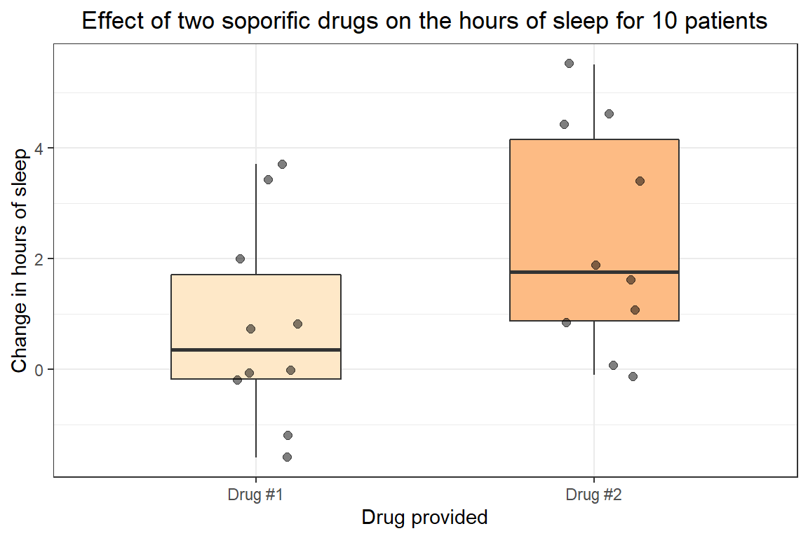

# Mann-Whitney U & Wilcoxon signed-rank tests

 When we have an ordinal dependent variable or a continuous variable
that does not meet the assumptions of the t-test, we can look to the
Mann-Whitney U test (also known as the Wilcoxon rank sum test). If the
groups are paired then the Wilcoxon signed-rank test replaces the paired
t-test as a non-parametric alternative. This means that while these
tests do make the assumption that the two samples come from similarly
shaped (symmetrical) distributions, those distributions do not need to
be normally distributed (parametric).

 Before committing to the Mann-Whitney U or the Wilcoxon signed-rank
test we should determine if the following assumptions are valid:

-   The **dependent variable is ordinal or continuous** and the
    **independent variable has two groups**
-   The observations are **independent** and **randomly sampled**
-   Both groups have **symmetrical distributions**

 We can then test the null and alternative hypotheses:

 <i>H<sub>0</sub></i>: The probability that a randomly drawn observation
from one population will be greater than a randomly drawn observation
from the second observation is 50%. Or, the two samples belong to the
same population with the same median.
<center>
M<sub>1</sub> = M<sub>2</sub>
</center>
<br>  <i>H<sub>A</sub></i>: The two samples have different medians and
thus do not come from the same population.
<center>
M<sub>1</sub> ≠ M<sub>2</sub>
</center>

<br>

### Fitting the Mann-Whitney U test

 In this example we will use the `mtcars` data set that is provided in
base R. The data set includes 10 aspects of automobile design and
performance for 32 automobile models built between 1973 and 1974. We
will specifically be interested in whether there are differences in
miles per gallon (*mpg*) between the two types of transmission (*am*),
automatic and manual. Specifying these two columns specifically in the
`summary()` function we can get an idea of how each look like.

``` r
summary(mtcars[, c("am", "mpg")])
```

    ##        am              mpg       
    ##  Min.   :0.0000   Min.   :10.40  
    ##  1st Qu.:0.0000   1st Qu.:15.43  
    ##  Median :0.0000   Median :19.20  
    ##  Mean   :0.4062   Mean   :20.09  
    ##  3rd Qu.:1.0000   3rd Qu.:22.80  
    ##  Max.   :1.0000   Max.   :33.90

 Because *am* is coded as a number rather than a factor the `summary()`
function calculates the mean and quantiles, which are not very useful to
us. For the *mpg* variable we do see that it appears to be continuous
and there are no missing data or miscoded values. Plotting the data as
below, we might hypothesize that there is a difference between automatic
and manual transmission and the miles per gallon for the automobiles.


 To statistically determine if there are differences between these two
types of transmissions we will use the Mann-Whitney U test. In R, we can
perform a Mann-Whitney test using the `wilcox.test()` function with the
continuous variable (*mpg*) on the left and the categorical variable
(*mpg*) on the right of the `~`. We will also set the `conf.int` option
to `TRUE` so that the 95% confidence intervale and differences in
location are calculated. Although *am* is coded as a numerical variable,
because it only consists of 0’s and 1’s the `wilcox.test()` function
will recognize the two groups and we do not need to change the variable
type to a factor.

``` r
wilcox.test(mpg ~ am, data = mtcars, conf.int = TRUE)
```

    ## Warning in wilcox.test.default(x = c(21.4, 18.7, 18.1, 14.3, 24.4, 22.8, : cannot compute exact p-
    ## value with ties

    ## Warning in wilcox.test.default(x = c(21.4, 18.7, 18.1, 14.3, 24.4, 22.8, : cannot compute exact
    ## confidence intervals with ties

    ## 
    ##  Wilcoxon rank sum test with continuity correction
    ## 
    ## data:  mpg by am
    ## W = 42, p-value = 0.001871
    ## alternative hypothesis: true location shift is not equal to 0
    ## 95 percent confidence interval:
    ##  -11.699942  -2.900042
    ## sample estimates:
    ## difference in location 
    ##              -6.799963

 Note that we get warning messages with the output from the test This is
because we have some values with tied rankings and the sample sizes
lower than 50, which causes the exact p-value and confidence intervals
to be unable to be calculated. There are different ways we can avoid
this issue, such as increasing the sample size to 50 or greater, but in
many cases that solution would not be feasible. Instead, the estimated
p-value based on a normal approximation calculated by the
`wilcox.test()` is good enough, and we can conclude that automobiles
with automatic transmissions have a lower miles per gallon than those
with manual transmissions. The median difference between automatic and
manual miles per gallon is somewhere between -2.9 and -11.7 mpg with 95%
confidence, and the median of the difference between automatic and
manual transmissions is -6.8 mpg (note that this is not the difference
in medians).

### Fitting the Wilcoxon signed-rank test

 In the case that our data is paired the Mann-Whitney U test is no
longer viable. Instead, we should apply the Wilcoxon signed-rank test
which in R uses the same `wilcox.test()` function but requires us to set
the `paired` option to `TRUE`.

``` r
summary(sleep)
```

    ##      extra        group        ID   
    ##  Min.   :-1.600   1:10   1      :2  
    ##  1st Qu.:-0.025   2:10   2      :2  
    ##  Median : 0.950          3      :2  
    ##  Mean   : 1.540          4      :2  
    ##  3rd Qu.: 3.400          5      :2  
    ##  Max.   : 5.500          6      :2  
    ##                          (Other):8



``` r
wilcox.test(extra ~ group, sleep, paired = TRUE, conf.int = TRUE)
```

    ## Warning in wilcox.test.default(x = c(0.7, -1.6, -0.2, -1.2, -0.1, 3.4, 3.7, : cannot compute exact
    ## p-value with ties

    ## Warning in wilcox.test.default(x = c(0.7, -1.6, -0.2, -1.2, -0.1, 3.4, 3.7, : cannot compute exact
    ## confidence interval with ties

    ## Warning in wilcox.test.default(x = c(0.7, -1.6, -0.2, -1.2, -0.1, 3.4, 3.7, : cannot compute exact
    ## p-value with zeroes

    ## Warning in wilcox.test.default(x = c(0.7, -1.6, -0.2, -1.2, -0.1, 3.4, 3.7, : cannot compute exact
    ## confidence interval with zeroes

    ## 
    ##  Wilcoxon signed rank test with continuity correction
    ## 
    ## data:  extra by group
    ## V = 0, p-value = 0.009091
    ## alternative hypothesis: true location shift is not equal to 0
    ## 95 percent confidence interval:
    ##  -2.949921 -1.050018
    ## sample estimates:
    ## (pseudo)median 
    ##      -1.400031

 Again we see that there are warning messages, this time both that the
samples have ties while the sample sizes are &lt;50 and that there are
0’s in our data set. Many times this is unavoidable without increases
our sample size, but again the estimated p-value is suitable for this
analysis.

 With a p-value less than 0.05 (p-value = 0.009091) we can conclude that
the medians are not equal and that Drug \#2 has a greater effect on the
change in hours of sleep compared to Drug \#1. The median difference in
the change of hours of sleep for Drug \#1 compared to Drug \#2 is
somewhere between -2.95 and -1.05 with 95% confidence.

### Full code block

``` r
# Print summary statistics for the am and mpg variables from the mtcars data set
summary(mtcars[, c("am", "mpg")])

# Perform a Mann-Whitney test with miles per gallon as the dependent and transmission as the
# independent variable
wilcox.test(mpg ~ am, data = mtcars, conf.int = TRUE)

# Print summary statistics for the sleep data set
summary(sleep)

# Perform a Wilcoxon signed-rank test with the change in hours of sleep as the dependent and the
# type of trug as the independent variable
wilcox.test(extra ~ group, sleep, paired = TRUE, conf.int = TRUE)
```
