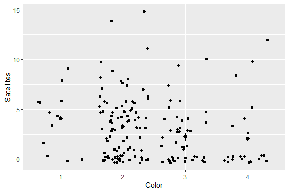

# Poisson Regression

### Load the data

    Here, we will use a dataset provided in [STAT 501 Regression
Methods](https://online.stat.psu.edu/stat504/lesson/9/9.2) that observed
the relationship between the number of male crabs attaching to a female
crab’s nest (*Satellites*) and characteristics of the female crab that
include the color (*Color*), spine condition (*Spine*), weight
(*Weight*), and carapace width (*Width*).

To read the data into R, we can use the `read.table()` function and set
`row.names = 1` so that the first column of the data (the observation
number) is set as a rown name instead of its own variable.

``` r
crab <- read.csv("dat/crab.csv")
```

It is important to look at the structure of our dataset to make sure
that it is read by R in the way we want it. Using the `str()` function
we can see some features of our data.

``` r
str(crab)
```

    ## 'data.frame':    173 obs. of  5 variables:
    ##  $ Color     : int  2 3 3 4 2 1 4 2 2 2 ...
    ##  $ Spine     : int  3 3 3 2 3 2 3 3 1 3 ...
    ##  $ Width     : num  28.3 26 25.6 21 29 25 26.2 24.9 25.7 27.5 ...
    ##  $ Weight    : num  3.05 2.6 2.15 1.85 3 2.3 1.3 2.1 2 3.15 ...
    ##  $ Satellites: int  8 4 0 0 1 3 0 0 8 6 ...

``` r
crab$Color <- factor(crab$Color)
crab$Spine <- factor(crab$Spine)
```

Importantly, the *Color*, *Spine*, and *Satellites* variables are all
read as integers while the *Width* and *Weight* are read as numerical.
The issue here is that color and spine condition are not actually
integers, only coded in that way. We will want to keep this in mind when
we fit our model so that we correctly code our variable types.


### Fit a Poisson regression model

``` r
crab.pois <- glm(Satellites ~ Color + Spine + Weight + Width,
                 data = crab,
                 family = poisson)

summary(crab.pois)
```

    ## 
    ## Call:
    ## glm(formula = Satellites ~ Color + Spine + Weight + Width, family = poisson, 
    ##     data = crab)
    ## 
    ## Deviance Residuals: 
    ##     Min       1Q   Median       3Q      Max  
    ## -3.0291  -1.8632  -0.5991   0.9331   4.9449  
    ## 
    ## Coefficients:
    ##             Estimate Std. Error z value Pr(>|z|)   
    ## (Intercept) -0.35722    0.96700  -0.369  0.71182   
    ## Color2      -0.26491    0.16811  -1.576  0.11507   
    ## Color3      -0.51374    0.19536  -2.630  0.00855 **
    ## Color4      -0.53126    0.22692  -2.341  0.01922 * 
    ## Spine2      -0.15044    0.21358  -0.704  0.48119   
    ## Spine3       0.08742    0.11993   0.729  0.46604   
    ## Weight       0.49712    0.16628   2.990  0.00279 **
    ## Width        0.01651    0.04894   0.337  0.73582   
    ## ---
    ## Signif. codes:  0 '***' 0.001 '**' 0.01 '*' 0.05 '.' 0.1 ' ' 1
    ## 
    ## (Dispersion parameter for poisson family taken to be 1)
    ## 
    ##     Null deviance: 632.79  on 172  degrees of freedom
    ## Residual deviance: 549.56  on 165  degrees of freedom
    ## AIC: 920.86
    ## 
    ## Number of Fisher Scoring iterations: 6

``` r
crab.pois <- glm(Satellites ~ Color + Weight,
                 data = crab,
                 family = poisson)

summary(crab.pois)
```

    ## 
    ## Call:
    ## glm(formula = Satellites ~ Color + Weight, family = poisson, 
    ##     data = crab)
    ## 
    ## Deviance Residuals: 
    ##     Min       1Q   Median       3Q      Max  
    ## -2.9831  -1.9273  -0.5549   0.8645   4.8271  
    ## 
    ## Coefficients:
    ##             Estimate Std. Error z value Pr(>|z|)    
    ## (Intercept) -0.04961    0.23311  -0.213   0.8315    
    ## Color2      -0.20508    0.15371  -1.334   0.1821    
    ## Color3      -0.44966    0.17574  -2.559   0.0105 *  
    ## Color4      -0.45228    0.20843  -2.170   0.0300 *  
    ## Weight       0.54608    0.06809   8.020 1.06e-15 ***
    ## ---
    ## Signif. codes:  0 '***' 0.001 '**' 0.01 '*' 0.05 '.' 0.1 ' ' 1
    ## 
    ## (Dispersion parameter for poisson family taken to be 1)
    ## 
    ##     Null deviance: 632.79  on 172  degrees of freedom
    ## Residual deviance: 551.78  on 168  degrees of freedom
    ## AIC: 917.08
    ## 
    ## Number of Fisher Scoring iterations: 6

``` r
contrasts(crab$Color)
```

    ##   2 3 4
    ## 1 0 0 0
    ## 2 1 0 0
    ## 3 0 1 0
    ## 4 0 0 1

``` r
contrasts(crab$Color) <- matrix(c(-1/4, 3/4, -1/4, -1/4,
                                  -1/4, -1/4, 3/4, -1/4,
                                  -1/4, -1/4, -1/4, 3/4),
                                nrow = 4)
```

``` r
library(tidyverse)

ggplot(crab, aes(x = Color,  y = Satellites)) +
  stat_summary(geom = "pointrange", fun.data = "mean_se") +
  geom_jitter()
```



``` r
crab$C1 <- 1*(crab$Color == 1)
crab$C2 <- 1*(crab$Color == 2)
crab$C3 <- 1*(crab$Color == 3)
crab$C4 <- 1*(crab$Color == 4)
crab$S1 <- 1*(crab$Spine == 1)
crab$S2 <- 1*(crab$Spine == 2)
crab$S3 <- 1*(crab$Spine == 3)

model <- glm(Satellites ~ C2 + C3 + C4 + S2 + S3 + Weight + Width,
             data = crab,
             family = poisson)
summary(model)
```

    ## 
    ## Call:
    ## glm(formula = Satellites ~ C2 + C3 + C4 + S2 + S3 + Weight + 
    ##     Width, family = poisson, data = crab)
    ## 
    ## Deviance Residuals: 
    ##     Min       1Q   Median       3Q      Max  
    ## -3.0291  -1.8632  -0.5991   0.9331   4.9449  
    ## 
    ## Coefficients:
    ##             Estimate Std. Error z value Pr(>|z|)   
    ## (Intercept) -0.35722    0.96700  -0.369  0.71182   
    ## C2          -0.26491    0.16811  -1.576  0.11507   
    ## C3          -0.51374    0.19536  -2.630  0.00855 **
    ## C4          -0.53126    0.22692  -2.341  0.01922 * 
    ## S2          -0.15044    0.21358  -0.704  0.48119   
    ## S3           0.08742    0.11993   0.729  0.46604   
    ## Weight       0.49712    0.16628   2.990  0.00279 **
    ## Width        0.01651    0.04894   0.337  0.73582   
    ## ---
    ## Signif. codes:  0 '***' 0.001 '**' 0.01 '*' 0.05 '.' 0.1 ' ' 1
    ## 
    ## (Dispersion parameter for poisson family taken to be 1)
    ## 
    ##     Null deviance: 632.79  on 172  degrees of freedom
    ## Residual deviance: 549.56  on 165  degrees of freedom
    ## AIC: 920.86
    ## 
    ## Number of Fisher Scoring iterations: 6

``` r
# vif(model)

# model <- glm(Sa ~ W, family = poisson)
# summary(model)
```

### Interpret the results

``` r
summary(crab.pois)
```

    ## 
    ## Call:
    ## glm(formula = Satellites ~ Color + Weight, family = poisson, 
    ##     data = crab)
    ## 
    ## Deviance Residuals: 
    ##     Min       1Q   Median       3Q      Max  
    ## -2.9831  -1.9273  -0.5549   0.8645   4.8271  
    ## 
    ## Coefficients:
    ##             Estimate Std. Error z value Pr(>|z|)    
    ## (Intercept) -0.04961    0.23311  -0.213   0.8315    
    ## Color2      -0.20508    0.15371  -1.334   0.1821    
    ## Color3      -0.44966    0.17574  -2.559   0.0105 *  
    ## Color4      -0.45228    0.20843  -2.170   0.0300 *  
    ## Weight       0.54608    0.06809   8.020 1.06e-15 ***
    ## ---
    ## Signif. codes:  0 '***' 0.001 '**' 0.01 '*' 0.05 '.' 0.1 ' ' 1
    ## 
    ## (Dispersion parameter for poisson family taken to be 1)
    ## 
    ##     Null deviance: 632.79  on 172  degrees of freedom
    ## Residual deviance: 551.78  on 168  degrees of freedom
    ## AIC: 917.08
    ## 
    ## Number of Fisher Scoring iterations: 6

``` r
# 
# pchisq(crab.pois$deviance, crab.pois$df.residual)
# 
# influence(crab.pois)
# plot(influence(crab.pois)$pear.res)
# 
# crab.pois <- glm(Sa ~ factor(C) + factor(S) + W + Wt,
#                  data = crab,
#                  family = quasipoisson)
# summary(crab.pois)$dispersion
```

### Full code block
