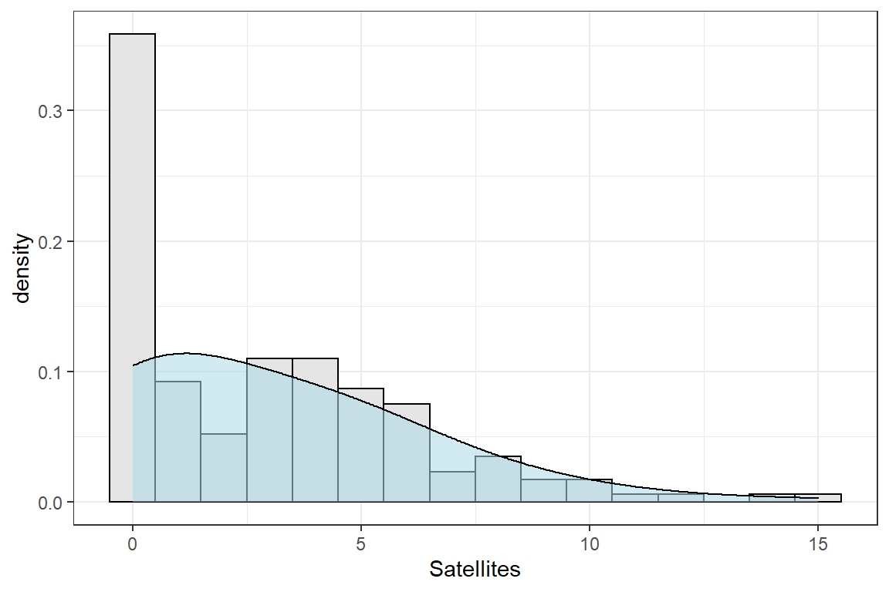
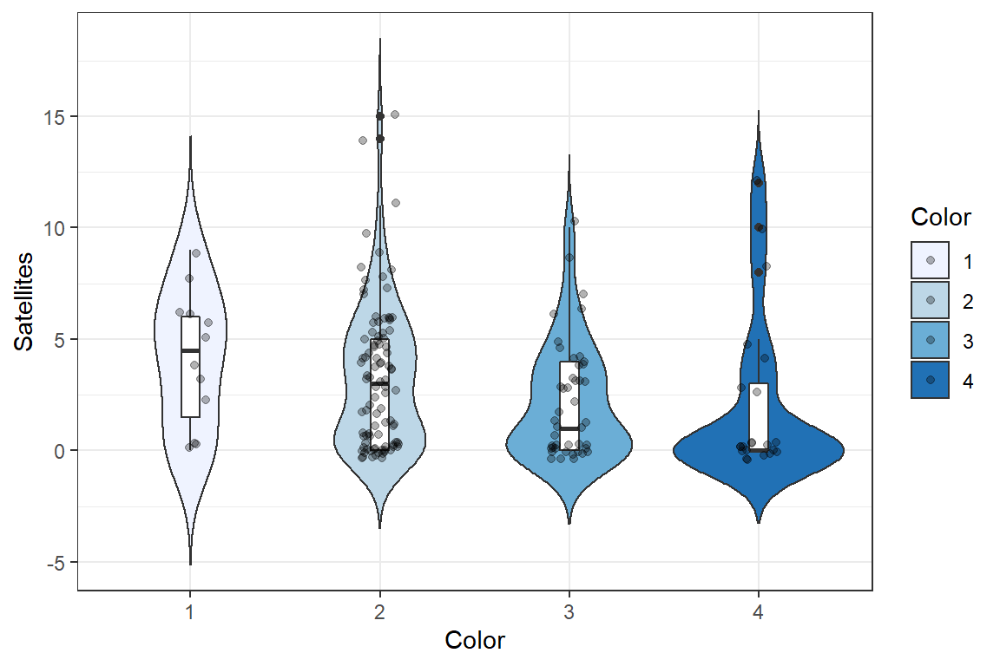

# Poisson Regression

 

### Load the data

 Here, we will use [this data
set](https://github.com/tylerbg/DLC_stat_resources/tree/master/docs/R/dat/crab.csv)
provided in [STAT 501 Regression
Methods](https://online.stat.psu.edu/stat504/lesson/9/9.2) that observed
the relationship between the number of male crabs attaching to a female
crab’s nest (*Satellites*) and the characteristics of the female crab
that include the color (*Color*), spine condition (*Spine*), weight
(*Weight*), and carapace width (*Width*).

To read the data into R, we can use the `read.table()` function and set
`row.names = 1` so that the first column of the data (the observation
number) is set as a rown name instead of its own variable.

``` r
crab <- read.csv("dat/crab.csv")
```

It is important to look at the structure of our dataset to make sure
that it is read by R in the way we want it. Using the `str()` function
we can see some features of our data.

``` r
str(crab)
```

    ## 'data.frame':    173 obs. of  5 variables:
    ##  $ Color     : int  2 3 3 4 2 1 4 2 2 2 ...
    ##  $ Spine     : int  3 3 3 2 3 2 3 3 1 3 ...
    ##  $ Width     : num  28.3 26 25.6 21 29 25 26.2 24.9 25.7 27.5 ...
    ##  $ Weight    : num  3.05 2.6 2.15 1.85 3 2.3 1.3 2.1 2 3.15 ...
    ##  $ Satellites: int  8 4 0 0 1 3 0 0 8 6 ...

``` r
crab$Color <- factor(crab$Color)
crab$Spine <- factor(crab$Spine)
```

Importantly, the *Color*, *Spine*, and *Satellites* variables are all
read as integers while the *Width* and *Weight* are read as numerical.
The issue here is that color and spine condition are not actually
integers, only coded in that way. We will want to keep this in mind when
we fit our model so that we correctly code our variable types.



### Fit a Poisson regression model

``` r
crab.pois <- glm(Satellites ~ Color + Spine + Weight + Width,
                 data = crab,
                 family = poisson)

summary(crab.pois)
```

    ## 
    ## Call:
    ## glm(formula = Satellites ~ Color + Spine + Weight + Width, family = poisson, 
    ##     data = crab)
    ## 
    ## Deviance Residuals: 
    ##     Min       1Q   Median       3Q      Max  
    ## -3.0291  -1.8632  -0.5991   0.9331   4.9449  
    ## 
    ## Coefficients:
    ##             Estimate Std. Error z value Pr(>|z|)   
    ## (Intercept) -0.35722    0.96700  -0.369  0.71182   
    ## Color2      -0.26491    0.16811  -1.576  0.11507   
    ## Color3      -0.51374    0.19536  -2.630  0.00855 **
    ## Color4      -0.53126    0.22692  -2.341  0.01922 * 
    ## Spine2      -0.15044    0.21358  -0.704  0.48119   
    ## Spine3       0.08742    0.11993   0.729  0.46604   
    ## Weight       0.49712    0.16628   2.990  0.00279 **
    ## Width        0.01651    0.04894   0.337  0.73582   
    ## ---
    ## Signif. codes:  0 '***' 0.001 '**' 0.01 '*' 0.05 '.' 0.1 ' ' 1
    ## 
    ## (Dispersion parameter for poisson family taken to be 1)
    ## 
    ##     Null deviance: 632.79  on 172  degrees of freedom
    ## Residual deviance: 549.56  on 165  degrees of freedom
    ## AIC: 920.86
    ## 
    ## Number of Fisher Scoring iterations: 6

``` r
crab.pois <- glm(Satellites ~ Color + Weight,
                 data = crab,
                 family = poisson)

summary(crab.pois)
```

    ## 
    ## Call:
    ## glm(formula = Satellites ~ Color + Weight, family = poisson, 
    ##     data = crab)
    ## 
    ## Deviance Residuals: 
    ##     Min       1Q   Median       3Q      Max  
    ## -2.9831  -1.9273  -0.5549   0.8645   4.8271  
    ## 
    ## Coefficients:
    ##             Estimate Std. Error z value Pr(>|z|)    
    ## (Intercept) -0.04961    0.23311  -0.213   0.8315    
    ## Color2      -0.20508    0.15371  -1.334   0.1821    
    ## Color3      -0.44966    0.17574  -2.559   0.0105 *  
    ## Color4      -0.45228    0.20843  -2.170   0.0300 *  
    ## Weight       0.54608    0.06809   8.020 1.06e-15 ***
    ## ---
    ## Signif. codes:  0 '***' 0.001 '**' 0.01 '*' 0.05 '.' 0.1 ' ' 1
    ## 
    ## (Dispersion parameter for poisson family taken to be 1)
    ## 
    ##     Null deviance: 632.79  on 172  degrees of freedom
    ## Residual deviance: 551.78  on 168  degrees of freedom
    ## AIC: 917.08
    ## 
    ## Number of Fisher Scoring iterations: 6

``` r
contrasts(crab$Color)
```

    ##   2 3 4
    ## 1 0 0 0
    ## 2 1 0 0
    ## 3 0 1 0
    ## 4 0 0 1

``` r
contrasts(crab$Color) <- matrix(c(-1/4, 3/4, -1/4, -1/4,
                                  -1/4, -1/4, 3/4, -1/4,
                                  -1/4, -1/4, -1/4, 3/4),
                                nrow = 4)
```

``` r
library(tidyverse)

ggplot(crab, aes(x = Color,  y = Satellites, fill = Color)) +
  geom_violin(trim = FALSE) +
  # stat_summary(geom = "pointrange", fun.data = "mean_se") +
  geom_boxplot(width = 0.1, fill = "white") +
  geom_jitter(alpha = 0.3, width = 0.1) +
  scale_fill_brewer(palette="Blues") +
  theme_bw()
```



### Interpret the results

``` r
summary(crab.pois)
```

    ## 
    ## Call:
    ## glm(formula = Satellites ~ Color + Weight, family = poisson, 
    ##     data = crab)
    ## 
    ## Deviance Residuals: 
    ##     Min       1Q   Median       3Q      Max  
    ## -2.9831  -1.9273  -0.5549   0.8645   4.8271  
    ## 
    ## Coefficients:
    ##             Estimate Std. Error z value Pr(>|z|)    
    ## (Intercept) -0.04961    0.23311  -0.213   0.8315    
    ## Color2      -0.20508    0.15371  -1.334   0.1821    
    ## Color3      -0.44966    0.17574  -2.559   0.0105 *  
    ## Color4      -0.45228    0.20843  -2.170   0.0300 *  
    ## Weight       0.54608    0.06809   8.020 1.06e-15 ***
    ## ---
    ## Signif. codes:  0 '***' 0.001 '**' 0.01 '*' 0.05 '.' 0.1 ' ' 1
    ## 
    ## (Dispersion parameter for poisson family taken to be 1)
    ## 
    ##     Null deviance: 632.79  on 172  degrees of freedom
    ## Residual deviance: 551.78  on 168  degrees of freedom
    ## AIC: 917.08
    ## 
    ## Number of Fisher Scoring iterations: 6

``` r
# 
# pchisq(crab.pois$deviance, crab.pois$df.residual)
# 
# influence(crab.pois)
# plot(influence(crab.pois)$pear.res)
# 
# crab.pois <- glm(Sa ~ factor(C) + factor(S) + W + Wt,
#                  data = crab,
#                  family = quasipoisson)
# summary(crab.pois)$dispersion
```

### Full code block

### Poisson Regression with [The Children Ever Born Data](https://data.princeton.edu/wws509/datasets/#ceb)

``` r
ceb <- read.table("dat/ceb.txt", stringsAsFactors = TRUE)
```

``` r
head(ceb)
```

    ##   dur   res  educ mean  var  n     y
    ## 1 0-4  Suva  none 0.50 1.14  8  4.00
    ## 2 0-4  Suva lower 1.14 0.73 21 23.94
    ## 3 0-4  Suva upper 0.90 0.67 42 37.80
    ## 4 0-4  Suva  sec+ 0.73 0.48 51 37.23
    ## 5 0-4 urban  none 1.17 1.06 12 14.04
    ## 6 0-4 urban lower 0.85 1.59 27 22.95

``` r
str(ceb)
```

    ## 'data.frame':    70 obs. of  7 variables:
    ##  $ dur : Factor w/ 6 levels "0-4","10-14",..: 1 1 1 1 1 1 1 1 1 1 ...
    ##  $ res : Factor w/ 3 levels "rural","Suva",..: 2 2 2 2 3 3 3 3 1 1 ...
    ##  $ educ: Factor w/ 4 levels "lower","none",..: 2 1 4 3 2 1 4 3 2 1 ...
    ##  $ mean: num  0.5 1.14 0.9 0.73 1.17 0.85 1.05 0.69 0.97 0.96 ...
    ##  $ var : num  1.14 0.73 0.67 0.48 1.06 1.59 0.73 0.54 0.88 0.81 ...
    ##  $ n   : int  8 21 42 51 12 27 39 51 62 102 ...
    ##  $ y   : num  4 23.9 37.8 37.2 14 ...

``` r
dur.levels <- levels(ceb$dur)

ceb$dur <- factor(ceb$dur, levels = dur.levels[c(1, 6, 2:5)])
```

-   dur = marriage duration
-   res = residence type
-   educ = education level
-   mean = mean number of children ever born
-   var = variance of children ever born
-   n = number of women

``` r
ceb.pois <- glm(round(y) ~ dur + res + educ, data = ceb, family = "poisson")

summary(ceb.pois)
```

    ## 
    ## Call:
    ## glm(formula = round(y) ~ dur + res + educ, family = "poisson", 
    ##     data = ceb)
    ## 
    ## Deviance Residuals: 
    ##      Min        1Q    Median        3Q       Max  
    ## -18.2023   -4.1368   -0.3074    3.7858   16.2193  
    ## 
    ## Coefficients:
    ##             Estimate Std. Error z value Pr(>|z|)    
    ## (Intercept)  4.77392    0.04655  102.56  < 2e-16 ***
    ## dur5-9       0.89541    0.05240   17.09  < 2e-16 ***
    ## dur10-14     1.22136    0.05024   24.31  < 2e-16 ***
    ## dur15-19     1.31091    0.04975   26.35  < 2e-16 ***
    ## dur20-24     1.32965    0.04965   26.78  < 2e-16 ***
    ## dur25-29     1.89210    0.04756   39.78  < 2e-16 ***
    ## resSuva     -1.44312    0.02785  -51.83  < 2e-16 ***
    ## resurban    -1.04901    0.02405  -43.62  < 2e-16 ***
    ## educnone     0.16257    0.02168    7.50  6.4e-14 ***
    ## educsec+    -1.94337    0.05208  -37.32  < 2e-16 ***
    ## educupper   -0.88738    0.02951  -30.07  < 2e-16 ***
    ## ---
    ## Signif. codes:  0 '***' 0.001 '**' 0.01 '*' 0.05 '.' 0.1 ' ' 1
    ## 
    ## (Dispersion parameter for poisson family taken to be 1)
    ## 
    ##     Null deviance: 13735.6  on 69  degrees of freedom
    ## Residual deviance:  2504.1  on 59  degrees of freedom
    ## AIC: 2955.6
    ## 
    ## Number of Fisher Scoring iterations: 5
