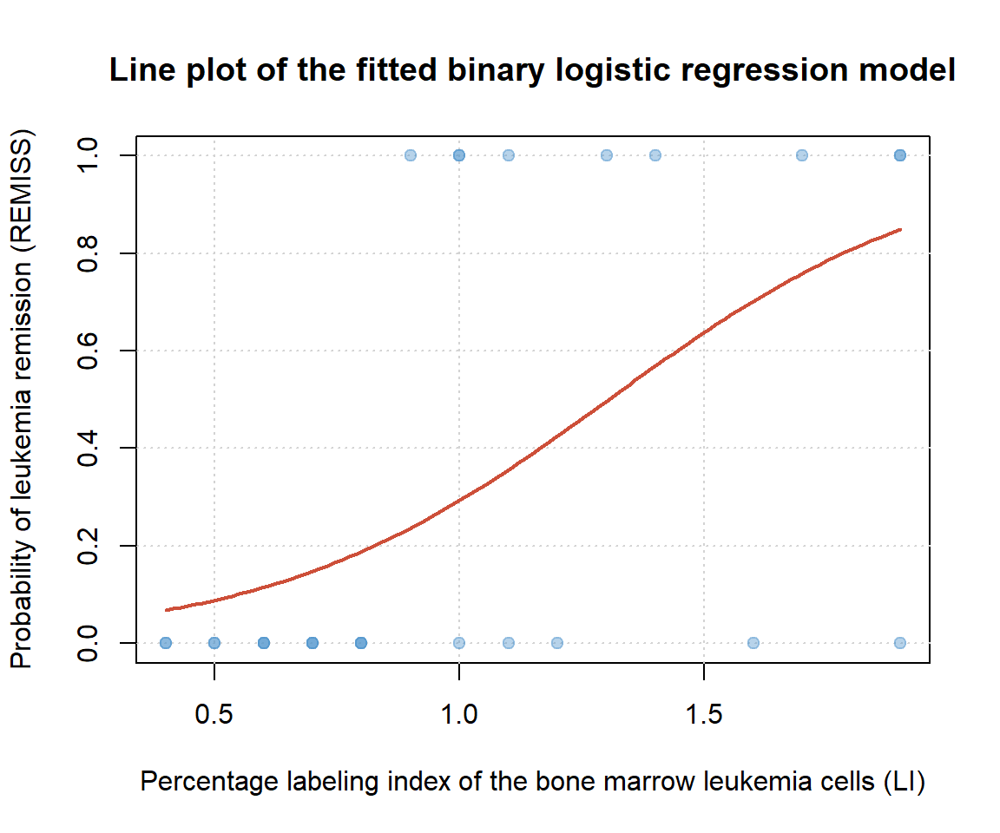

# Binary Logistic (Logit) Regression

 When our response variable has only two outcomes (binary), such as
*agree* and \*\*disagree\* or *yes* and *no*, we can estimate the log of
odds for which of the two outcomes an observation may fall in from a set
of predictors using binary logistic regression. The assumptions for
logit regression include:

-   The observations are independent
-   Little to no multicollinearity exists among the predictor variables
-   No extreme outliers or influential points
-   The sample size is sufficiently large

### Fitting a logit model

 For this example we will use this [data
set](https://github.com/tylerbg/DLC_stat_resources/tree/master/docs/R/dat/leukemia_remission.csv)
originally provided in [STAT 501 Regression
Methods](https://online.stat.psu.edu/stat501/lesson/15/15.1) that
includes six possible factors that may predict Leukemia remission:

-   *BLAST* - absolute number of blasts in the peripheral blood
-   *CELL* - cellularity of the marrow clot section
-   *INFIL* - percentage of absolute marrow leukemia cell infiltrate
-   *LI* - percentage labeling index of the bone marrow leukemia cells
-   *SMEAR* - smear differential percentage of blasts
-   *TEMP* - highest temperature prior to start of treatment

 We can load the data into R with the `read.csv()` function. As always,
it is good to look at the structure of the data set which we can do with
`str()`.

``` r
remiss <- read.csv("dat/leukemia_remission.csv")

str(remiss)
```

    ## 'data.frame':    27 obs. of  7 variables:
    ##  $ REMISS: int  1 1 0 0 1 0 1 0 0 0 ...
    ##  $ CELL  : num  0.8 0.9 0.8 1 0.9 1 0.95 0.95 1 0.95 ...
    ##  $ SMEAR : num  0.83 0.36 0.88 0.87 0.75 0.65 0.97 0.87 0.45 0.36 ...
    ##  $ INFIL : num  0.66 0.32 0.7 0.87 0.68 0.65 0.92 0.83 0.45 0.34 ...
    ##  $ LI    : num  1.9 1.4 0.8 0.7 1.3 0.6 1 1.9 0.8 0.5 ...
    ##  $ BLAST : num  1.1 0.74 0.18 1.05 0.52 0.52 1.23 1.35 0.32 0 ...
    ##  $ TEMP  : num  1 0.99 0.98 0.99 0.98 0.98 0.99 1.02 1 1.04 ...

 Our response variable for leukemia remission, *REMISS*, is either a 0
for no remission or a 1 for remission, meaning that it is binary and
suitable for logistic regression. Our six predictor variables are all
continuous and we can leave them as they are. We will go ahead and
accept that the observations are independent, there are no outliers, and
we have a sufficiently large sample size.

 Now that we have our data set loaded we can simply fit a logistic
regression model with the `glm()` function. We set up our model formula
with the response variable, *REMISS*, to the left and the predictor
variables to the right of a *\~*. Instead of writing out all of our
predictor variables we can instead choose to use a “.” which will add
all of the rest of the variables in the data frame to the model formula.
Finally, after filling out the `data =` argument we need to set
`family = binomial` to indicate that we want to fit a logistic
regression model, otherwise `glm()` would default to fitting a linear
model.

 Like any other model fit by the `glm()` function we can use the
`summary()` command to print the results.

``` r
remiss.fit <- glm(REMISS ~ ., data = remiss, family = binomial)

summary(remiss.fit)
```

    ## 
    ## Call:
    ## glm(formula = REMISS ~ ., family = binomial, data = remiss)
    ## 
    ## Deviance Residuals: 
    ##      Min        1Q    Median        3Q       Max  
    ## -1.95404  -0.66259  -0.02516   0.78184   1.57465  
    ## 
    ## Coefficients:
    ##               Estimate Std. Error z value Pr(>|z|)
    ## (Intercept)   64.25808   74.96480   0.857    0.391
    ## CELL          30.83006   52.13520   0.591    0.554
    ## SMEAR         24.68632   61.52601   0.401    0.688
    ## INFIL        -24.97447   65.28088  -0.383    0.702
    ## LI             4.36045    2.65798   1.641    0.101
    ## BLAST         -0.01153    2.26634  -0.005    0.996
    ## TEMP        -100.17340   77.75289  -1.288    0.198
    ## 
    ## (Dispersion parameter for binomial family taken to be 1)
    ## 
    ##     Null deviance: 34.372  on 26  degrees of freedom
    ## Residual deviance: 21.594  on 20  degrees of freedom
    ## AIC: 35.594
    ## 
    ## Number of Fisher Scoring iterations: 8

 The p-values for the Wald’s tests on the estimated coefficients are
listed in the `Pr(>|z|)` column, from where we can see that none of the
six variables are significant predictors for leukemia remission in this
model. Unlike with Minitab or other statistical software, the base
`summary()` function in R does not provide variance inflation factors
(VIFs). To calculate the VIFs for our fit logit model we can use the
`vif()` function from the `car` package.

``` r
library(car)

vif(remiss.fit)
```

    ##       CELL      SMEAR      INFIL         LI      BLAST       TEMP 
    ##  62.463539 434.423427 471.097597   4.431189   4.176061   3.014554

 VIFs greater than 10 (or as some suggest greater than 5) indicate a
high degree of multicollinearity among those variables which can
severely affect regression models. There are different suggestions on
how to deal with high VIFs, but in our case we will choose to fit a
simpler model with only one variable that we hypothesize would have the
biggest influence on the probability of Leukemia remission, *LI*.

 Instead of recoding a new model in `glm()`, we can use `update()` to
refit the original model with only *LI* as a predictor variable. To do
so, we input the object that we assigned our original model to then
write the formula `. ~ LI` to indicate we wish to keep the response
variable and only include LI as a predictor variable. We can then assign
the model to a new object and use `summary()` to print the results.

``` r
remiss.fit2 <- update(remiss.fit, . ~ LI)

summary(remiss.fit2)
```

    ## 
    ## Call:
    ## glm(formula = REMISS ~ LI, family = binomial, data = remiss)
    ## 
    ## Deviance Residuals: 
    ##     Min       1Q   Median       3Q      Max  
    ## -1.9448  -0.6465  -0.4947   0.6571   1.6971  
    ## 
    ## Coefficients:
    ##             Estimate Std. Error z value Pr(>|z|)   
    ## (Intercept)   -3.777      1.379  -2.740  0.00615 **
    ## LI             2.897      1.187   2.441  0.01464 * 
    ## ---
    ## Signif. codes:  0 '***' 0.001 '**' 0.01 '*' 0.05 '.' 0.1 ' ' 1
    ## 
    ## (Dispersion parameter for binomial family taken to be 1)
    ## 
    ##     Null deviance: 34.372  on 26  degrees of freedom
    ## Residual deviance: 26.073  on 25  degrees of freedom
    ## AIC: 30.073
    ## 
    ## Number of Fisher Scoring iterations: 4

 In the summary from our simpler model we see that when *LI* is
statistically significant with a p-value below 0.05. Keep in mind that
the interpretation of the coefficient is different from linear
regression. Specifically for our example, we could conclude that for
every 1 unit increase in the *LI* variable the log odds of *REMISS*
being 1 increases by 2.897. This type of interpretation will not be very
meaningful for many applications, but the important information to take
away here is that *LI* is a significant predictor of *REMISS* for which
they share a positive relationship. Or alternatively, as the percentage
labeling index of the bone marrow leukemia cells increases so does the
probability of leukemia remission, which we can observe as the red line
in the plot below.



### Full code block

``` r
# Load the data and display the structure of the resulting data frame
remiss <- read.csv("dat/leukemia_remission.csv")

str(remiss)

# Fit a binary logistic regression model including all predictor variables and print a summary of
# the results
remiss.fit <- glm(REMISS ~ ., data = remiss, family = binomial)

summary(remiss.fit)

# Load the car package to calculate VIFs for the full model
library(car)

vif(remiss.fit)

# Fit a new logistic regression model with only the LI variable and print a summary of the results
remiss.fit2 <- update(remiss.fit, . ~ LI)

summary(remiss.fit2)
```
