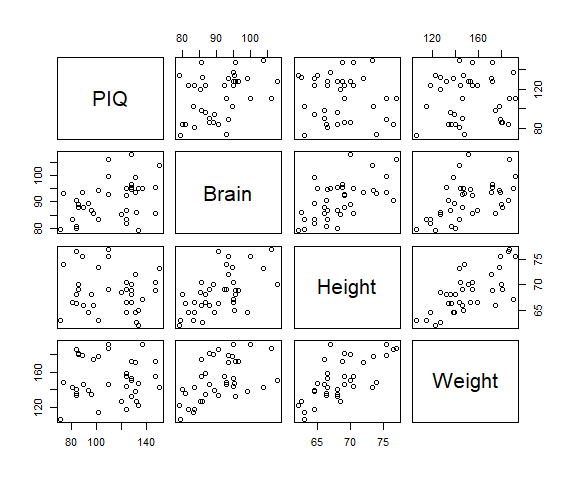

# Multiple Linear Regression (MLR)

### [MLR hypotheses](https://online.stat.psu.edu/stat501/lesson/5/5.3)

    **Null hypothesis:** The estimated coefficient (*β*) for variable
*i* is equal to 0.  
<center>
<i>H<sub>0</sub>: β<sub>i</sub> = 0</i>
</center>

 

    **Alternative hypothesis:** *β*<sub>*i*</sub> is not equal to 0.  
<center>
<i>H<sub>A</sub>: β<sub>i</sub> ≠ 0, </i>or<i> H<sub>A</sub>:
β<sub>i</sub> &gt; 0 or β<sub>i</sub> &lt; 0</i>
</center>

 

### [MLR assumptions](https://online.stat.psu.edu/stat501/lesson/7/7.3)

-   The predictor and response variables have a **linear relationship**.
-   The errors are **independent**, **normally distributed**, and have
    **equal variances**.

### Loading the data in R

    In this example we will be using a dataset provided in [Example 5-1
of the STAT 501 Regression Methods
course](https://online.stat.psu.edu/stat501/lesson/5/5.1) that includes
data on participant’s performance IQ score (*PIQ*), brain size
(*Brain*), and two variables on body size, *Height* and *Weight*.



From the three physical attributes of each participant we look to find a
relationship with their `PIQ`. We will first load the data into R using
the `read.table()` function.

``` r
iqsize <- read.table("dat/iqsize.txt", header = TRUE)
```

    Now that the dataset is loaded, you can get some information on the
dataset using the `summary()` and `str()` functions on `iqsize`.

``` r
summary(iqsize)
```

    ##       PIQ             Brain            Height          Weight     
    ##  Min.   : 72.00   Min.   : 79.06   Min.   :62.00   Min.   :106.0  
    ##  1st Qu.: 89.25   1st Qu.: 85.48   1st Qu.:66.00   1st Qu.:135.2  
    ##  Median :115.00   Median : 90.54   Median :68.00   Median :146.5  
    ##  Mean   :111.34   Mean   : 90.68   Mean   :68.42   Mean   :151.1  
    ##  3rd Qu.:128.00   3rd Qu.: 94.95   3rd Qu.:70.38   3rd Qu.:172.0  
    ##  Max.   :150.00   Max.   :107.95   Max.   :77.00   Max.   :192.0

``` r
str(iqsize)
```

    ## 'data.frame':    38 obs. of  4 variables:
    ##  $ PIQ   : int  124 150 128 134 110 131 98 84 147 124 ...
    ##  $ Brain : num  81.7 103.8 96.5 95.2 92.9 ...
    ##  $ Height: num  64.5 73.3 68.8 65 69 64.5 66 66.3 68.8 64.5 ...
    ##  $ Weight: int  118 143 172 147 146 138 175 134 172 118 ...

### Fitting a MLR model

    To fit a linear regression model we can use the `lm()` function in R
where the response variable *PIQ* is to the left of of the `~` and the
predictor variables *Brain*, *Height*, and *Weight* are to the right and
separated by `+`. Alternatively, instead of listing each predictor
variable we could use `.` on the right of the `~` to tell R to include
all other variables in the data frame as a predictor variable.

``` r
fit.lm <- lm(PIQ ~ Brain + Height + Weight, data = iqsize)

fit.lm <- lm(PIQ ~ ., data = iqsize)
```

The `summary()` output includes some descriptive statistics of each of
the four variables while the `str()` function gives information on how
the data frame is set up.

### Interpreting the results

    Using the `summary()` function we can print out summary statistics
of our MLR model.

``` r
summary(fit.lm)
```

    ## 
    ## Call:
    ## lm(formula = PIQ ~ ., data = iqsize)
    ## 
    ## Residuals:
    ##    Min     1Q Median     3Q    Max 
    ## -32.74 -12.09  -3.84  14.17  51.69 
    ## 
    ## Coefficients:
    ##               Estimate Std. Error t value Pr(>|t|)    
    ## (Intercept)  1.114e+02  6.297e+01   1.768 0.085979 .  
    ## Brain        2.060e+00  5.634e-01   3.657 0.000856 ***
    ## Height      -2.732e+00  1.229e+00  -2.222 0.033034 *  
    ## Weight       5.599e-04  1.971e-01   0.003 0.997750    
    ## ---
    ## Signif. codes:  0 '***' 0.001 '**' 0.01 '*' 0.05 '.' 0.1 ' ' 1
    ## 
    ## Residual standard error: 19.79 on 34 degrees of freedom
    ## Multiple R-squared:  0.2949, Adjusted R-squared:  0.2327 
    ## F-statistic: 4.741 on 3 and 34 DF,  p-value: 0.007215

    From the summary statistics we can fist note that *PIQ* can be
predicted by the variables included in our model as the p-value for the
MLR model is below 0.05, although the r<sup>2</sup> is \~3 to say that
relationship is weak. Further, the *Brain* and *Height* variables are
statistically significant predictors of *PIQ* given by the p-values for
their coefficients (`Pr(>|t|)` column) being below 0.05. Conversely, the
*Weight* variable is not statistically significant and even close to 1,
so we could conclude that the weight of the participant has no
relationship with their performance IQ score.

### Full code block

``` r
# Load the dataset
iqsize <- read.table("dat/iqsize.txt", header = TRUE)

# Fit a linear model with PIQ as the response and Brain, Height, and Weight as the predictor variables
fit.lm <- lm(PIQ ~ Brain + Height + Weight, data = iqsize) # Alternatively, the formula can be written as "PIQ ~ ."

# View the results of the linear model
summary(fit.lm)
```
