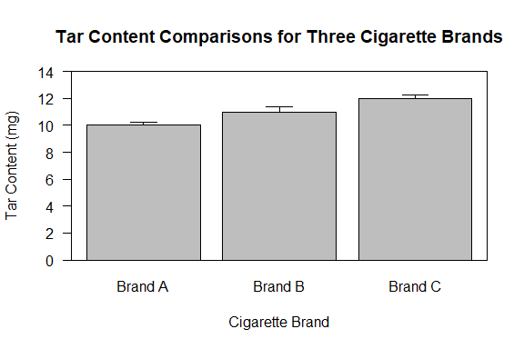
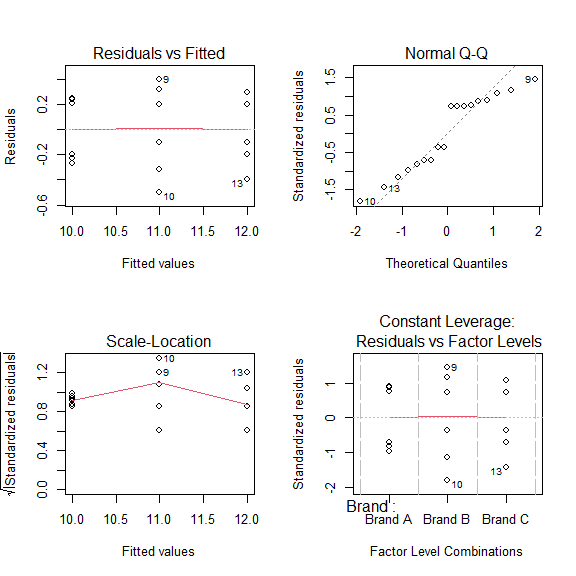

# One-way Aanalysis of Variance (ANOVA)

    For this tutorial we will be using a sample dataset from the [PSU
STAT 500 Applied Statistics
course](https://online.stat.psu.edu/stat500/lesson/10/10.1). The dataset
contains measurements of tar content as measured by Lab Precise from
three cigarette brands. A barplot presenting the means and standard
deviations of the tar content from each brand is shown below.



    From briefly observing the barplot, there does appear to be a
difference in tar content among the three cigarette brands. However, we
should use a statistical test, in this case a one-way ANOVA, to
quantitatively determine if there are differences in tar content among
the brands based on the following statistical hypotheses and
assumptions. We will use a threshold of 0.05 (sometimes shown as α =
0.05) to determine statistical significance in the following tests.

### [ANOVA hypotheses](https://online.stat.psu.edu/stat500/lesson/10/10.2)

-   **Null hypothesis:** the means of each group are equal.  
-   **Alternative hypothesis:** at least one of the group means is not
    equal to the others.

### [ANOVA assumptions](https://online.stat.psu.edu/stat500/lesson/10/10.2/10.2.1)

-   The observations are **independent**.
-   Each factor is **approximately normally distributed**.
-   The distributions of the factors have **equal variances**.

    Since each of the tar measurements comes from a different brand of
cigarette, we could safely assume that there is no dependence between
the three brands and accept the assumption of independent observations.
We can check the assumption of normally distributed observations after
we fit the model, but for the assumption of equal variances we can apply
the Bartlett Test of Homogeneity of Variances using `bartlett.test()`.
Before we can do so however, we will need to read our data into R.

### Entering the data in R

    Typically we would load our data into R from a file, however for
this example we will manually input the data into a data frame with the
following code.

``` r
lab_precise <- data.frame(Tar_mg = c(10.21, 10.25, 10.24, 9.80, 9.77, 9.73,
                                     11.32, 11.20, 11.40, 10.50, 10.68, 10.90,
                                     11.60, 11.90, 11.80, 12.30, 12.20, 12.20),
                          Brand = factor(c(rep("Brand A", 6),
                                           rep("Brand B", 6),
                                           rep("Brand C", 6))))
```

    Using the `data.frame()` function we created a data frame with two
columns, one labeled *Tar\_mg* with the tar content from each sample and
the second titled *Brand* that indicates which cigarette brand each
measurement came from. We will also assign the *Brand* column as a
factor using `factor()` which is not always necessary but a good habit.
(Note that the data frame is currently in long format which is preferred
in many R functions compared to the wide format as shown in the [PSU
STAT 500 example](https://online.stat.psu.edu/stat500/lesson/10/10.1).)

    Now that our data has been read into R we can use the
`bartlett.test()` function to determine if the tar content among the
three cigarette brands have equal variances.

``` r
bartlett.test(Tar_mg ~ Brand, data = lab_precise)
```

    ## 
    ##  Bartlett test of homogeneity of variances
    ## 
    ## data:  Tar_mg by Brand
    ## Bartlett's K-squared = 0.6594, df = 2, p-value = 0.7191

    The test returned a p-value of 0.7191 that is well above our
threshold of 0.05, therefore we can go ahead and assume that the
variances of the tar content are equal among the three brands and
continue with our analysis.

### Fitting an one-way ANOVA

    Now that we have our data, we can fit an ANOVA model with *Tar\_mg*
as the response to the factor *Brand* using the `aov()` function as
follows.

``` r
aov.fit <- aov(Tar_mg ~ Brand, data = lab_precise)
```

    Before we begin interpreting the results of the model we should
first check to see how well the model fits. A simple qualitative way to
do so is to check [diagnostic plots of the
residuals](https://online.stat.psu.edu/stat462/node/117/). Using the
`plot()` function we can observe four of these types of diagnostic
plots. We can observe them separately or put them together in one plot
using `par(mfrow = c(2,2))`.

``` r
par(mfrow = c(2,2))
plot(aov.fit)
```



    The four plots provided are the Residuals vs Fitted, Normal Q-Q,
Scale-Location, and Leverage plots. While each plot gives us important
information on how our data fit in the ANOVA model, the important one to
assess our assumption of normality is the Normal Q-Q plot. Ideally, the
points will sit along the dashed line. However, in our plot there does
seem to be a number of points that may be deviating away from that line.
This could be a cause for concern if we wanted to be certain that this
assumption holds.

    To quantitatively confirm if our data meets the assumption of
normality we could employ a statistical test, such as the Shapiro-Wilk
Normality Test using the `shapiro.test()` function. However, we have
some leeway in this assumption and for now can assume that the data was
sampled from an approximately normal distribution and fits the ANOVA
model well to move on to interpreting the results of the model.

### [Interpreting the ANOVA results](https://online.stat.psu.edu/stat485/lesson/12/12.2)

    To summarize the results of the ANOVA model we can use the
`summary()`, or alternatively the `anova()`, function.

``` r
summary(aov.fit)
```

    ##             Df Sum Sq Mean Sq F value   Pr(>F)    
    ## Brand        2 12.000   6.000   65.46 3.89e-08 ***
    ## Residuals   15  1.375   0.092                     
    ## ---
    ## Signif. codes:  0 '***' 0.001 '**' 0.01 '*' 0.05 '.' 0.1 ' ' 1

    From the summary of the ANOVA model we see that our factor, *Brand*,
has a p-value well below our threshold of 0.05. This tells us that the
mean tar content for at least one of the brands of cigarettes is
different from the others. To determine which of these means are
significantly different we follow up the ANOVA with a post-hoc test. In
this case we will use a Tukey’s honestly significant difference test
(Tukey HSD) with the `TukeyHSD()` function.

``` r
TukeyHSD(aov.fit)
```

    ##   Tukey multiple comparisons of means
    ##     95% family-wise confidence level
    ## 
    ## Fit: aov(formula = Tar_mg ~ Brand, data = lab_precise)
    ## 
    ## $Brand
    ##                 diff       lwr      upr     p adj
    ## Brand B-Brand A    1 0.5459914 1.454009 0.0001132
    ## Brand C-Brand A    2 1.5459914 2.454009 0.0000000
    ## Brand C-Brand B    1 0.5459914 1.454009 0.0001132

    The `TukeyHSD()` command provides the difference between each
comparison of means (*diff*), lower and upper confidence intervals
(*lwr* and *upr*), and the adjusted p-value of those comparisons (*p
adj*). From the adjusted p-values, we can see that for each group-wise
comparison the p-values are below 0.05, meaning that each brand of
cigarettes is significantly different from one another. Therefore, we
can conclude that there are differences in the tar content among these
three brands of cigarettes, namely with *Brand A* having the lowest,
*Brand C* having the highest, and *Brand B* being between the two other
brands in milligrams of tar.

### Full code block

``` r
# Enter the data as a dataframe
lab_precise <- data.frame(Tar_mg = c(10.21, 10.25, 10.24, 9.80, 9.77, 9.73,
                                     11.32, 11.20, 11.40, 10.50, 10.68, 10.90,
                                     11.60, 11.90, 11.80, 12.30, 12.20, 12.20),
                          Brand = factor(c(rep("Brand A", 6),
                                           rep("Brand B", 6),
                                           rep("Brand C", 6))))

# Check assumption of equal variances among the factors
bartlett.test(Tar_mg ~ Brand, data = lab_precise)

# Fit a one-way ANOVA model
aov.fit <- aov(Tar_mg ~ Brand, data = lab_precise)

# Generate diagnostic plots to assess the fit of the ANOVA model
par(mfrow = c(2,2))
plot(aov.fit)

# Summarize the results of the ANOVA model
summary(aov.fit)

# Perform and summarize a Tukey HSD post-hoc test
TukeyHSD(aov.fit)
```
