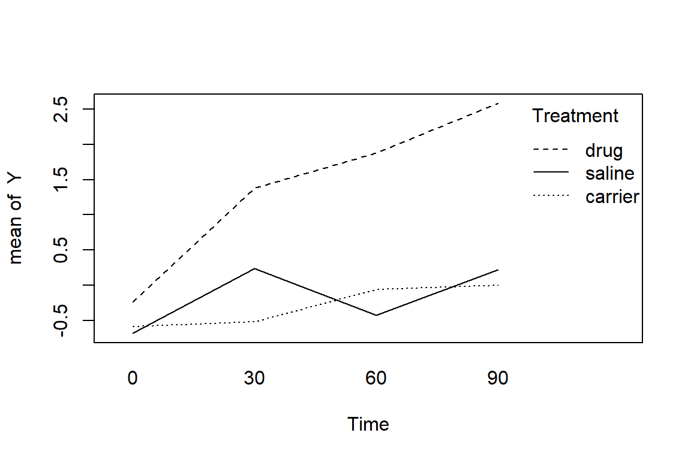

<!-- TABLE OF CONTENTS -->
<aside>
  <div id="toc_container">
  <p class="toc_title">Contents</p>
  <ul class="toc_list">
    <a href="#repeated-measures-anova-in-r">Repeated measures ANOVA in R</a><br>
    <a href="#checking-assumptions">Checking assumptions</a><br>
       <a href="#sample-size">&emsp;Sample size</a><br>
       <a href="#outliers">&emsp;Outliers</a><br>
       <a href="#normality">&emsp;Normality</a><br>
       <a href="#correlations">&emsp;Correlations</a><br>
       <a href="#heteroskedasticity">&emsp;Heteroskedasticity</a><br>
    <a href="#one-way-manova">One-way MANOVA</a><br>
      <a href="#post-hoc-tests">&emsp;Post-hoc tests</a><br>
    <a href="#two-way-manova">Two-way MANOVA</a><br>
      <a href="#post-hoc2">&emsp;Post-hoc tests</a><br>
  </ul>
  </div>
</aside>

# [Repeated measures ANOVA](https://repub.github.io/DLC_statistical_guides/docs/Info/repeated-measures-ANOVA) in `R`

In this guide we will be using a data set provided by [STAT 510 - Applied Time Series Analysis](https://online.stat.psu.edu/stat510/lesson/10/10.1), which contains observations from an experiment designed to detect phlebitis (venous inflammation) by measuring temperature during intravenous administration of a drug of interest in the ear of animals over time.  The data set has four variables:

* `Animal` - the unique identifier for the 15 animals tested.
* `Treatment` - the treatment that was administered.
* `Time` - the timepoint in minutes when the temperature was recorded.
* `Y` - the difference in temperature between the treated and untreated ears of the animal.

<!-- Convert treatment to factor  -->

<!-- ```{r} -->
<!-- library(tidyverse) -->

<!-- phleb <- phleb %>% -->
<!--   mutate(Treatment = recode_factor(Treatment, -->
<!--                                    `1` = "drug", -->
<!--                                    `2` = "carrier", -->
<!--                                    `3` = "saline")) -->
<!-- phleb -->

<!-- write_csv(phleb, "../../dat/phlebitis.csv") -->
<!-- ``` -->

First, we will load the data set using `read.csv()` and assign the resulting data frame to `phelb`, then we will use the `head()` and `str()` functions to take a peak at the data and its structure.


```r
phleb <- read.csv("../../dat/phlebitis.csv")

head(phleb)
str(phleb)
```

```
##   Animal Treatment Time    Y
## 1      1      drug    0 -0.3
## 2      1      drug   30 -0.2
## 3      1      drug   60  1.2
## 4      1      drug   90  3.1
## 5      2      drug    0 -0.5
## 6      2      drug   30  2.2
## 'data.frame':	60 obs. of  4 variables:
##  $ Animal   : int  1 1 1 1 2 2 2 2 3 3 ...
##  $ Treatment: chr  "drug" "drug" "drug" "drug" ...
##  $ Time     : int  0 30 60 90 0 30 60 90 0 30 ...
##  $ Y        : num  -0.3 -0.2 1.2 3.1 -0.5 2.2 3.3 3.7 -1.1 2.4 ...
```


```r
phleb$Treatment <- factor(phleb$Treatment)
phleb$Animal <- factor(phleb$Animal)
```


<!-- For *Time*, since there are four time points we could also code it as a factor or keep it as numeric -->

## Linear mixed effect (LME) approach
### Time as a numeric variable

Although the repeated measures ANOVA can be performed in base `R`, to reduce complexity we will instead use the `lme4`package, which contains functions built around mixed-effect modeling.  Additionally, we will load the `lmerTest` package which expands on the `lme4` package by including more readable statistical output.


```r
library(lme4)
library(lmerTest)
library(car)
```

Each animal was only given one of the three treatments which was measured over four time points.  Therefore, the repeated measures are `Time` within `Animal`.  From the `lme4` package we will use the `lmer()` function to fit our model, in which we will code a model formula with the response varaible *Y* on the left side of a `~` and the predictor variables on thr right side.  In the predictor variables we will include *Treatment* and *Time* with their interaction.  To include our repeated measure, we will add `(1 | Animal)` to the model formula to indicate that measurements were repeated on each animal and is therefore our random effect.  We will then use the `anova()` function to print out the resulting ANOVA table.


```r
phleb_lmer <- lmer(Y ~ Treatment * Time + (1 | Animal), data = phleb)

Anova(phleb_lmer, type = 3)
```

```
## Analysis of Deviance Table (Type III Wald chisquare tests)
## 
## Response: Y
##                  Chisq Df Pr(>Chisq)   
## (Intercept)     3.9066  1   0.048096 * 
## Treatment       2.5515  2   0.279221   
## Time            2.0621  1   0.150997   
## Treatment:Time 13.2946  2   0.001298 **
## ---
## Signif. codes:  0 '***' 0.001 '**' 0.01 '*' 0.05 '.' 0.1 ' ' 1
```

From the results there is clearly a statistically significant interaction between *Treatment* and *Time*, indicating that the difference in ear temperature (*Y*) changes differently between at least some of the treatments and how those temperatures vary over time is also different for at least some of the treatments.  To visualize these variations we can use the `with()` and `interaction.plot()` functions to plot the differences in ear temperature over time for each treatment.


```r
with(phleb,
     interaction.plot(Time, Treatment, Y))
```



From the interaction plot it appears that both saline and carrier have somewhat similar responses, while the drug increases the mean difference in ear temperature over time.  However, as we have multiple comparisons to make here the results above of a significant interaction term do not inform us of exactly what comparisons are statistically different or not.  To make these pairwise comparisons we can use the `emmeans()` package.


```r
library(emmeans)
```


```r
phleb_emm <- emmeans(phleb_lmer, list(pairwise ~ Treatment * Time), adjust = "tukey")

phleb_emm$`pairwise differences of Treatment, Time`
```

```
##  1                              estimate    SE df t.ratio p.value
##  carrier Time45 - drug Time45      -1.69 0.302 12  -5.597  0.0003
##  carrier Time45 - saline Time45    -0.13 0.302 12  -0.431  0.9037
##  drug Time45 - saline Time45        1.56 0.302 12   5.166  0.0006
## 
## Degrees-of-freedom method: kenward-roger 
## P value adjustment: tukey method for comparing a family of 3 estimates
```

From the results of the Tukey's pairwise comparisons we can see that the drug treatment is significantly higher than both the carrier and saline treatments, of which are not statistically different from one another.  However, it is important to note that since we used *Time* as a continuous variable this comparison was made over the average of the time measures and not for each time point.  If we are interested at what time points the differences in ear temperature vary then we should code *Time* as a factor.

### Time as a factor variable

Now we will perform the same analysis but with *Time* as a factor rather than a continuous variable.  We will first use `factor()` to reassign *Time* then use the same code as above to fit and display the results of the repeated measures ANOVA.


```r
phleb_lmer <- lmer(Y ~ Treatment * factor(Time) + (1 | Animal), data = phleb)

Anova(phleb_lmer, type = 3)
```

```
## Analysis of Deviance Table (Type III Wald chisquare tests)
## 
## Response: Y
##                          Chisq Df Pr(>Chisq)   
## (Intercept)             2.5421  1    0.11085   
## Treatment               0.8040  2    0.66897   
## factor(Time)            2.3690  3    0.49943   
## Treatment:factor(Time) 17.4003  6    0.00792 **
## ---
## Signif. codes:  0 '***' 0.001 '**' 0.01 '*' 0.05 '.' 0.1 ' ' 1
```

Note that from the results we again have a statistically significant interaction term.  However, it also does not give us information regarding which comparisons in *Treatment* and *Time* are statistically different, so we will again employ the `emmeans()` function to test these pairwise comparisons.


```r
phleb_emm <- emmeans(phleb_lmer, list(pairwise ~ Treatment * factor(Time)), adjust = "tukey")

phleb_emm$`pairwise differences of Treatment, Time`
```

```
##  1                               estimate    SE   df t.ratio p.value
##  carrier Time0 - drug Time0         -0.34 0.514 45.8  -0.661  0.9999
##  carrier Time0 - saline Time0        0.10 0.514 45.8   0.194  1.0000
##  carrier Time0 - carrier Time30     -0.06 0.481 36.0  -0.125  1.0000
##  carrier Time0 - drug Time30        -1.96 0.514 45.8  -3.810  0.0188
##  carrier Time0 - saline Time30      -0.82 0.514 45.8  -1.594  0.9025
##  carrier Time0 - carrier Time60     -0.52 0.481 36.0  -1.081  0.9937
##  carrier Time0 - drug Time60        -2.46 0.514 45.8  -4.782  0.0010
##  carrier Time0 - saline Time60      -0.16 0.514 45.8  -0.311  1.0000
##  carrier Time0 - carrier Time90     -0.58 0.481 36.0  -1.206  0.9850
##  carrier Time0 - drug Time90        -3.16 0.514 45.8  -6.142  <.0001
##  carrier Time0 - saline Time90      -0.80 0.514 45.8  -1.555  0.9160
##  drug Time0 - saline Time0           0.44 0.514 45.8   0.855  0.9993
##  drug Time0 - carrier Time30         0.28 0.514 45.8   0.544  1.0000
##  drug Time0 - drug Time30           -1.62 0.481 36.0  -3.368  0.0668
##  drug Time0 - saline Time30         -0.48 0.514 45.8  -0.933  0.9983
##  drug Time0 - carrier Time60        -0.18 0.514 45.8  -0.350  1.0000
##  drug Time0 - drug Time60           -2.12 0.481 36.0  -4.408  0.0044
##  drug Time0 - saline Time60          0.18 0.514 45.8   0.350  1.0000
##  drug Time0 - carrier Time90        -0.24 0.514 45.8  -0.467  1.0000
##  drug Time0 - drug Time90           -2.82 0.481 36.0  -5.863  0.0001
##  drug Time0 - saline Time90         -0.46 0.514 45.8  -0.894  0.9989
##  saline Time0 - carrier Time30      -0.16 0.514 45.8  -0.311  1.0000
##  saline Time0 - drug Time30         -2.06 0.514 45.8  -4.004  0.0108
##  saline Time0 - saline Time30       -0.92 0.481 36.0  -1.913  0.7439
##  saline Time0 - carrier Time60      -0.62 0.514 45.8  -1.205  0.9859
##  saline Time0 - drug Time60         -2.56 0.514 45.8  -4.976  0.0005
##  saline Time0 - saline Time60       -0.26 0.481 36.0  -0.541  1.0000
##  saline Time0 - carrier Time90      -0.68 0.514 45.8  -1.322  0.9718
##  saline Time0 - drug Time90         -3.26 0.514 45.8  -6.337  <.0001
##  saline Time0 - saline Time90       -0.90 0.481 36.0  -1.871  0.7682
##  carrier Time30 - drug Time30       -1.90 0.514 45.8  -3.693  0.0258
##  carrier Time30 - saline Time30     -0.76 0.514 45.8  -1.477  0.9393
##  carrier Time30 - carrier Time60    -0.46 0.481 36.0  -0.956  0.9978
##  carrier Time30 - drug Time60       -2.40 0.514 45.8  -4.665  0.0015
##  carrier Time30 - saline Time60     -0.10 0.514 45.8  -0.194  1.0000
##  carrier Time30 - carrier Time90    -0.52 0.481 36.0  -1.081  0.9937
##  carrier Time30 - drug Time90       -3.10 0.514 45.8  -6.026  <.0001
##  carrier Time30 - saline Time90     -0.74 0.514 45.8  -1.438  0.9491
##  drug Time30 - saline Time30         1.14 0.514 45.8   2.216  0.5472
##  drug Time30 - carrier Time60        1.44 0.514 45.8   2.799  0.2144
##  drug Time30 - drug Time60          -0.50 0.481 36.0  -1.040  0.9955
##  drug Time30 - saline Time60         1.80 0.514 45.8   3.499  0.0432
##  drug Time30 - carrier Time90        1.38 0.514 45.8   2.682  0.2673
##  drug Time30 - drug Time90          -1.20 0.481 36.0  -2.495  0.3746
##  drug Time30 - saline Time90         1.16 0.514 45.8   2.255  0.5211
##  saline Time30 - carrier Time60      0.30 0.514 45.8   0.583  1.0000
##  saline Time30 - drug Time60        -1.64 0.514 45.8  -3.188  0.0929
##  saline Time30 - saline Time60       0.66 0.481 36.0   1.372  0.9617
##  saline Time30 - carrier Time90      0.24 0.514 45.8   0.467  1.0000
##  saline Time30 - drug Time90        -2.34 0.514 45.8  -4.548  0.0021
##  saline Time30 - saline Time90       0.02 0.481 36.0   0.042  1.0000
##  carrier Time60 - drug Time60       -1.94 0.514 45.8  -3.771  0.0209
##  carrier Time60 - saline Time60      0.36 0.514 45.8   0.700  0.9999
##  carrier Time60 - carrier Time90    -0.06 0.481 36.0  -0.125  1.0000
##  carrier Time60 - drug Time90       -2.64 0.514 45.8  -5.132  0.0003
##  carrier Time60 - saline Time90     -0.28 0.514 45.8  -0.544  1.0000
##  drug Time60 - saline Time60         2.30 0.514 45.8   4.471  0.0027
##  drug Time60 - carrier Time90        1.88 0.514 45.8   3.654  0.0287
##  drug Time60 - drug Time90          -0.70 0.481 36.0  -1.455  0.9431
##  drug Time60 - saline Time90         1.66 0.514 45.8   3.227  0.0848
##  saline Time60 - carrier Time90     -0.42 0.514 45.8  -0.816  0.9995
##  saline Time60 - drug Time90        -3.00 0.514 45.8  -5.831  <.0001
##  saline Time60 - saline Time90      -0.64 0.481 36.0  -1.331  0.9691
##  carrier Time90 - drug Time90       -2.58 0.514 45.8  -5.015  0.0005
##  carrier Time90 - saline Time90     -0.22 0.514 45.8  -0.428  1.0000
##  drug Time90 - saline Time90         2.36 0.514 45.8   4.587  0.0019
## 
## Degrees-of-freedom method: kenward-roger 
## P value adjustment: tukey method for comparing a family of 12 estimates
```

After setting *Time* to a factor and looking at all pairwise comparisons at each of the 4 levels of *Time* and 3 levels of *Treatment* we have a number of comparisons equal to:

$$\frac{k_{Time}*k_{Treatment}*(k_{Time}*k_{Treatment}-1)}{2} = 66$$


## Autoregressive model of order 1 (AR1) approach

With some experiments where the response is expected to change over time we may also make the assumption that those changes per time point rely on their values at the previous timepoint.  In these cases we may want to use an AR(1) structured model to account for measurements at the previous time point.

To do so, we will need to employ another library, `nlme`, to fit a linear model using generalized least squares that includes the AR(1) component.  We will use the `gls()` function to fit this model with a similar model formula as above, however we will add the random effects component in `corAR1()` to specifiy the AR(1) structure for the model.  We then use the `anova()` function to print a summary of the results.


```r
library(nlme)

phleb_gls <- gls(Y ~ Treatment * Time, data = phleb, correlation = corAR1(form = ~ 1 | Animal))

anova(phleb_gls)

Anova(phleb_gls, type = 3, data = phleb)
```

```
## Denom. DF: 54 
##                numDF   F-value p-value
## (Intercept)        1  5.744409  0.0200
## Treatment          2 17.862772  <.0001
## Time               1 21.527038  <.0001
## Treatment:Time     2  5.502033  0.0067
## Analysis of Deviance Table (Type III tests)
## 
## Response: Y
##                Df   Chisq Pr(>Chisq)   
## (Intercept)     1  3.2672   0.070677 . 
## Treatment       2  1.9336   0.380289   
## Time            1  1.5463   0.213678   
## Treatment:Time  2 11.0041   0.004078 **
## ---
## Signif. codes:  0 '***' 0.001 '**' 0.01 '*' 0.05 '.' 0.1 ' ' 1
```

From the ANOVA table above we see again that there is a statistically significant interaction between *Treatment* and *Time*.  To test which groups vary from one another we will again employ the `emmeans()` function to perform Tukey-adjusted pairwise comparisons.


```r
phleb_emm <- emmeans(phleb_gls, list(pairwise ~ Treatment * Time), adjust = "tukey", data = phleb)

phleb_emm$`pairwise differences of Treatment, Time`
```

```
##  1                              estimate    SE   df t.ratio p.value
##  carrier Time45 - drug Time45      -1.66 0.309 18.4  -5.360  0.0001
##  carrier Time45 - saline Time45    -0.12 0.309 18.4  -0.389  0.9205
##  drug Time45 - saline Time45        1.54 0.309 18.4   4.971  0.0003
## 
## Degrees-of-freedom method: satterthwaite 
## P value adjustment: tukey method for comparing a family of 3 estimates
```

Similar to the LME model above the drug treatment causes higher differences in ear temperature on average compared to the carrier and saline treatments which are not statistically different from one another.  


