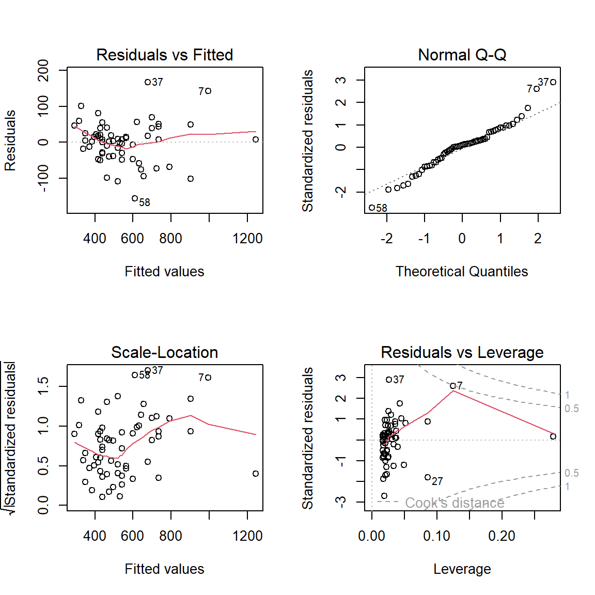

# Simple Linear Regression (SLR)

    In this example we will be using a sample dataset offered in
[Example 1-2 of the STAT 501 Regression Methods
course](https://online.stat.psu.edu/stat501/lesson/1/1.7). The dataset
contains the heights in feet (ft) and the number of stories for a set of
buildings built between 1907 and 1992. Here, we are interested in
determining the relationship, if any, between a building’s height
(*HGHT*) and the number of stories that building has (*STORIES*) as
shown in the following plot.


    Above, the individual data points are blue circles and a fitted
regression is shown as the dotted red line. To statistically assess the
relationship between *HGHT* and *STORIES* we will fit a simple linear
regression with the following hypotheses and assumptions.

### [SLR hypotheses](https://online.stat.psu.edu/stat501/lesson/1/1.9)

-   **Null hypothesis:** The correlation coefficient (*ρ*) for the two
    variables is equal to 0.  
    <center>
    <i>H<sub>0</sub>: ρ = 0</i>
    </center>
     
-   **Alternative hypothesis:** The correlation between the two
    variables is not equal to 0.  
    <center>
    <i>H<sub>A</sub>: ρ ≠ 0, </i>or<i> H<sub>A</sub>: ρ &gt; 0 or ρ &lt;
    0</i>
    </center>
     

### [SLR assumptions](https://online.stat.psu.edu/stat501/lesson/4/4.1)

-   The predictor and response variables have a **linear relationship**.
-   The errors are **independent**, **normally distributed**, and have
    **equal variances**.

    From the plot above, since the points form an approximately straight
line we can assume that they have some linear relationship. We can also
go ahead and accept that the two variables are independent. For the
other assumptions,we can first fit the SLR model and then assess how
true they hold.

### Loading the data in R

    First, we will need to read the file into R. As this dataset is in a
tabular format we can use the `read.table()` function to do so. Note
that our dataset has header information (column names), so we should
include the `header = TRUE` option.

``` r
bldgstories <- read.table("dat/bldgstories.txt", header = TRUE)
```

    Now that the dataset is loaded, you can view a brief summary of the
dataset using the `summary()` function on the assigned object.

### Fitting a SLR model

    To fit a linear regression model we can use the `lm()` function as
follows.

``` r
fit.lm <- lm(HGHT ~ STORIES, data = bldgstories)
```

    Before looking at the results of the model we should first assess
how well the model fits our data. There are a number of ways to do so,
but a simple qualitative approach is to observe diagnostic plots of the
residuals. We can do so by using the `plot()` function which gives us
four different types of diagnostic plots.

``` r
par(mfrow = c(2,2))
plot(fit.lm)
```



    In the first plot, [Residuals vs
Fitted](https://online.stat.psu.edu/stat501/lesson/4/4.2), the residuals
form a roughly horizontal band around 0 without any obvious patterns.
For the [Normal Q-Q](https://online.stat.psu.edu/stat501/lesson/4/4.6)
plot the data points mostly align with the dashed line, although they
slightly tail off at the extremes. No patterna are also observed in the
**Scale-Location** plot. In the [Residuals vs
Leverage](https://online.stat.psu.edu/stat462/node/173/) plot we do not
observe any points outside of the red dashed bands. All together, we can
conclude that our data is normally distributed, has equal variances, and
does not contain outliers and move on to interpreting the results of the
model.

### Interpreting the results

    Using the `summary()` function we can print out summary statistics
of our fitted linear model.

``` r
summary(fit.lm)
```

    ## 
    ## Call:
    ## lm(formula = HGHT ~ STORIES, data = bldgstories)
    ## 
    ## Residuals:
    ##      Min       1Q   Median       3Q      Max 
    ## -156.759  -33.239    5.995   28.450  167.487 
    ## 
    ## Coefficients:
    ##             Estimate Std. Error t value Pr(>|t|)    
    ## (Intercept)  90.3096    20.9622   4.308 6.44e-05 ***
    ## STORIES      11.2924     0.4844  23.310  < 2e-16 ***
    ## ---
    ## Signif. codes:  0 '***' 0.001 '**' 0.01 '*' 0.05 '.' 0.1 ' ' 1
    ## 
    ## Residual standard error: 58.33 on 58 degrees of freedom
    ## Multiple R-squared:  0.9036, Adjusted R-squared:  0.9019 
    ## F-statistic: 543.4 on 1 and 58 DF,  p-value: < 2.2e-16

    From the summary statistics we can first note that the p-value of
the model (titled `p-value` at the end of the output) is &lt; 2.2 \*
10<sup>-16</sup> which is much less than our threshold of 0.05.
Therefore, we can conclude that there is a statistically significant
relationship between *STORIES* and *HGHT*. From the R<sup>2</sup>
(called `Multiple R-squared` in the output) we can see that this
relationship is strong with a value of 0.9036.

    If we are interested in predicting the height of a building from its
number of stories we can look at the coefficients table where the
estimated coefficient of *STORIES* (`Estimate` column) is 11.2924 which
is statistically significant with a p-value (`Pr(>|t|)` column) less
than 2.2 \* 10<sup>-16</sup> (Note that this is a different statistical
test and hypothesis than above that is based on the t-value (`t value`
column) of the estimated coefficient). We can then predict that for
every increase in the number of stories of a building, the expected
height of that building is increased by 11.2924. We can write this out
mathematically as:

<center>
<i>Height</i> = <i>11.2924 </i>x<i> Stories </i>+<i> 90.3096</i>
</center>

 

    To predict the height of a building based of its number of stories
we then just plug it in to the equation. For example, if we wanted to
predict the height of a building that has 52 stories our calculation
would be:

<center>
<i>Height</i> = <i>11.2924 </i>x<i> 52 </i>+<i> 90.3096 </i>=<i><b>
677.5144 </b></i>
</center>

 

    Therefore, we predict that a building that has 52 stories would be
about 678 ft in height. If we look at our original scatterplot of the
data, we can see that the predicted point falls directly on the linear
line and near our other data points.


### Full code block

``` r
# Load the dataset
bldgstories <- read.table("dat/bldgstories.txt", header = TRUE)

# Fit a linear model
fit.lm <- lm(HGHT ~ STORIES, data = bldgstories)

# Generate diagnostic plots of the residuals to assess how well the model fits
par(mfrow = c(2,2))
plot(fit.lm)

# View the results of the linear model
summary(fit.lm)
```
