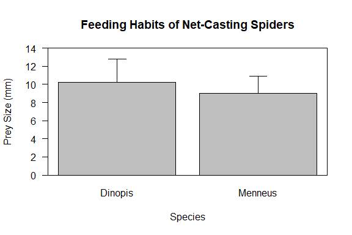

# T-tests

    For this example we will be using a dataset from [STAT 415
Introduction to
Mathematics](https://online.stat.psu.edu/stat415/lesson/11/11.3).



### Hypotheses

-   **Null Hypothesis:** The means of the two groups are equal.  

    <center>

    <i>H<sub>0</sub>: μ<sub>1</sub> </i>=<i> μ<sub>2</sub></i>

    </center>

     

-   **Alternative Hypothesis:** The means of the two groups are not
    equal.  

    <center>

    <i>H<sub>0</sub>: μ<sub>1</sub> </i>≠<i> μ<sub>2</sub></i>

    </center>

     

### Entering the data

``` r
australia <- data.frame("Species" = c(rep("Dinopis", 10),
                                      rep("Menneus", 10)),
                        "Feeding" = c(12.9, 10.2, 7.4, 7.0, 10.5, 11.9, 7.1, 9.9, 14.4, 11.3,
                                      10.2, 6.9, 10.9, 11, 10.1, 5.3, 7.5, 10.3, 9.2, 8.8))
```

``` r
bartlett.test(Feeding ~ Species, data = australia)
```

    ## 
    ##  Bartlett test of homogeneity of variances
    ## 
    ## data:  Feeding by Species
    ## Bartlett's K-squared = 0.66748, df = 1, p-value = 0.4139

``` r
t.test(Feeding ~ Species, data = australia, var.equal = TRUE)
```

    ## 
    ##  Two Sample t-test
    ## 
    ## data:  Feeding by Species
    ## t = 1.2453, df = 18, p-value = 0.229
    ## alternative hypothesis: true difference in means is not equal to 0
    ## 95 percent confidence interval:
    ##  -0.8520327  3.3320327
    ## sample estimates:
    ## mean in group Dinopis mean in group Menneus 
    ##                 10.26                  9.02

``` r
t.test(Feeding ~ Species, data = australia)
```

    ## 
    ##  Welch Two Sample t-test
    ## 
    ## data:  Feeding by Species
    ## t = 1.2453, df = 16.74, p-value = 0.2302
    ## alternative hypothesis: true difference in means is not equal to 0
    ## 95 percent confidence interval:
    ##  -0.8633815  3.3433815
    ## sample estimates:
    ## mean in group Dinopis mean in group Menneus 
    ##                 10.26                  9.02
