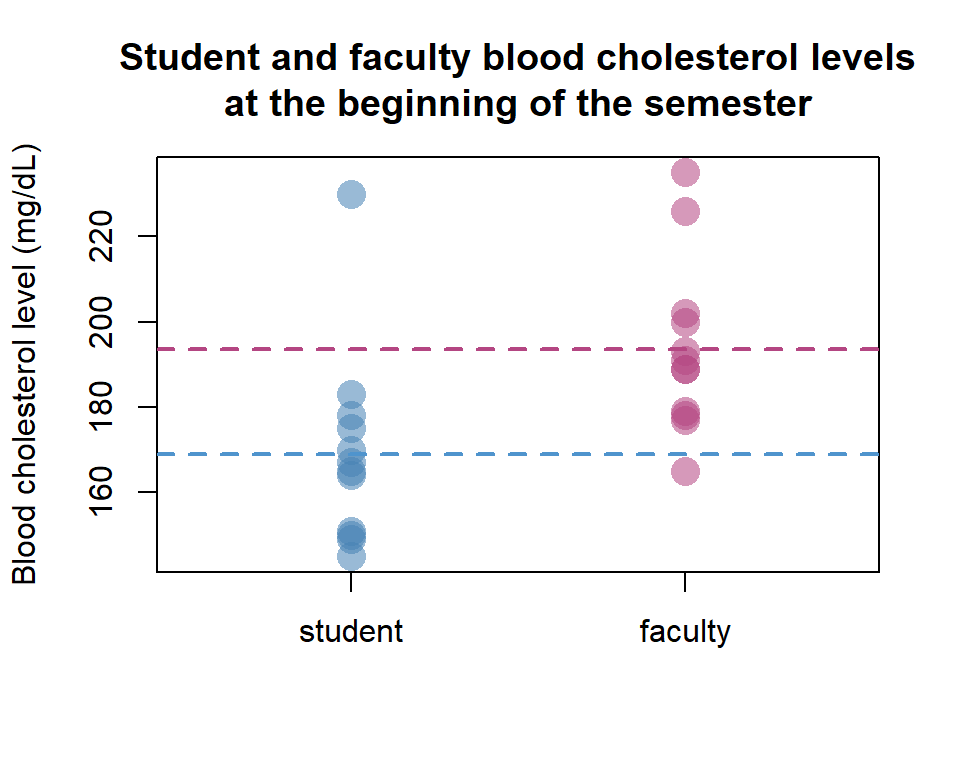

# T-tests

 When we are interested in testing whether one mean is equal to some
value or the equality of two means we can rely on the t-test. While
there are different forms of the t-test, they all are based on the
t-distribution for a given mean and variance.

### T-test for one mean

 The simplest form of the t-test is when we have one sample for which we
want to determine if the group is significantly different from some
predetermined value. For instance, say we wanted to determine if the
average student at Penn State had a normal blood cholesterol value
(&lt;200 mg/dL). At the beginning of the semester we recruited 10
students to donate their blood to our study and measured their
cholesterol levels.

``` r
PSU_student <- c(170, 230, 175, 145, 149, 165, 164, 150, 167, 151, 178, 183)

t.test(PSU_student, mu = 200, alternative = "less")
```

    ## 
    ##  One Sample t-test
    ## 
    ## data:  PSU_student
    ## t = -4.7133, df = 11, p-value = 0.0003182
    ## alternative hypothesis: true mean is less than 200
    ## 95 percent confidence interval:
    ##      -Inf 180.7602
    ## sample estimates:
    ## mean of x 
    ##  168.9167


 We use the `t.test()` function on our dataset, `PSU_student`, and set
the mean we are test to 200 with the `mu` option. Additionally, because
we are only interested in if the students have blood cholesterol levels
that are below that threshold, we set the `alternative` option to
`"less"`, indicating that our alternative hypothesis for this test is
that the true mean is less than the mean that we defined in the `mu`
option as 200. If instead we did not hypothesize that blood cholesterol
would be more or less than 200 but not 200, we would set `alternative`
to `"two.sided"` (the default value).

 From our results we see that the p-value for our t-test (p = 3.18 x
10<sup>-4</sup>) is well below our threshold of α = 0.05. Therefore, we
can accept our alternative hypothesis that the mean blood cholesterol
level for PSU students is less than 200 mg/dL. The `t.test()` function
also returns the mean of our sample, 168.9 mg/dL.

### Two-sample t-test

 Now let us say that we want to compare the average PSU student’s blood
cholesterol with the faculty at Penn State.

``` r
PSU_faculty <- c(189, 165, 191, 193, 177, 200, 179, 189, 202, 235, 178, 226)
```



 We can perform a two-sample t-test in R using the same `t.test()`
function, but this time instead of defining `mu` we include the two data
sets to be compared.

``` r
t.test(PSU_student, PSU_faculty)
```

    ## 
    ##  Welch Two Sample t-test
    ## 
    ## data:  PSU_student and PSU_faculty
    ## t = -2.8134, df = 21.667, p-value = 0.01022
    ## alternative hypothesis: true difference in means is not equal to 0
    ## 95 percent confidence interval:
    ##  -43.010549  -6.489451
    ## sample estimates:
    ## mean of x mean of y 
    ##  168.9167  193.6667

 Because we are testing two groups we do not need to set a value for
`mu` (the default is 0, meaning that we are testing if the difference of
blood cholesterol values between students and faculty is or is not 0).
Additionally, because we are interested in testing if there is a
difference between the two groups in any direction we do not need to
define the `alternative` option which is set to `"two.sided"` as
default. Note that the `t.test()` function assumes the variances are
unequal (`var.equal = FALSE` as default).

 From the output we can see that there is a statistically significant
difference in the blood cholesterol levels between Penn State students
and faculty (p = 0.01862). Additionally, the output provides a
confidence interval from which we can conclude with 95% certainty that
the mean difference between the two groups is somewhere between -45.99
and -4.81. Higher (or lower) ranges for the confidence interval can be
set through the `conf.level` option.

### Paired t-test

 Now let us say that we collected the same group of students at the end
of the semester during finals week to see if their blood cholesterol
levels might have changed due to the stress of the semester. We can
compare the means from the beginning of the semester and those at finals
week, but now we will be performing a paired t-test because the
individuals we are measuring from are the same. Note that it is
important that we put the data in the same order!

``` r
PSU_student2 <- c(179, 224, 175, 140, 148, 181, 179, 142, 180, 169, 170, 189)
```


 We can again use the same `t.test()` function setting the `paired`
option to `TRUE`. Because we do not make any hypotheses that the blood
cholesterol levels are higher or lower at the end of the semester, only
different, we keep the `alternative` option to its default,
`"two.sided"`.

``` r
t.test(PSU_student, PSU_student2, paired = TRUE)
```

    ## 
    ##  Paired t-test
    ## 
    ## data:  PSU_student and PSU_student2
    ## t = -1.4269, df = 11, p-value = 0.1814
    ## alternative hypothesis: true difference in means is not equal to 0
    ## 95 percent confidence interval:
    ##  -10.381676   2.215009
    ## sample estimates:
    ## mean of the differences 
    ##               -4.083333

 The results from our test suggest that there is not a difference in
student blood cholesterol levels from the beginning of the semester to
finals week. First, the p-value is above our threshold of 0.05. In
addition, the 95% confidence intervals around the mean of the
differences (-4.08) includes 0 between the lower and upper limits.

### Full Code Block

``` r
# Input student blood cholesterol data from the beginning of the semester
PSU_student <- c(170, 230, 175, 145, 149, 165, 164, 150, 167, 151, 178, 183)

# Perform a one-mean t-test to determine if the average blood pressure is less than 200
t.test(PSU_student, mu = 200, alternative = "less")

# Add the blood cholesterol data from faculty
PSU_faculty <- c(189, 165, 191, 193, 177, 200, 179, 189, 202, 235, 178, 226)

# Compare student and faculty cholesterol levels with a two-sample t-test
t.test(PSU_student, PSU_faculty)

# Add cholesterol levels from the same students during finals week
PSU_student2 <- c(179, 224, 175, 140, 148, 181, 179, 142, 180, 169, 170, 189)

# Use a paired t-test to compare student cholesterol levels at the beginning and end of
# the semester
t.test(PSU_student, PSU_student2, paired = TRUE)
```
