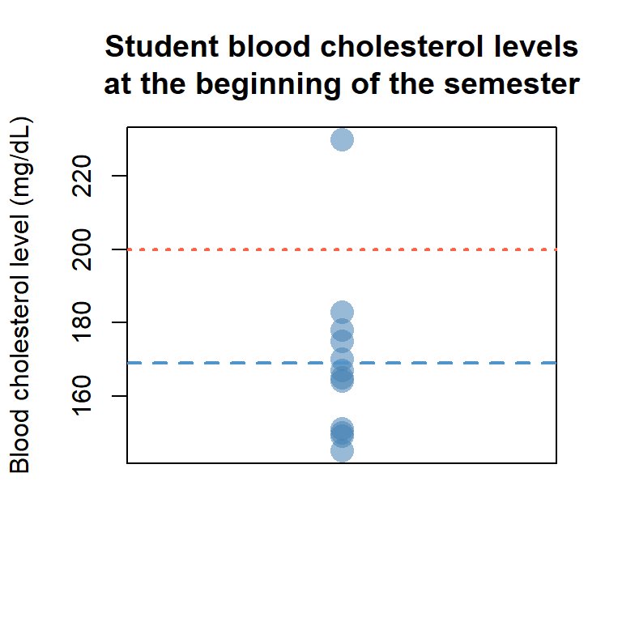

<aside>

<div id="toc_container">

<p class="toc_title">
Contents
</p>
<ul class="toc_list">
<li>
<a href="t-test-one-mean">T-tests for one mean</a> <!-- <ul> -->
<!--   <li>1.1 First Sub Point 1</li> -->
<!--   <li>1.2 First Sub Point 2</li> --> <!-- </ul> -->
</li>
<li>
<a href="two-sample-t-test">Two-sample t-test</a>
</li>
<li>
<a href="two-sample-t-test">Paired-t-test</a>
</li>
<li>
<a href="two-sample-t-test">Full code block</a>
</li>
</ul>

</div>

</aside>

# T-test for one mean <a name="t-test-one-mean"></a>

 The simplest form of the t-test is when we want to test the
distribution of one sample against some predetermined value. For
example, say we designed a study to determine if the average student at
Penn State has a normal blood cholesterol value (\<200 mg/dL). At the
beginning of the semester we recruited 12 students who donated their
blood and we measured their cholesterol levels. We can manually input
the results into R as follows:

``` r
PSU_student <- c(170, 230, 175, 145, 149, 165, 164, 150, 167, 151, 178, 183)
```



 The stripchart on the left shows the distribution of our data, from
which we will employ a t-test to assess if the mean blood cholesterol
from these 12 students at the beginning of the semester (blue dashed
line) is significantly lower than the normal threshold of 200 mg/dL (red
dotted line). We will decide to use a significance threshold of α =
0.05.

 To do so, we will wrap our sample, `PSU_student`, in the `t.test()`
function. Because we are interested in testing if the blood cholesterol
levels from these students are significantly below 200, we set the `mu`
option to 200 (the default is 0). Additionally, since we are
specifically interested in testing whether the mean student blood
cholesterol levels (x̄) are below that threshold, we set the
`alternative` option to `"less"`. This option sets our null
(H<sub>0</sub>) and alternative (H<sub>A</sub>) hypotheses to:

<center>
<i>H<sub>0</sub></i>: <i>x̄</i> ≥ <i>200, H<sub>A</sub></i>: <i>x̄</i> \<
<i>200</i>
</center>

<br>

 If we instead hypothesized that the mean blood cholesterol would be
either more or less than 200, we would set `alternative` to
`"two.sided"` (the default value). We can then run our code as follows:

``` r
t.test(PSU_student, mu = 200, alternative = "less")
```

    ## 
    ##  One Sample t-test
    ## 
    ## data:  PSU_student
    ## t = -4.7133, df = 11, p-value = 0.0003182
    ## alternative hypothesis: true mean is less than 200
    ## 95 percent confidence interval:
    ##      -Inf 180.7602
    ## sample estimates:
    ## mean of x 
    ##  168.9167

 From the printout of results we see that the p-value for our t-test (p
= 3.18 x 10<sup>-4</sup>) is well below our threshold of α = 0.05.
Therefore, we can reject the null hypothesis in favor of the alternative
hypothesis to conclude the mean blood cholesterol level for PSU students
at the beginning of the semester is less than 200 mg/dL. The `t.test()`
function also returns the mean of our sample, 168.9 mg/dL.

# Two-sample t-test <a name="two-sample-t-test"></a>

 Now let us say that we want to compare the average PSU student’s blood
cholesterol with the faculty at Penn State. We similarly input their
data into R as follows:

``` r
PSU_faculty <- c(189, 165, 191, 193, 177, 200, 179, 189, 202, 235, 178, 226)
```


 In the above stripchart it appears that the distribution and mean of
blood cholesterol levels for students (blue) are mostly below those of
faculty (red), although there is some overlap. To statistically
determine whether these two groups vary we can employ the two-sample
t-test, which can be performed in R using the same function as before
but this time we wrap both data sets instead of defining `mu`.
Additionally, because we are hypothesizing that the two groups vary but
not in which direction they vary we leave the `alternative` option to
its default, `two.sided`, to test the null and alternative hypotheses:

<center>
<i>H<sub>0</sub></i>: <i>x̄<sub>Student</sub></i> =
<i>x̄<sub>Faculty</sub>, H<sub>A</sub></i>: <i>x̄<sub>Student</sub></i> ≠
<i>x̄<sub>Faculty</sub></i>
</center>

<br>

 Another thing we may want to consider before performing a t-test is
whether the samples have equal variance. While we can change whether R
runs an equal or unequal variance t-test (known as Welch’s t-test) using
the `var.equal` option (set to `FALSE` as default), if the variances are
equal then we will receive the same result regardless of which option we
set, and if they are not equal then we would violate the assumption of
the equal variance t-test. Therefore, we can choose to leave it alone
and run our code as follows:

``` r
t.test(PSU_student, PSU_faculty)
```

    ## 
    ##  Welch Two Sample t-test
    ## 
    ## data:  PSU_student and PSU_faculty
    ## t = -2.8134, df = 21.667, p-value = 0.01022
    ## alternative hypothesis: true difference in means is not equal to 0
    ## 95 percent confidence interval:
    ##  -43.010549  -6.489451
    ## sample estimates:
    ## mean of x mean of y 
    ##  168.9167  193.6667

 From the output we can see that there is a statistically significant
difference in the blood cholesterol levels between Penn State students
and faculty (p = 0.01022). Additionally, the output provides a
confidence interval from which we can conclude with 95% certainty that
the mean difference between the two groups is somewhere between -43 and
-6.5. Higher (or lower) ranges for the confidence interval can be set
through the `conf.level` option.

# Paired t-test <a name="paired-t-test"></a>

 Now let us say that we collected samples from the same group of
students during finals week to see if their blood cholesterol levels
might have changed due to the stress of the semester. We can compare the
means from the beginning of the semester and those at finals week, but
now we will be performing a paired t-test because our samples are coming
from the same individuals. Note that it is important that we put the
data in the same order!

``` r
PSU_student2 <- c(179, 224, 175, 140, 148, 181, 179, 142, 180, 169, 170, 189)
```


 In the stripchart above there is overlap between our samples from the
beginning of the semester (blue) and finals week (brown), but the mean
appears to have slightly increased so maybe the stress of the semester
has increased the student’s blood cholesterol overall.

 We can again use the same `t.test()` function setting the `paired`
option to `TRUE`. Again, we are only hypothesizing that the blood
cholesterol levels are different but not in any specific direction, so
we keep the `alternative` option to its default, `"two.sided"`. We then
perform a paired t-test as follows:

``` r
t.test(PSU_student, PSU_student2, paired = TRUE)
```

    ## 
    ##  Paired t-test
    ## 
    ## data:  PSU_student and PSU_student2
    ## t = -1.4269, df = 11, p-value = 0.1814
    ## alternative hypothesis: true mean difference is not equal to 0
    ## 95 percent confidence interval:
    ##  -10.381676   2.215009
    ## sample estimates:
    ## mean difference 
    ##       -4.083333

 The test results suggest that there is not a statistically significant
difference in student blood cholesterol levels from the beginning of the
semester to finals week. The estimated p-value is above our threshold of
α = 0.05 and the upper and lower limits of the 95% confidence interval
around the mean of the differences (-4.08) includes 0. Therefore, we
accept the null hypothesis that there is not a difference in student
blood cholesterol between the beginning of the semester and final’s
week.

### Full Code Block <a name="full-code-block"></a>

``` r
# Input student blood cholesterol data from the beginning of the semester
PSU_student <- c(170, 230, 175, 145, 149, 165, 164, 150, 167, 151, 178, 183)

# Perform a one-mean t-test to determine if the average blood pressure is less than 200
t.test(PSU_student, mu = 200, alternative = "less")

# Add the blood cholesterol data from faculty
PSU_faculty <- c(189, 165, 191, 193, 177, 200, 179, 189, 202, 235, 178, 226)

# Compare student and faculty cholesterol levels with a two-sample t-test
t.test(PSU_student, PSU_faculty)

# Add cholesterol levels from the same students during finals week
PSU_student2 <- c(179, 224, 175, 140, 148, 181, 179, 142, 180, 169, 170, 189)

# Use a paired t-test to compare student cholesterol levels at the beginning and end of
# the semester
t.test(PSU_student, PSU_student2, paired = TRUE)
```
