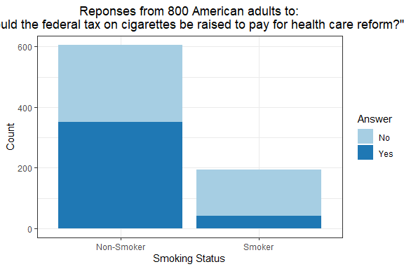

# Comparing Two Proportions

 

 **Null hypothesis:** The proportions of the two variables are the
equal.
<center>
<i>H<sub>0</sub>: p<sub>1</sub> = p<sub>2</sub></i>
</center>
 <b>Alternative hypothesis:</b> The proportions of the two variables are
not equal.
<center>
<i>H<sub>A</sub>: p<sub>1</sub> ≠ p<sub>2</sub></i>
</center>

<br>

 To statistically test the equality of two proportions the following
assumptions should be valid.

-   The data was gathered by **simple random sampling**
-   The two samples are **independent**
-   Both groups follow a **binomial distribution**

### Performing a test of equal proportions

 For this R tutorial we will use the example from [Penn State’s
Introduction to Mathematical Statistics
course](https://online.stat.psu.edu/stat415/lesson/9/9.4). Assume that
800 American adults were polled on the question: “Should the federal tax
on cigarettes be raised to pay for health care reform?”. Of those
polled, 195 identified themselves as *smokers*, 41 of which responded
‘yes’, while 605 identified as *non-smokers* with 351 responding yes.
Plotting the results of the survey (below) we might suggest that there
is a difference in how *smokers* and *non-smokers* responded overall, so
we can use a proportion test to statistically support or reject this
hypothesis.



 In this tutorial we will manually input the data into R. First, we will
make two vectors, one with the total number of *non-smokers* and
*smokers* polled (*count*) and the second with the number of yes
responds for each group (*yes*) with the `c()` function.

``` r
n <- c(605, 195)
yes <- c(351, 41)
```

 We can perform a proportion test using the `prop.test()` function which
takes the vector of successes as the first argument and the total number
of trials as the second argument.

``` r
prop.test(yes, n)
```

    ## 
    ##  2-sample test for equality of proportions with continuity correction
    ## 
    ## data:  yes out of n
    ## X-squared = 79.273, df = 1, p-value < 2.2e-16
    ## alternative hypothesis: two.sided
    ## 95 percent confidence interval:
    ##  0.2971087 0.4427091
    ## sample estimates:
    ##    prop 1    prop 2 
    ## 0.5801653 0.2102564

 The p-value for our test is extremely small and well below 0.05, so we
can conclude that there is a statistically significant difference
between the two proportions. Specifically, the proportion of smokers who
answered ‘yes’ to the survey question is significantly lower than the
proportion of non-smokers who answered ‘yes’.

 *Note that the test statistic for our test is slightly different than
in the STAT 415 example. This is because `prop.test()` uses the Yates’
continuity correction by default. By setting `correct = FALSE` within
prop.test() the correction will not be made to result in the same test
statistic that is calculated in the STAT 415 example.*

### Full code block

``` r
# Input the total number of non-smokers and somkers polled and the number of yes responses for each
n <- c(605, 195)
yes <- c(351, 41)

# Perform a proportion test
prop.test(yes, n)
```
