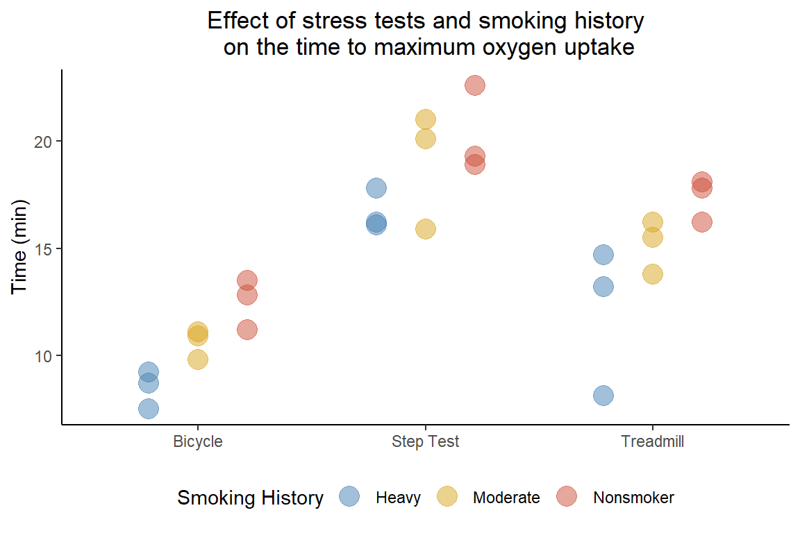

# Two-way Analysis of Variance (ANOVA<sup>2</sup>)

 For data sets with two factors the ANOVA<sup>2</sup> can be a powerful
statistical tool when the data meets the following assumptions:

-   The data are continuous,
-   randomly sampled from the population,
-   approximately normally distributed,
-   and have equal variances between the groups.

 For this example we will use a data set from [STAT 414 Introduction to
Mathematical
Statistics](https://online.stat.psu.edu/stat415/lesson/14/14.1) where a
physiologist wanted to determine if smoking history affected how a
subject responds to different types of stress tests. The time to maximum
oxygen uptake (VO<sub>2max</sub>) was measured from subjects belonging
to three different categories of smoking history (*Nonsmoker*,
*Moderate*, and *Heavy*) while performing three different stress tests
(*Bicycle*, *Step Test*, and *Treadmill*).



<br>

 The physiologist wants to test the following questions and their
respective hypotheses:

1.  Does smoking history affect the time to VO<sub>2max</sub>?
    <center>
    <i>H<sub>0</sub></i>:<i> α<sub>Nonsmoker</sub> =
    α<sub>Moderate</sub> = α<sub>Heavy</sub> = 0</i>
    </center>
    <center>
    <i>H<sub>A</sub></i>: at least one <i>α<sub>i</sub> ≠ 0</i>
    </center>
2.  Are there differences between the types of stress tests and the time
    to reach VO<sub>2max</sub>?
    <center>
    <i>H<sub>0</sub></i>:<i> β<sub>Bicycle</sub> = β<sub>Step Test</sub>
    = β<sub>Treadmill</sub> = 0</i>
    </center>
    <center>
    <i>H<sub>A</sub></i>: at least one <i>β<sub>j</sub> ≠ 0</i>
    </center>
3.  Is there an interaction between the three types of stress tests and
    smoking history?
    <center>
    <i>H<sub>0</sub></i>: <i>αβ<sub>ij</sub> = 0</i>
    </center>
    <center>
    <i>H<sub>A</sub></i>: <i>αβ<sub>ij</sub> ≠ 0</i>
    </center>

### Fit a two-way ANOVA

 First, we should read the data into R using the `read.csv()` command
putting the pathway where our data set is stored in either double (`""`)
or single (`''`) quotes. We can also set `stringsAsFactors = TRUE` to
force R to read the character variables as factors so that later coding
will be more convenient.

``` r
stress <- read.csv("dat/smoking_stress.csv", stringsAsFactors = TRUE)
```

 To fit a two-way ANOVA in R we can use the `aov()` command. Since we
will be calling other functions we should assign the results of the
ANOVA<sup>2</sup> as an object, which we store here as `stress.aov`.

``` r
stress.aov <- aov(Time ~ Smoking.History * Test, data = stress)
```

 As with coding other models in R, the response variable (*Time*) is
coded to the left of a `~` while predictor variables (*Smoking History*
and *Test*) are to the right. We separate the predictors with an
asterisk `*` to indicate that we want to include both variables and an
interaction term between them. If we wanted to include each term
separately we can write the model as follows, which is equivalent to
using the `*`.

``` r
stress.aov <- aov(Time ~ Smoking.History + Test + Smoking.History:Test, data = stress)
```

### Interpreting the results

 Using the `summary()` command we can print a table of results from our
fitted ANOVA<sup>2</sup> model.

``` r
summary(stress.aov)
```

    ##                      Df Sum Sq Mean Sq F value   Pr(>F)    
    ## Smoking.History       2  84.90   42.45  12.897 0.000335 ***
    ## Test                  2 298.07  149.04  45.279 9.47e-08 ***
    ## Smoking.History:Test  4   2.81    0.70   0.214 0.927341    
    ## Residuals            18  59.25    3.29                     
    ## ---
    ## Signif. codes:  0 '***' 0.001 '**' 0.01 '*' 0.05 '.' 0.1 ' ' 1

 Notably, both *Smoking History* and *Test* are statistically
significant with p-values well below our statistical threshold of α =
0.05. However, the interaction between these two variables is not
statistically significant. We can then answer the physiologist’s third
question by concluding that there is not a significant interaction
between the types of stress tests and a subject’s smoking history.

 Sometimes you will see that researchers refit a model by dropping the
interaction term when it turns up insignificant. However, since the
physiologist originally hypothesized an interaction between our two
variables, we should leave it in the model and continue with pairwise
comparisons on *Smoking History* and *Test*.

 Since the interaction term is insignificant we should not follow up on
that part of the ANOVA model with post-hoc tests. So, to leave out a lot
of unnecessary output we can first assign the results from the Tukey
post-hoc test using `TukeyHSD()` to an object then use `$` to only print
the pairwise comparisons from *Smoking History* and *Test*.

``` r
stress.Tukey <- TukeyHSD(stress.aov)

stress.Tukey$Smoking.History
```

    ##                        diff        lwr      upr        p adj
    ## Moderate-Heavy     2.533333  0.3506141 4.716053 0.0216511252
    ## Nonsmoker-Heavy    4.322222  2.1395029 6.504942 0.0002327506
    ## Nonsmoker-Moderate 1.788889 -0.3938304 3.971608 0.1197401463

``` r
stress.Tukey$Test
```

    ##                          diff       lwr       upr        p adj
    ## Step Test-Bicycle    8.133333  5.950614 10.316053 5.590174e-08
    ## Treadmill-Bicycle    4.322222  2.139503  6.504942 2.327506e-04
    ## Treadmill-Step Test -3.811111 -5.993830 -1.628392 8.483156e-04

 From the output, we can see that each pairwise comparison is
statisticall significant except for the comparison between *Nonsmoker*
and *Moderate*. Therefore, we can answer the physiologist’s original two
questions as follows:

1.  Heavy smokers have a significantly lower time to VO<sub>2max</sub>
    compared to moderate and nonsmokers, however there is not a
    statistically significant difference between moderate and
    nonsmokers.
2.  There are statistically significant differences in the time to reach
    VO<sub>2max</sub> among the three types of stress tests, with the
    bicycle being the lowest, then treadmill, and the step test with the
    highest time.

### Full code block

``` r
# Read the data into R
stress <- read.csv("dat/smoking_stress.csv")

# Fit a two-way ANOVA with interaction effects then print the results
stress.aov <- aov(Time ~ Smoking.History * Test, data = stress)

summary(stress.aov)

# Perform a Tukey post-hoc test on the model for pairwise comparisons
TukeyHSD(stress.aov)

stress.Tukey$Smoking.History
stress.Tukey$Test
```
