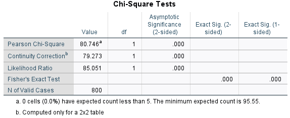

# Comparing Two Proportions in SPSS

#### Hypotheses

    *Null hypothesis:* the two proportions are equal.  
    *Alternative hypothesis:* the two proportions are not equal.

#### Assumptions

#### Running the test

For this R tutorial we will use the example from [Penn State’s
Introduction to Mathematical Statistics
course](https://online.stat.psu.edu/stat415/lesson/9/9.4). Assume that
800 adult Americans were polled on the question: “Should the federal tax
on cigarettes be raised to pay for health care reform?”.

